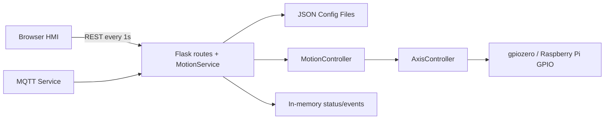
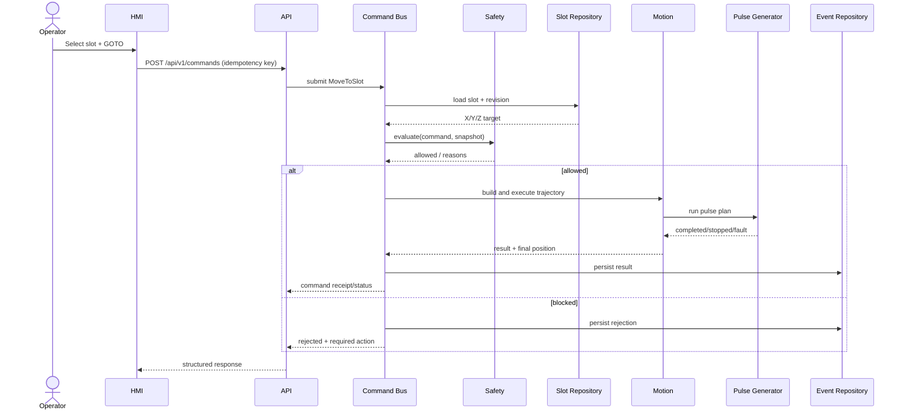

# NARIT VENDING — Architecture Proposal และ Migration Plan

สถานะเอกสาร: **Proposal / Awaiting Approval**  
เป้าหมาย: ปรับโครงสร้างแบบ Incremental โดยไม่เปลี่ยนพฤติกรรม GPIO, Motion, HMI, API, Slot และ Configuration ที่ใช้งานอยู่โดยไม่ได้รับอนุมัติ

## 1. Executive Summary

ระบบปัจจุบันทำงานได้ แต่มีความเสี่ยงจากไฟล์ขนาดใหญ่ ความรับผิดชอบซ้อนกัน และ configuration หลายแหล่งที่สามารถ override กันโดยไม่ชัดเจน การปรับปรุงควรเริ่มจากการสร้าง safety net และ single source of truth ก่อนแยก motion หรือเปลี่ยน GPIO backend

ข้อเสนอหลัก:

1. รักษา API และ HMI ปัจจุบันผ่าน compatibility layer
2. สร้าง Command Bus กลางให้ HTTP, MQTT และงานภายในใช้เส้นทางเดียวกัน
3. แยก Machine State Machine และ Safety Interlock ออกจาก route และ GPIO
4. สร้าง Pulse Generator interface ก่อนพิจารณา `pigpio` หรือ hardware-timed pulse
5. รวม configuration ให้มี owner เดียว พร้อม schema, version, migration, backup และ rollback
6. แยก Slot Repository และ Event/Alarm Repository ออกจาก machine configuration
7. Deploy แบบ release directory + health check + atomic rollback

**คำแนะนำลำดับแรก:** อนุมัติ Phase 1 เท่านั้นก่อน เพื่อเพิ่ม characterization tests, config validation, backup และ health checks โดยยังไม่เปลี่ยน motion behavior

## 2. Current Architecture Analysis

### 2.1 Baseline ที่ตรวจพบ

| ส่วน | สภาพปัจจุบัน | ผลกระทบ |
|---|---|---|
| HTTP/Application | `narit_vending/webapp.py` ประมาณ 1,267 บรรทัด มี `MotionService`, persistence และ routes อยู่ร่วมกัน | แก้ส่วนหนึ่งกระทบหลายส่วนและทดสอบแยกยาก |
| Motion/GPIO | `narit_vending/motion.py` ประมาณ 1,189 บรรทัด มี axis control, coordinated motion, pulse timing และ config builder | safety policy ผูกกับ hardware execution |
| Frontend | `static/app.js` ประมาณ 2,562 บรรทัด และ `style.css` ประมาณ 5,101 บรรทัด | state และ workspace coupling สูง เกิด regression ข้ามหน้าได้ง่าย |
| HTML | `templates/index.html` ประมาณ 892 บรรทัด รวมทุก workspace | component boundary ไม่ชัด |
| MQTT | adapter เรียก `MotionService` โดยตรง | HTTP และ MQTT อาจผ่าน validation/safety คนละเส้นทาง |
| Configuration | ค่า axis ปรากฏทั้ง machine config และ `hardware_config.json.machine_parameters.axes` | ค่าที่บันทึกอาจถูก override โดยไม่เห็นจาก HMI |
| Slots | slot positions อยู่ร่วมกับ machine configuration | schema และ lifecycle ของ slot ผูกกับ hardware config |
| State | ใช้ string/boolean หลายตัวแทนสถานะเครื่อง | เกิด state combination ที่ขัดแย้งกันได้ |
| Command execution | ใช้ lock เพื่อกันคำสั่งพร้อมกัน แต่ไม่มี command queue/audit แบบเป็นระบบ | ตรวจสอบ pending, cancel, retry และ idempotency ยาก |
| Deployment | systemd รันเป็น root และ deploy ด้วยการ copy ทับ installation | rollback และ partial deployment มีความเสี่ยง |
| Tests | ไม่มี automated test suite ครอบคลุม safety/motion/API | refactor แล้วพิสูจน์ behavior เดิมได้ยาก |

### 2.2 Dependency ปัจจุบัน



จุด coupling สำคัญคือ `MotionService` เป็นทั้ง application service, command handler, machine-state owner, configuration service, slot service และ safety gate ในชั้นเดียว

## 3. Technical Debt และ Risks

### 3.1 Technical Debt

1. **God objects:** `MotionService`, `MotionController` และ frontend global state รับผิดชอบมากเกินไป
2. **Routes อยู่ใน app factory:** route registration, parsing, execution และ error mapping แยกทดสอบยาก
3. **Duplicated configuration ownership:** motor/axis parameters มีหลายไฟล์และ merge ตามลำดับ
4. **Implicit state machine:** READY, HOMING, MOVING, ALARM และ E-STOP ไม่ได้ถูกจำกัด transition ด้วย model กลาง
5. **Command inconsistency:** move-to-slot มีขั้น preview/arm แต่ jog, home, motor test และ MQTT ยังไม่มี envelope และ audit แบบเดียวกัน
6. **Frontend duplication:** มี implementation รุ่นเดิม/รุ่นใหม่บาง workspace ทำให้ navigation และ refresh ผิดหน้าได้
7. **No durable diagnostics:** event/alarm สำคัญยังไม่ถูกจัดเก็บเป็น repository ที่ query ย้อนหลังได้
8. **Status payload coupling:** polling status รวมข้อมูลหลายชนิด รวมถึง slots ทำให้ payload โตตาม feature
9. **No API contract version:** frontend และ backend เปลี่ยนพร้อมกันโดยไม่มี compatibility window
10. **Deployment mutates live tree:** หาก copy หรือ setup ล้มเหลว ระบบอาจอยู่ในสภาพครึ่งเก่า/ครึ่งใหม่

### 3.2 Safety และ Operational Risks

| Risk | Severity | Likelihood | Control ที่เสนอ |
|---|---:|---:|---|
| Config override ทำให้ pulses/mm หรือ direction ไม่ตรงค่าที่ HMI แสดง | Critical | Medium | Single source, schema, effective-config endpoint, checksum |
| HTTP และ MQTT ผ่าน safety validation คนละทาง | Critical | Medium | Command Bus + SafetyInterlock กลาง |
| State combination ขัดแย้ง เช่น READY พร้อม E-STOP | Critical | Medium | Explicit state machine และ invariant tests |
| Pulse timing จาก Python jitter เมื่อโหลด CPU สูง | High | Medium | PulseGenerator abstraction, timing metrics, optional pigpio backend |
| Motor Test bypass normal workflow | Critical | Medium | isolated MOTOR_TEST state, physical E-stop, timeout/watchdog, audit |
| Command ซ้ำจาก retry/network | High | Medium | command ID, idempotency key และ command repository |
| API ใช้ CORS กว้างและไม่มี role boundary | High | Medium | trusted-origin config, authentication/roles ใน phase แยก |
| Service รันเป็น root | High | Medium | least-privilege service account + GPIO permissions |
| Deploy copy ทับแล้ว rollback ไม่ได้ทันที | High | Medium | versioned releases + atomic symlink |
| ไม่มี automated safety regression | Critical | High | unit, integration, fault injection และ Pi smoke tests |

## 4. Architecture Principles

1. **Safety before motion:** ทุก command ที่ทำให้เกิดการเคลื่อนที่ต้องผ่าน safety policy เดียวกัน
2. **One command path:** HTTP, MQTT และ internal automation ส่ง `CommandEnvelope` เข้า Command Bus
3. **One configuration owner:** ค่า effective ทุกค่าต้องระบุ source และ schema version ได้
4. **Hardware behind interfaces:** domain/application code ไม่ import GPIO library โดยตรง
5. **State is explicit:** state transition ต้องตรวจสอบได้และมี audit event
6. **Backward compatible migration:** endpoint และ frontend เดิมยังทำงานระหว่าง migration
7. **Fail safe:** API/config/GPIO/sensor ไม่พร้อมต้องเข้าสู่ NOT_READY, CONFIG_REQUIRED, ALARM หรือ E_STOP ไม่ใช่ READY
8. **Observable operations:** ทุก command มี ID, timestamps, phase, result และ failure reason
9. **Rollback is a feature:** config และ software release ต้องย้อนกลับได้โดยไม่สร้างไฟล์ผสม

## 5. Proposed Target Structure

```text
narit_vending/
├── api/
│   ├── app_factory.py
│   ├── error_handlers.py
│   ├── legacy/
│   │   └── routes.py
│   └── v1/routes/
│       ├── status.py
│       ├── commands.py
│       ├── motion.py
│       ├── slots.py
│       ├── configuration.py
│       ├── alarms.py
│       └── maintenance.py
├── application/
│   ├── command_bus.py
│   ├── command_queue.py
│   ├── command_handler.py
│   ├── commands/
│   │   ├── base.py
│   │   ├── home.py
│   │   ├── jog.py
│   │   ├── move.py
│   │   ├── slot.py
│   │   ├── motor_test.py
│   │   └── safety.py
│   └── services/
│       ├── machine_service.py
│       ├── motion_service.py
│       ├── homing_service.py
│       ├── motor_test_service.py
│       ├── safety_service.py
│       ├── slot_service.py
│       └── configuration_service.py
├── domain/
│   ├── models/
│   │   ├── axis.py
│   │   ├── slot.py
│   │   ├── command.py
│   │   ├── alarm.py
│   │   └── configuration.py
│   ├── state_machine/
│   │   ├── machine_state.py
│   │   └── transitions.py
│   └── safety/
│       ├── interlock.py
│       └── policy.py
├── infrastructure/
│   ├── gpio/
│   │   ├── interfaces.py
│   │   ├── gpiozero_backend.py
│   │   ├── pigpio_backend.py
│   │   └── mock_backend.py
│   ├── config/
│   │   ├── schema.py
│   │   ├── loader.py
│   │   ├── migrations.py
│   │   └── backup.py
│   ├── mqtt/
│   │   ├── adapter.py
│   │   └── schemas.py
│   └── persistence/
│       ├── slot_json.py
│       ├── event_sqlite.py
│       └── command_sqlite.py
├── repositories/
│   ├── slot_repository.py
│   ├── event_repository.py
│   └── command_repository.py
├── diagnostics/
│   ├── health.py
│   ├── startup_check.py
│   └── metrics.py
├── static/
│   ├── js/core/
│   ├── js/api/
│   ├── js/workspaces/
│   ├── js/components/
│   ├── css/core/
│   ├── css/components/
│   └── css/workspaces/
└── templates/
    ├── index.html
    └── partials/

config/
├── schema/
├── machine.json
├── hardware.json
├── slots.json
└── mqtt.json

tests/
├── unit/
├── integration/
├── fault_injection/
├── browser/
└── pi_smoke/
```

ไฟล์เดิมจะไม่ถูกลบทันที แต่จะทำหน้าที่ facade/compatibility จนกว่า behavior tests และ Pi validation ผ่าน

## 6. Layer Responsibilities

| Layer | รับผิดชอบ | ห้ามรับผิดชอบ |
|---|---|---|
| API | parse/validate request, auth context, response mapping | GPIO, pulse loop, config merge |
| Application | command orchestration, queue, cancellation, idempotency | pin toggling และ Flask objects |
| Domain | state, rules, invariants, safety decision | filesystem, MQTT, gpiozero |
| Infrastructure | GPIO, JSON/SQLite, MQTT, clock | business/safety policy |
| Repository | persistence contract และ transaction boundary | UI formatting, GPIO |
| Frontend | presentation, polling, user intent, confirmation | ตัดสิน safety readiness เอง |

## 7. Core Interfaces และ Data Models

### 7.1 Command Envelope

```python
@dataclass(frozen=True)
class CommandEnvelope:
    command_id: str
    command_type: str
    requested_at: datetime
    requested_by: str
    source: Literal["http", "mqtt", "system"]
    idempotency_key: str
    parameters: Mapping[str, object]
    config_revision: str
```

Command result ต้องมี `accepted`, `state`, `reason_code`, `message`, `started_at`, `completed_at` และ `correlation_id`

### 7.2 Pulse Generator

```python
class PulseGenerator(Protocol):
    def enable_axis(self, axis: AxisId) -> None: ...
    def disable_axis(self, axis: AxisId) -> None: ...
    def set_direction(self, axis: AxisId, direction: Direction) -> None: ...
    def run(self, plan: PulsePlan, stop_token: StopToken) -> PulseResult: ...
    def stop_all(self) -> None: ...
```

`gpiozero_backend` รักษาพฤติกรรมเดิม ส่วน `pigpio_backend` ต้องอยู่หลัง feature flag และผ่าน bench test ก่อนใช้จริง

### 7.3 Safety Interlock

```python
class SafetyInterlock(Protocol):
    def evaluate(
        self, command: CommandEnvelope, snapshot: MachineSnapshot
    ) -> SafetyDecision: ...
```

ผลลัพธ์ต้องระบุ `allowed`, `reason_codes`, `required_actions` และ `snapshot_revision` เพื่อป้องกันการตรวจ state เก่าแล้วสั่งงานภายหลัง

### 7.4 Repositories

- `SlotRepository`: list/get/save/validate/revision
- `CommandRepository`: enqueue/start/complete/fail/cancel/find_by_idempotency_key
- `EventRepository`: append/query/latest
- `ConfigurationRepository`: load_effective/validate/save_revision/rollback

## 8. Machine State Model

```mermaid
stateDiagram-v2
    [*] --> STARTING
    STARTING --> CONFIG_REQUIRED: invalid or missing config
    STARTING --> E_STOP: E-stop active
    STARTING --> NOT_READY: hardware initialized
    NOT_READY --> HOMING: Home accepted
    HOMING --> READY: all axes homed
    HOMING --> ALARM: timeout / limit fault
    READY --> MOVING: Move/Jog accepted
    READY --> DISPENSING: Dispense accepted
    READY --> MOTOR_TEST: authorized test mode
    MOVING --> READY: completed
    DISPENSING --> READY: completed
    MOTOR_TEST --> NOT_READY: exit test; re-home required
    MOVING --> ALARM: motion fault
    DISPENSING --> ALARM: dispense fault
    MOTOR_TEST --> ALARM: test fault
    NOT_READY --> E_STOP: E-stop active
    READY --> E_STOP: E-stop active
    MOVING --> E_STOP: E-stop active
    HOMING --> E_STOP: E-stop active
    MOTOR_TEST --> E_STOP: E-stop active
    ALARM --> NOT_READY: reset accepted and fault cleared
    E_STOP --> NOT_READY: physical release + reset
```

Invariants สำคัญ:

- READY ต้องมี controller online, E-stop clear, no blocking alarm, interlock enabled และ X/Y/Z homed
- E_STOP และ READY ห้ามเกิดพร้อมกัน
- MOTOR_TEST แยกจาก normal command queue และเมื่อออกต้องบังคับ re-home
- command เคลื่อนที่ใหม่ห้ามเริ่มขณะ command เดิม RUNNING ยกเว้น STOP/E-STOP

## 9. Move-to-Slot Sequence



## 10. Configuration Architecture

### 10.1 Ownership ที่เสนอ

| File | Owner | ตัวอย่างข้อมูล |
|---|---|---|
| `config/hardware.json` | Hardware adapter | GPIO pins, polarity, driver enable, sensor polarity |
| `config/machine.json` | Motion/domain | travel, speed, acceleration, pitch, steps/rev, microstep |
| `config/slots.json` | Slot repository | slot 1–30 และ X/Y/Z |
| `config/mqtt.json` | MQTT adapter | broker, topics, credentials reference |

ห้ามมี field เดียวกันในหลายไฟล์ ยกเว้น migration input ที่ถูกแปลงแล้วสร้าง effective config เพียงชุดเดียว

### 10.2 Save workflow

1. รับ proposed config พร้อม `base_revision`
2. validate schema, ranges, pin collision และ cross-field constraints
3. สร้าง backup revision
4. เขียน temp file + fsync + atomic rename
5. โหลดกลับและตรวจ checksum
6. mark `restart_required` เฉพาะ field ที่จำเป็น
7. หาก startup check ไม่ผ่าน ให้ rollback revision ก่อนหน้า

API ควรมี `GET /api/v1/config/effective` เพื่อแสดงค่า effective พร้อม source, revision และ restart requirement

## 11. API Strategy

### 11.1 Versioned API

- คง endpoint เดิมภายใต้ legacy blueprint
- เพิ่ม `/api/v1/status`, `/api/v1/commands`, `/api/v1/commands/{id}`
- เพิ่ม `/api/v1/slots`, `/api/v1/config/effective`, `/api/v1/alarms`, `/api/v1/events`
- response ใช้ envelope เดียว: `ok`, `data`, `error`, `correlation_id`, `server_time`
- endpoint motion รับ `Idempotency-Key` และตอบ `202 Accepted` เมื่อเข้าคิว
- status แยก machine snapshot ออกจาก slot catalog เพื่อลด polling payload

### 11.2 Compatibility

Legacy route จะ translate request ไปเป็น command ใหม่ ไม่เรียก GPIO โดยตรง เมื่อ metrics ยืนยันว่าไม่มี consumer เก่าแล้วจึงประกาศ deprecation

## 12. Frontend Architecture

1. `core/store.js`: normalized machine snapshot และ connection state
2. `api/client.js`: timeout, retry เฉพาะ GET, correlation ID และ offline handling
3. `core/poller.js`: polling ทุก 1 วินาทีแบบ single-flight ป้องกัน request ซ้อน
4. `workspaces/*.js`: render และ bind event เฉพาะ workspace
5. `components/*.js`: status badge, axis card, slot map, alarm list, modal
6. CSS แยก tokens/core/components/workspaces โดยยังใช้ dark-blue theme เดิม
7. navigation เปลี่ยน workspace โดยไม่ rebind handler ซ้ำ
8. command button ใช้ backend safety decision; frontend มีเพียง UX guard ไม่ถือเป็น safety control

Phase แรกยังไม่เปลี่ยนหน้าตา แต่เพิ่ม browser regression tests เพื่อรักษา navigation และ status header ทุก workspace

## 13. MQTT Boundary

MQTT ยังพักไว้ได้ตามแผนโครงการ แต่โครงสร้างรองรับดังนี้:

- MQTT adapter แปลง payload เป็น `CommandEnvelope`
- ใช้ schema version และ topic allowlist
- ทุกคำสั่งมี command ID/idempotency key
- publish acknowledgement และ final result แยก topic
- ห้าม MQTT เรียก `MotionService` หรือ GPIO โดยตรง
- credential มาจาก environment/secret file ไม่เก็บ password จริงใน repository

## 14. Migration Plan

### Phase 1 — Safety Net และ Configuration Foundation

**เป้าหมาย:** ไม่มี behavior change

- เพิ่ม characterization tests สำหรับ status, home, jog, slot move, E-stop และ motor test validation
- เพิ่ม mock GPIO และ deterministic clock
- สร้าง config schema/revision/backup และ effective-config report
- ตรวจ duplicated fields และ pin collisions ตอน startup
- เพิ่ม `/health/live` และ `/health/ready`
- บันทึก baseline API fixtures และ frontend navigation smoke tests

**Exit criteria:** tests ผ่าน, effective config ตรงค่าที่ Pi ใช้จริง, deploy/rollback dry run ผ่าน  
**Rollback:** ปิด feature flag และใช้ loader เดิม; ไม่มีการย้ายไฟล์ config จริงในเฟสนี้

### Phase 2 — State, Safety และ Command Foundation

- เพิ่ม explicit machine state และ transition guard
- เพิ่ม CommandEnvelope, in-memory queue และ command audit repository
- ให้ legacy API translate เข้า Command Bus
- รวม safety decision ของ HTTP/MQTT/internal command
- เพิ่ม STOP/E-STOP priority path ที่ไม่รอ queue ปกติ

**Exit criteria:** legacy API contract tests ผ่านและ GPIO trace เท่ากับ baseline  
**Rollback:** switch service factory กลับ legacy service

### Phase 3 — Motion Decomposition

- แยก axis model, trajectory planner, homing, coordinated motion และ motor test
- ใส่ `PulseGenerator` interface ครอบ gpiozero behavior เดิม
- เพิ่ม timing metrics, watchdog และ cancellation tests
- ทดลอง pigpio backend เฉพาะ bench rig ภายใต้ feature flag

**Exit criteria:** pulse count/direction/enable/timing tolerance ผ่าน bench test ทุกแกน  
**Rollback:** เลือก `gpiozero_backend` เดิมใน config

### Phase 4 — API, Repositories และ Frontend Modules

- เปิด `/api/v1`
- แยก slots, commands, events และ alarms repositories
- migrate slot config ด้วย revision/checksum
- แยก frontend modules ทีละ workspace เริ่ม Dashboard แล้ว Motion Control
- ลด status polling payload และเพิ่ม offline/UNKNOWN behavior

**Exit criteria:** browser tests ที่ 1280×720, 1600×900, 1920×1080 ผ่านและ legacy API ยังทำงาน  
**Rollback:** frontend cache version ย้อนกลับและ legacy routes ยังอยู่

### Phase 5 — MQTT และ Production Deployment Hardening

- ต่อ MQTT ผ่าน Command Bus เมื่อพร้อมใช้งาน Cloud
- ใช้ release directories, atomic current symlink และ automatic health gate
- ใช้ dedicated service account และ systemd hardening ที่ไม่ขัดกับ GPIO
- เพิ่ม startup config report, audit retention และ backup rotation
- ประกาศ deprecation schedule ของ legacy modules หลัง burn-in

**Exit criteria:** cold boot, network loss, MQTT loss, E-stop และ rollback drills ผ่านบน Raspberry Pi ARM64  
**Rollback:** atomic symlink กลับ release ก่อนหน้าและ restore config revision

## 15. File Migration Map

| Current | Target | วิธี migrate |
|---|---|---|
| `narit_vending/webapp.py` | `api/`, `application/services/` | คง facade แล้ว extract route/service ทีละกลุ่ม |
| `narit_vending/motion.py` | `domain/`, `application/services/`, `infrastructure/gpio/` | ครอบ behavior เดิมด้วย interfaces ก่อนแยก |
| `narit_vending/mqtt_service.py` | `infrastructure/mqtt/adapter.py` | เปลี่ยน direct service call เป็น Command Bus |
| `machine_config.json` | `config/machine.json`, `config/slots.json` | migrate ด้วย schema version และ checksum |
| `hardware_config.json` | `config/hardware.json`, `config/mqtt.json` | ตัด duplicated machine axes หลัง compatibility period |
| `static/app.js` | `static/js/core`, `api`, `components`, `workspaces` | extract ทีละ workspace พร้อม smoke tests |
| `static/style.css` | `static/css/core`, `components`, `workspaces` | แยกโดยไม่เปลี่ยน visual baseline |
| `templates/index.html` | `templates/index.html`, `partials/` | แยก partial หลัง frontend state stable |
| systemd/deploy scripts | versioned deployment | เพิ่ม release ID, health gate และ rollback command |

## 16. Test Strategy

### Unit

- state transitions และ invariants
- safety policy ทุก command/state combination
- pulse/mm, direction, microstep และ trajectory calculation
- config schema, migration, collision และ range validation
- slot validation และ repository revision conflict
- idempotency/cancellation/queue priority

### Integration โดยไม่ใช้มอเตอร์จริง

- Flask API + Command Bus + mock GPIO
- จำลอง home/limit/E-stop sensors
- บันทึก GPIO trace แล้วเทียบ baseline
- config save/rollback และ corrupted-file recovery
- MQTT payload validation โดยไม่เชื่อม broker จริง

### Fault Injection

- E-stop ระหว่าง MOVING/HOMING/MOTOR_TEST
- limit switch เปลี่ยนสถานะระหว่าง pulse train
- sensor stuck active/inactive
- GPIO backend exception
- config invalid/corrupted/write interrupted
- network/API timeout และ duplicate command
- process restart ระหว่าง command

### Raspberry Pi Smoke/Acceptance

- verify pin map/polarity โดยไม่ต่อโหลดก่อน
- test enable/direction/pulse ทีละแกนด้วย safe frequency
- home และ limit test แบบ low speed
- slot move แบบลด speed และมี observer/E-stop
- soak test, CPU load timing และ service restart

CI ต้องใช้ mock GPIO เท่านั้น ห้ามสั่งมอเตอร์จริงโดยอัตโนมัติ

## 17. Deployment และ Rollback

โครงสร้าง production ที่เสนอ:

```text
/opt/narit-vending/
├── releases/2026xxxx-HHMMSS-<git-sha>/
├── shared/config/
├── shared/data/
├── shared/logs/
├── current -> releases/<active>
└── previous -> releases/<previous>
```

ขั้นตอน deploy:

1. build/validate artifact บนเครื่องพัฒนา
2. upload ไป release directory ใหม่ ไม่แก้ `current`
3. install dependencies และ run tests/startup check ใน release ใหม่
4. backup config พร้อม revision/checksum
5. switch `current` symlink แบบ atomic
6. restart service และตรวจ `/health/live`, `/health/ready`
7. หากไม่ผ่านภายใน timeout ให้ switch กลับ `previous` และ restart
8. เก็บอย่างน้อย 3 releases และ config backups ตาม retention policy

systemd ควรใช้ dedicated user, environment file, `Restart=on-failure`, startup timeout และ hardening เท่าที่ไม่ปิดสิทธิ์ GPIO ที่จำเป็น

## 18. Priority Recommendation

| Priority | งาน | เหตุผล |
|---|---|---|
| P0 | Characterization tests + effective config validation | ลดความเสี่ยง motion ผิดค่าก่อน refactor |
| P0 | Explicit safety/state invariants | ป้องกัน READY หรือ motion ใน state ที่ไม่ปลอดภัย |
| P0 | Atomic config backup/rollback | ป้องกัน Pi start ไม่ขึ้นหลัง save config |
| P1 | Command Bus + idempotency + audit | รวม HTTP/MQTT และแก้ duplicate command |
| P1 | PulseGenerator abstraction | เตรียม timing backend โดยไม่เปลี่ยน domain |
| P1 | Versioned deployment + health rollback | ลด downtime และ partial deploy |
| P2 | API v1 + repositories | ลด coupling และรองรับข้อมูลระยะยาว |
| P2 | Frontend modularization | ลด regression ข้าม workspace |
| P3 | MQTT cloud activation | ทำหลัง command/safety boundary พร้อม |

## 19. Approval Gate

ก่อนแก้ runtime code ขออนุมัติขอบเขต **Phase 1** ดังนี้:

- อนุญาตเพิ่ม tests, mock GPIO, config schema/report, backups และ health endpoints
- ไม่เปลี่ยน GPIO pin, polarity, pulse frequency, acceleration, direction หรือ motion sequence
- ไม่ย้าย config จริงจนกว่าจะมี migration dry run และ backup
- ไม่เปิด MQTT cloud control
- ไม่ deploy ขึ้น Pi จน local tests และ rollback dry run ผ่าน

เมื่อ Phase 1 ผ่าน จะนำ GPIO trace, API compatibility report, effective config report และ rollback result มาให้อนุมัติก่อนเริ่ม Phase 2
