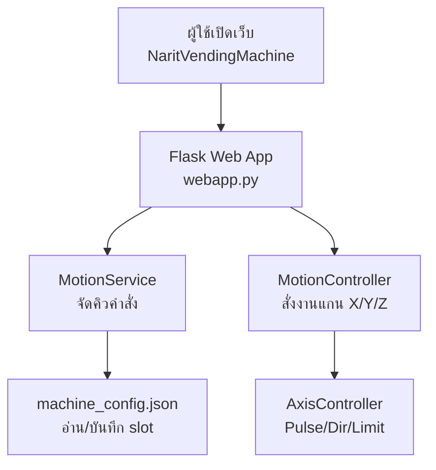
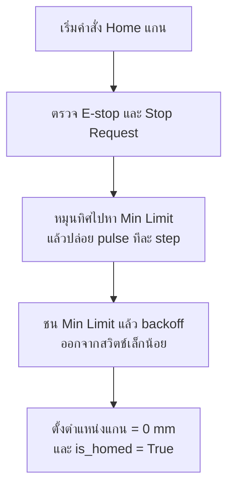
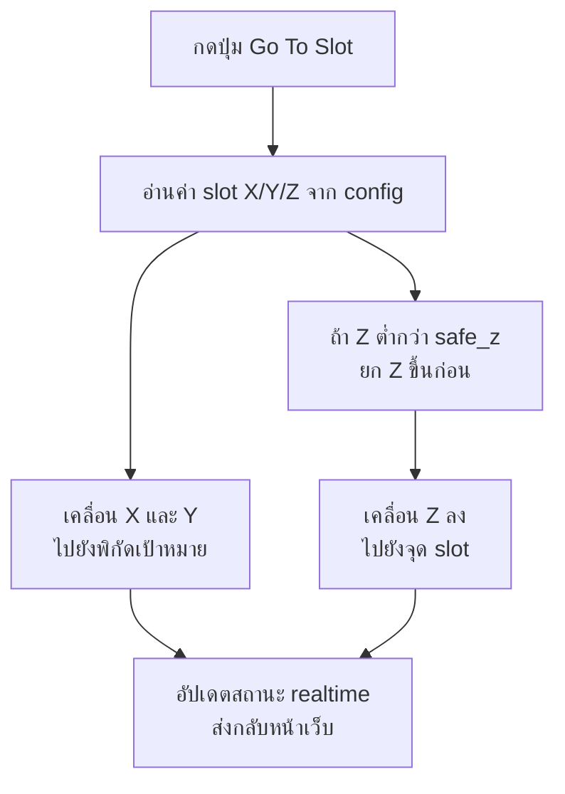

# Narit Vending Machine Architecture

เอกสารนี้อธิบายโครงสร้าง การทำงาน และ flowchart ของระบบ `Narit Vending Machine` ในรูปแบบ Markdown เพื่อให้อ่านต่อใน repo ได้เหมือน `README.md`

## ภาพรวมระบบ

ระบบนี้ทำงานบน `Raspberry Pi` โดยให้ Pi เป็น `web server` สำหรับควบคุมเครื่องจ่ายสินค้า ผู้ใช้เปิดหน้าเว็บผ่านชื่อเครื่อง `NaritVendingMachine` แล้วสั่งงาน `Home`, `Jog`, `Go To Slot`, `Save Slot` และ `Stop` ได้จาก browser

ระบบแบ่งออกเป็น 3 ชั้นหลัก:

- `Motion Control Layer`
  ควบคุมมอเตอร์ `X/Y/Z`, limit switch, emergency stop, และตำแหน่ง
- `Command/API Layer`
  รับคำสั่งจาก CLI หรือ Web API แล้วส่งต่อไปยัง motion controller
- `Web UI Layer`
  แสดงสถานะ realtime และให้ผู้ใช้สั่งงานผ่านหน้าเว็บ

## โครงสร้างไฟล์สำคัญ

- `main.py`
  จุดเริ่มต้นของ CLI โดยเรียก `narit_vending.cli.main`
- `narit_vending/motion.py`
  แกนหลักของระบบ ควบคุม `X/Y/Z`, `home`, `move`, `limit`, `stop`, และ `slot config`
- `narit_vending/cli.py`
  คำสั่งแบบ terminal เช่น `status`, `home`, `jog`, `move`, `goto-slot`
- `narit_vending/webapp.py`
  `Flask` web server และ REST API
- `narit_vending/templates/index.html`
  โครงสร้างหน้าเว็บควบคุม
- `narit_vending/static/app.js`
  logic ฝั่ง browser สำหรับเรียก API และอัปเดตสถานะ realtime
- `narit_vending/static/style.css`
  รูปแบบหน้าเว็บ theme `blue dark`
- `machine_config.json`
  เก็บค่าคอนฟิกของแกนและตำแหน่ง `slot 1-30`
- `deploy/narit-vending-web.service`
  `systemd service` สำหรับให้เว็บเริ่มอัตโนมัติหลังบูต
- `scripts/setup_pi.sh`
  สคริปต์ติดตั้ง dependency, ตั้ง hostname, และเปิด service
- `scripts/deploy_to_pi.ps1`
  สคริปต์ deploy จาก Windows ไปยัง Raspberry Pi ผ่าน `SSH`

## ค่าคอนฟิกเครื่อง

ไฟล์ `machine_config.json` ใช้เก็บ:

- พินของแต่ละแกน
- `steps_per_mm`
- `max_travel_mm`
- `pulse_delay`
- `jog_step_mm`
- ลำดับการ `home`
- ตำแหน่ง `slot 1-30`

### สรุปแกน

| Axis | Pulse Pin | Dir Pin | Min Limit | Max Limit | Steps/mm | Max Travel (mm) |
|---|---:|---:|---:|---:|---:|---:|
| X | 16 | 23 | 17 | 27 | 80.0 | 220.0 |
| Y | 26 | 24 | 22 | 9 | 80.0 | 260.0 |
| Z | 18 | 25 | 11 | 5 | 50.0 | 200.0 |

### สรุป slot

- `slot 1-30` ใช้เก็บตำแหน่งสินค้า
- ค่าเริ่มต้นของทุก slot คือ `X=0`, `Y=0`, `Z=0`
- ผู้ใช้สามารถแก้และบันทึกค่าผ่านหน้าเว็บได้

## การทำงานของ Motion Control

ใน `narit_vending/motion.py` มี class สำคัญดังนี้:

- `AxisConfig`
  เก็บค่าคอนฟิกของแกนหนึ่งแกน
- `SlotPosition`
  เก็บพิกัดของ slot หนึ่งตำแหน่ง
- `MachineConfig`
  รวมค่าคอนฟิกทั้งหมดของเครื่อง
- `AxisController`
  คุมมอเตอร์ทีละแกน ปล่อย pulse, ตั้งทิศทาง, อ่าน limit switch, และคำนวณตำแหน่ง
- `MotionController`
  รวมการควบคุมแกนทั้งสามตัว เช่น `home_axis`, `home_all`, `move_by_mm`, `move_to_slot`, `update_slot`, และ `request_stop`

### กลไกความปลอดภัย

- ตรวจ `E-stop` ก่อนและระหว่างการเคลื่อนที่
- ตรวจ `stop_requested` จากปุ่ม `STOP` บนหน้าเว็บ
- ตรวจ `limit min/max`
- ตรวจ `software travel limit` จาก `max_travel_mm`
- หลัง `home` สำเร็จ จะตั้งตำแหน่งแกนเป็น `0 mm`

## การทำงานของ Web/API

ใน `narit_vending/webapp.py`:

- ใช้ `Flask` เป็น web server
- ใช้ `MotionService` เป็นตัวรวม business logic
- เก็บสถานะ `busy`
- เก็บ `last_error`
- อ่านและบันทึก `machine_config.json`
- expose API ให้หน้าเว็บเรียกใช้งาน

ตัวอย่าง endpoint:

- `GET /api/status`
- `POST /api/home/x`
- `POST /api/home/y`
- `POST /api/home/z`
- `POST /api/home/all`
- `POST /api/jog`
- `POST /api/stop`
- `POST /api/slots/<slot>/goto`
- `POST /api/slots/<slot>/save-current`
- `POST /api/slots/<slot>`

ใน `narit_vending/static/app.js`:

- หน้าเว็บจะ poll `GET /api/status` ทุก `500 ms`
- อัปเดตตำแหน่ง `X/Y/Z`
- อัปเดตสถานะ `homed`, `limit`, `E-stop`
- อัปเดตรายการ slot และ error ล่าสุด

## Flowchart ภาพรวมคำสั่งจากหน้าเว็บ

คำอธิบาย:
ผู้ใช้กดปุ่มบนหน้าเว็บ แล้ว `Flask` รับคำสั่ง จากนั้น `MotionService` จัดการ logic และสถานะ ก่อนส่งต่อให้ `MotionController` และ `AxisController` ทำงานกับฮาร์ดแวร์จริง ถ้าเกี่ยวกับ slot ระบบจะอ่านหรือบันทึก `machine_config.json`

## Flowchart การ Home แกน

คำอธิบาย:
เมื่อกด `Home` ระบบจะหมุนไปยัง `min limit` ของแกนนั้น ปล่อย pulse ทีละ step จนชนสวิตช์ จากนั้นถอยออกเล็กน้อยเพื่อ release สวิตช์ แล้วตั้งตำแหน่งแกนเป็น `0 mm`

## Flowchart การไปยัง Slot

คำอธิบาย:
เมื่อสั่งไปยัง slot ระบบจะอ่านค่า `X/Y/Z` จาก config ก่อน ถ้าแกน `Z` อยู่ต่ำกว่า `safe_z` จะยก `Z` ขึ้นเพื่อหลบการชน จากนั้นจึงเคลื่อน `X/Y` ไปยังตำแหน่งเป้าหมาย แล้วค่อยเลื่อน `Z` ลงไปยังตำแหน่ง slot

## ลำดับการเริ่มระบบเมื่อเปิดเครื่อง

1. Raspberry Pi บูตขึ้น
2. `systemd` เรียก `narit-vending-web.service`
3. service สั่ง Python ใน virtual environment ให้รัน `narit_vending.webapp`
4. `Flask` โหลด `machine_config.json` และสร้าง `MotionController`
5. ผู้ใช้เปิด `http://NaritVendingMachine.local/`
6. หน้าเว็บพร้อมรับคำสั่งทันที

## ข้อสังเกตในการดูแลต่อ

- ถ้าระบบจะมี motion ที่ใช้เวลานาน ควรแยกเป็น worker thread หรือ queue ที่ควบคุมได้ชัดขึ้น
- ควรเพิ่ม logging ของทุกคำสั่ง motion
- สามารถเพิ่ม profile ของสินค้าในแต่ละ slot ได้ เช่น เวลา dispense หรือ sequence เฉพาะ
- ควรทดสอบ `steps_per_mm`, `home_direction`, และ `max_travel_mm` กับเครื่องจริงเสมอ

## เอกสารที่เกี่ยวข้อง

- [README.md](C:\Users\Naruebest\OneDrive\Documents\NaritVending\README.md)
- [machine_config.json](C:\Users\Naruebest\OneDrive\Documents\NaritVending\machine_config.json)
- [motion.py](C:\Users\Naruebest\OneDrive\Documents\NaritVending\narit_vending\motion.py)
- [webapp.py](C:\Users\Naruebest\OneDrive\Documents\NaritVending\narit_vending\webapp.py)
