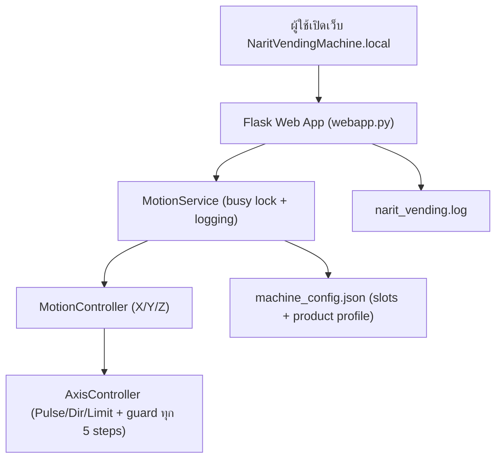
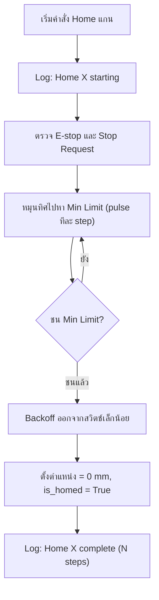
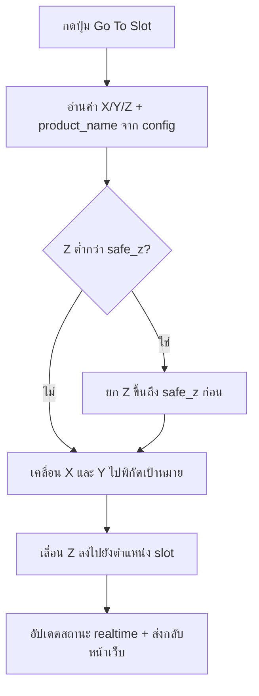

# Narit Vending Machine — Architecture (v2.0)

เอกสารนี้อธิบายโครงสร้าง การทำงาน และ flowchart ของระบบ `Narit Vending Machine` ฉบับสมบูรณ์ อัปเดตตามสถานะโค้ดจริงล่าสุด

---

## ภาพรวมระบบ

ระบบทำงานบน `Raspberry Pi` โดยให้ Pi เป็น `web server` สำหรับควบคุมเครื่องจ่ายสินค้า ผู้ใช้เปิดหน้าเว็บผ่านชื่อเครื่อง `NaritVendingMachine.local` แล้วสั่งงาน `Home`, `Jog`, `Go To Slot`, `Save Slot` และ `Stop` ได้จาก browser หรือเรียกผ่าน REST API โดยตรง

ระบบแบ่งออกเป็น 3 ชั้นหลัก:

- `Motion Control Layer` — ควบคุมมอเตอร์ `X/Y/Z`, limit switch, emergency stop, และตำแหน่ง
- `Command/API Layer` — รับคำสั่งจาก CLI หรือ REST API แล้วส่งต่อไปยัง motion controller
- `Web UI Layer` — แสดงสถานะ realtime และให้ผู้ใช้สั่งงานผ่านหน้าเว็บ

---

## โครงสร้างไฟล์สำคัญ

| ไฟล์ | หน้าที่ |
|---|---|
| `main.py` | จุดเริ่มต้น CLI เรียก `narit_vending.cli.main` |
| `narit_vending/motion.py` | แกนหลัก ควบคุม X/Y/Z, home, move, limit, stop, slot config, logging |
| `narit_vending/webapp.py` | Flask web server, REST API v2.0, CORS, logging, `MotionService` |
| `narit_vending/mqtt_service.py` | MQTT Client Service (LWT Heartbeat, Remote Dispense, Telemetry & Alarm Pub/Sub) |
| `narit_vending/cli.py` | คำสั่ง terminal: `status`, `home`, `jog`, `move`, `goto-slot` |
| `narit_vending/templates/index.html` | โครงสร้างหน้าเว็บควบคุม HMI |
| `narit_vending/static/app.js` | Browser logic สำหรับเรียก API, สปีดซิงค์, ไทม์เมอร์ และอัปเดตสถานะ realtime |
| `narit_vending/static/style.css` | รูปแบบหน้าเว็บ theme blue dark และแอนิเมชันไฟ LED สถานะ |
| `hardware_config.json` | คอนฟิกพินฮาร์ดแวร์ (STEP, DIR, ENABLE, Sensors, LEDs, Comm, MQTT, Accel/Decel) |
| `machine_config.json` | ค่าตำแหน่ง slot 1–30 (รวม product profile) |
| `narit_vending.log` | Log file บันทึกทุก request และ motion error อัตโนมัติ |
| `deploy/narit-vending-web.service` | systemd service สำหรับเริ่มเว็บอัตโนมัติหลังบูต |
| `scripts/setup_pi.sh` | ติดตั้ง dependency, ตั้ง hostname, เปิด service |
| `scripts/deploy_to_pi.ps1` | Deploy จาก Windows ไปยัง Pi ผ่าน SSH |

---

## การทำงานของระบบ MQTT (MQTT System Operation & Architecture)

ระบบควบคุมเครื่องจ่ายสินค้าอัตโนมัตินี้ได้รวมเอา **MQTT Protocol (Message Queuing Telemetry Transport)** เข้ามาเป็นช่องทางสื่อสารหลักแบบสองทาง (Bi-directional Asynchronous Communication) ควบคู่กับ HTTP REST API เพื่อรองรับการทำงานในลักษณะ Industrial IoT (IIoT)

### 1. จุดประสงค์และการประยุกต์ใช้งาน (Use Cases)
- **การสั่งจ่ายสินค้าแบบสตรีมมิง (Remote Dispense)**: รองรับคำสั่งจากเซิร์ฟเวอร์ชำระเงิน (Payment Gateway), ตู้ Kiosk หรือ Mobile App โดยไม่ต้องเปิดพอร์ต HTTP สู่สาธารณะ
- **การเฝ้าระวังสถานะแบบ Real-time (Telemetry Monitoring)**: รายงานพิกัด X/Y/Z, สถานะมอเตอร์, สวิตช์ E-Stop และสถานะไฟแจ้งเตือนกลับไปยัง Cloud Dashboard แบบทันที
- **การแจ้งเตือนเหตุฉุกเฉิน (Instant Alarm Notification)**: ส่งสัญญาณแจ้งเตือนความผิดพลาด (เช่น ชน Limit Switch หรือกดปุ่มหยุดฉุกเฉิน) ด้วย QoS สูงสุดไปยังระบบส่วนกลาง
- **กลไกการตรวจจับตู้ล้มเหลว (Last Will & Testament - LWT)**: เมื่อตู้สูญเสียการเชื่อมต่อหรือไฟดับ Broker จะแจ้งระบบส่วนกลางทันทีว่าตู้ Offline

---

### 2. โครงสร้างและกลไกซอฟต์แวร์ (Software Architecture & Execution Flow)

1. **Background Async Loop**:
   โมดูล `narit_vending/mqtt_service.py` จะถูกเริ่มต้นทำงานทันทีเมื่อ `MotionService` ใน `webapp.py` ถูกสร้าง โดยรันเป็น **Background Daemon Thread** (`paho.mqtt.client.loop_start()`) ทำให้การรับส่งข้อความ MQTT ไม่บล็อกการรันของเว็บเซิร์ฟเวอร์ Flask หรือการสั่งงานมอเตอร์

2. **Thread-Safe Command Execution**:
   คำสั่ง MQTT ทั้งหมดที่เข้ามาใน `_on_message()` จะถูกประมวลผลผ่านเมธอดของ `MotionService` ซึ่งมีการล็อกด้วย `threading.RLock()` ทำให้รับประกันความปลอดภัยของหน่วยความจำและการแย่งกันสั่งมอเตอร์ (Race Condition Protection)

---

### 3. โครงสร้าง Topic และรูปแบบ Payload (Topic Hierarchy & Schemas)

Topic ทั้งหมดอ้างอิงรหัสประจำเครื่องจาก `hardware_config.json` ในรูปแบบ `vending/{machine_id}/...`:

| Topic | Direction | QoS | Retain | คำอธิบาย & ตัวอย่าง Payload |
|---|---|:---:|:---:|---|
| `vending/{id}/heartbeat` | Publish (Pi -> Broker) | 1 | True | **สถานะการเชื่อมต่อ (LWT)**<br/>`{"online": true}` หรือ `{"online": false, "reason": "connection_lost"}` |
| `vending/{id}/status` | Publish (Pi -> Broker) | 1 | True | **สถานะเครื่องและพิกัดแกน (Telemetry)**<br/>`{"busy": false, "status": {"state": "idle", "estop": false, ...}}` |
| `vending/{id}/response` | Publish (Pi -> Broker) | 1 | False | **ผลการประมวลผลคำสั่ง**<br/>`{"cmd": "dispense", "result": {"ok": true, "message": "Machine operation started"}}` |
| `vending/{id}/cmd/dispense` | Subscribe (Broker -> Pi) | 1 | - | **สั่งจ่ายสินค้าตามช่อง**<br/>`{"slot": "5"}` หรือ `{"slot_code": "1"}` |
| `vending/{id}/cmd/speed` | Subscribe (Broker -> Pi) | 1 | - | **ปรับความเร็วมอเตอร์**<br/>`{"speed_mm_s": 45.0}` |
| `vending/{id}/cmd/timer` | Subscribe (Broker -> Pi) | 1 | - | **ตั้งเวลานับถอยหลัง**<br/>`{"duration_s": 60.0}` |
| `vending/{id}/cmd/home` | Subscribe (Broker -> Pi) | 1 | - | **สั่ง Home แกน**<br/>`{"axis": "all"}` หรือ `{"axis": "x"}` |
| `vending/{id}/cmd/stop` | Subscribe (Broker -> Pi) | 2 | - | **สั่งหยุดฉุกเฉิน / Soft Stop ทันที**<br/>`{}` |
| `vending/{id}/cmd/clear_alarm` | Subscribe (Broker -> Pi) | 1 | - | **รีเซ็ตสัญญาณเตือนภัย**<br/>`{}` |

---

### 4. การตั้งค่าคอนฟิกระบบ MQTT (`hardware_config.json`)

สามารถเปิด/ปิด หรือเปลี่ยน Broker ได้ผ่านไฟล์คอนฟิกโดยไม่ต้องแก้ไขโค้ด:

```json
"mqtt": {
  "enabled": true,
  "broker": "broker.emqx.io",
  "port": 1883,
  "client_id": "vending_machine_01",
  "username": "",
  "password": "",
  "topic_prefix": "vending/machine_01",
  "keepalive_s": 60
}
```

---

## ค่าคอนฟิกเครื่อง

ไฟล์ `machine_config.json` เก็บค่าทั้งหมดของระบบ:

- พิน `pulse`, `dir`, `head_limit`, `tail_limit` ของแต่ละแกน
- `steps_per_mm`, `max_travel_mm`, `max_speed_mm_s`, `default_speed_mm_s`, `jog_step_mm`
- ลำดับการ `home` (`home_order`)
- ตำแหน่ง `slot 1–30` พร้อม Product Profile

### สรุปแกน

| Axis | Pulse Pin | Dir Pin | Min Limit | Max Limit | Steps/mm | Max Travel (mm) |
|---|---:|---:|---:|---:|---:|---:|
| X | 16 | 23 | 17 | 27 | 80.0 | 220.0 |
| Y | 26 | 24 | 22 | 9 | 80.0 | 260.0 |
| Z | 18 | 25 | 11 | 5 | 50.0 | 200.0 |

### โครงสร้าง Slot (v2.0)

```json
"5": {
  "x_mm": 45.0,
  "y_mm": 20.0,
  "z_mm": 5.0,
  "product_name": "น้ำดื่ม",
  "dispense_delay_ms": 800
}
```

- `product_name` — ชื่อสินค้าในช่องนั้น (ค่าเริ่มต้น `""`)
- `dispense_delay_ms` — เวลาหน่วงสำหรับการ dispense (ค่าเริ่มต้น `0`)
- ค่าเริ่มต้นพิกัดทุก slot คือ `X=0`, `Y=0`, `Z=0`

---

## Classes ใน motion.py

### Exception Classes

| Class | สืบทอดจาก | เกิดเมื่อ |
|---|---|---|
| `MotionError` | RuntimeError | ข้อผิดพลาดทั่วไปของ motion |
| `LimitTriggeredError` | MotionError | ชน limit switch |
| `EmergencyStopError` | MotionError | E-Stop ถูกกด |
| `NotHomedError` | MotionError | สั่ง move_to_mm โดยยังไม่ home |
| `StopRequestedError` | MotionError | ผู้ใช้กด Stop บนหน้าเว็บ |

### Data Classes

| Class | ฟิลด์สำคัญ | หมายเหตุ |
|---|---|---|
| `AxisConfig` | pulse_pin, dir_pin, steps_per_mm, max_travel_mm, max_speed_mm_s, default_speed_mm_s | frozen=True |
| `SlotPosition` | code, x_mm, y_mm, z_mm, product_name, dispense_delay_ms | frozen=True, v2.0 |
| `MachineConfig` | x, y, z, home_order, slots, safe_z_mm | frozen=True |

### AxisController

ควบคุมมอเตอร์ทีละแกน

| เมธอด | หน้าที่ |
|---|---|
| `move_steps(steps, direction, speed_mm_s)` | ปล่อย pulse ตามจำนวน steps + คำนวณความเร็ว (หน่วงเวลา) อัตโนมัติ |
| `move_mm(distance_mm, speed_mm_s)` | แปลง mm → steps แล้วเรียก move_steps |
| `move_to_mm(target_mm, speed_mm_s)` | เคลื่อนไปตำแหน่งสัมบูรณ์ (ต้อง home ก่อน) |
| `home(backoff_steps, max_steps)` | Home แกน + บันทึก log start/complete |
| `stop()` | ปิด pulse ทันที |
| `status()` | คืนค่า position, homed, limit, estop |
| `_guard_before_move()` | ตรวจสอบก่อนเริ่มเคลื่อน |
| `_guard_during_move()` | ตรวจสอบระหว่างเคลื่อน (ทุก **5 steps**) |

### MotionController

รวมการควบคุมแกนทั้งสาม

| เมธอด | หน้าที่ |
|---|---|
| `axes()` | คืน `{"x": ..., "y": ..., "z": ...}` |
| `home_axis(axis_name)` | Home แกนเดียว |
| `home_all()` | Home ทุกแกนตาม home_order |
| `move_to(x_mm, y_mm, z_mm, speed_mm_s)` | เคลื่อนไปพิกัดสัมบูรณ์ (X→Y→Z ตามลำดับ) |
| `move_by_mm(x, y, z, speed_mm_s)` | เคลื่อนสัมพัทธ์จากตำแหน่งปัจจุบัน |
| `move_to_slot(slot_code)` | ยก Z → เคลื่อน X/Y → ลง Z ไปยัง slot |
| `update_slot(code, x, y, z, product_name, dispense_delay_ms)` | อัปเดตพิกัด + product profile (คง field เดิมถ้าไม่ส่งมา) |
| `request_stop()` | ตั้ง flag stop ทุกแกน |
| `clear_stop()` | ล้าง flag stop |
| `current_position()` | คืนตำแหน่งปัจจุบัน {x_mm, y_mm, z_mm} |
| `status()` | คืน estop, แกน X/Y/Z status, current_position |
| `emergency_stop_active()` | ตรวจสอบ E-Stop |

---

## กลไกความปลอดภัย

1. **E-Stop** — ตรวจก่อนและระหว่างการเคลื่อนที่
2. **Soft Stop Request** — จากปุ่ม SOFT STOP บนหน้าเว็บ (ไม่ block HTTP thread, มอเตอร์หยุดแต่ไม่ตัดไฟ)
3. **Limit Switch Min/Max** — ตรวจทั้ง head และ tail limit
4. **Software Travel Limit** — จาก `max_travel_mm` ใน config
5. **Guard ทุก 5 steps** — ตรวจสอบระหว่างเคลื่อนที่ถี่ขึ้น 4× (จากเดิม 20 steps)
6. **RLock** — ป้องกัน 2 คำสั่ง motion รันพร้อมกัน
7. **Input Validation** — ทุก endpoint ตรวจ field และ type ก่อนส่งให้ controller

---

## MotionService Methods (webapp.py)

| เมธอด | หน้าที่ |
|---|---|
| `status_payload()` | ส่งสถานะทั้งหมด (busy, last_error, slots, position) |
| `_run(fn)` | รัน fn ใน RLock + จัดการ exception + log error |
| `stop()` | สั่ง stop ทันที (ไม่ใช้ lock — ทำงานได้ขณะ busy) |
| `home_axis(axis)` | Home แกนเดียว |
| `home_all()` | Home ทุกแกน |
| `jog(axis, distance_mm)` | Jog แกนเดียวด้วยระยะทาง |
| `move_to(x, y, z)` | เคลื่อนไปพิกัด absolute |
| `move_to_slot(slot_code)` | ไปยัง slot |
| `save_slot(code, x, y, z, product_name, dispense_delay_ms)` | บันทึกพิกัด + product profile |
| `save_slot_from_current(code)` | บันทึกตำแหน่งปัจจุบันเป็น slot |
| `get_slot(code)` | ดึงข้อมูล slot เดียว (พร้อม product profile) |
| `reset_slot(code)` | Reset พิกัด → 0,0,0 (คง product_name ไว้) |
| `get_config()` | ดึง MachineConfig ทั้งหมด |
| `is_axis_homed(axis)` | เช็กว่าแกนนั้น home แล้วหรือยัง |
| `is_all_homed()` | เช็กทุกแกนพร้อมกัน + `all_homed` flag |

---

## REST API Endpoints (v2.0)

### พื้นฐาน

| Method | Endpoint | หน้าที่ |
|---|---|---|
| `GET` | `/api/ping` | เช็กการเชื่อมต่อ → `{ "ok": true, "message": "pong" }` |
| `GET` | `/api/status` | สถานะทั้งหมด (busy, position, slots, estop) |
| `GET` | `/api/config` | ค่าคอนฟิกแกน X/Y/Z |

### Home

| Method | Endpoint | หน้าที่ |
|---|---|---|
| `POST` | `/api/home/x` | Home แกน X |
| `POST` | `/api/home/y` | Home แกน Y |
| `POST` | `/api/home/z` | Home แกน Z |
| `POST` | `/api/home/all` | Home ทุกแกน |
| `GET` | `/api/home/<axis>/check` | เช็ก Home แกนเดียว (x, y, z) |
| `GET` | `/api/home/all/check` | เช็ก Home ทั้ง 3 แกนพร้อมกัน |

### การเคลื่อนที่

| Method | Endpoint | Body | หน้าที่ |
|---|---|---|---|
| `POST` | `/api/jog` | `{"axis": "x", "distance_mm": 10, "speed_mm_s": 20}` | Jog แกนเดียว (ระบุ speed_mm_s หรือ time_s ได้) |
| `POST` | `/api/move` | `{"x_mm": 10, "y_mm": 20, "time_s": 5}` | เคลื่อนไปพิกัด absolute (ระบุ speed_mm_s หรือ time_s ได้) |
| `POST` | `/api/stop` | — | หยุดทันที |

### Slot Management

| Method | Endpoint | Body | หน้าที่ |
|---|---|---|---|
| `GET` | `/api/slots` | — | ดึงข้อมูลทุก slot |
| `GET` | `/api/slots/<code>` | — | ดึงข้อมูล slot เดียว |
| `POST` | `/api/slots/<code>/goto` | — | เคลื่อนไปยัง slot |
| `POST` | `/api/slots/<code>/save-current` | — | บันทึกตำแหน่งปัจจุบัน |
| `POST` | `/api/slots/<code>` | `{"x_mm", "y_mm", "z_mm", "product_name", "dispense_delay_ms"}` | บันทึกพิกัด + product profile |
| `POST` | `/api/slots/<code>/reset` | — | Reset พิกัด → 0,0,0 |
| `DELETE` | `/api/slots/<code>` | — | ลบพิกัด (reset → 0,0,0) |

### Convention ของ Response

ทุก endpoint คืน `"ok": true/false` เสมอ พร้อม HTTP status code:

```json
{ "ok": true, ... }      ← สำเร็จ (HTTP 200)
{ "ok": false, "error": "..." }  ← ผิดพลาด (HTTP 400)
```

---

## Logging (v2.0)

- บันทึกลงไฟล์ `narit_vending.log` + stdout พร้อมกัน
- Format: `2026-07-17 14:41:00 [INFO] narit_vending.webapp: GET /api/status`
- Log ที่บันทึก:
  - ทุก HTTP request (method + path)
  - Home axis start และ complete (พร้อมจำนวน steps)
  - Motion error ทุกครั้ง (WARNING)
  - เริ่มต้น server

---

## CORS (v2.0)

เปิด CORS ทุก endpoint อัตโนมัติ:

```
Access-Control-Allow-Origin: *
Access-Control-Allow-Methods: GET, POST, DELETE, OPTIONS
Access-Control-Allow-Headers: Content-Type
```

---

## Flowchart ภาพรวมคำสั่งจากหน้าเว็บ



## Flowchart การ Home แกน



## Flowchart การไปยัง Slot



---

## ลำดับการเริ่มระบบ

1. Raspberry Pi บูตขึ้น
2. `systemd` เรียก `narit-vending-web.service`
3. service สั่ง Python ใน venv รัน `narit_vending.webapp`
4. `logging.basicConfig` ตั้งค่า log → ไฟล์ + stdout
5. `Flask` โหลด `machine_config.json` และสร้าง `MotionController`
6. Log: `Narit Vending starting — host=0.0.0.0 port=80`
7. ผู้ใช้เปิด `http://NaritVendingMachine.local/`
8. `app.js` เริ่ม poll `GET /api/status` ทุก 500 ms

---

## ข้อสังเกตและแผนพัฒนาต่อ

- [ ] **Worker Thread** — ถ้า motion ใช้เวลานาน ควรแยกเป็น background thread แบบ proper queue
- [ ] **Dispense Sequence** — ใช้ `dispense_delay_ms` ที่เก็บไว้ใน slot เพื่อ automate การจ่ายสินค้า
- [ ] **Dispense History** — บันทึกประวัติการจ่ายสินค้า (slot, เวลา, สำเร็จ/ล้มเหลว)
- [ ] **Auto-Home on Startup** — option `--auto-home` ใน service
- [ ] **Config Hot-Reload** — `POST /api/config/reload` โดยไม่ต้องรีสตาร์ท service
- [ ] **ทดสอบ** `steps_per_mm`, `home_direction`, และ `max_travel_mm` กับเครื่องจริงเสมอ

---

## เอกสารที่เกี่ยวข้อง

- [README.md](README.md)
- [API_DOCS.html](API_DOCS.html) — เอกสาร REST API ฉบับสมบูรณ์
- [ARCHITECTURE.html](ARCHITECTURE.html) — เอกสารนี้ในรูปแบบ HTML
- [machine_config.json](machine_config.json)
- [motion.py](narit_vending/motion.py)
- [webapp.py](narit_vending/webapp.py)
