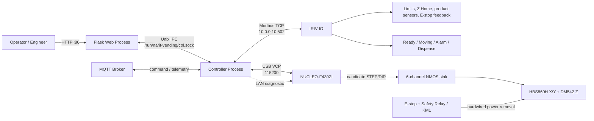
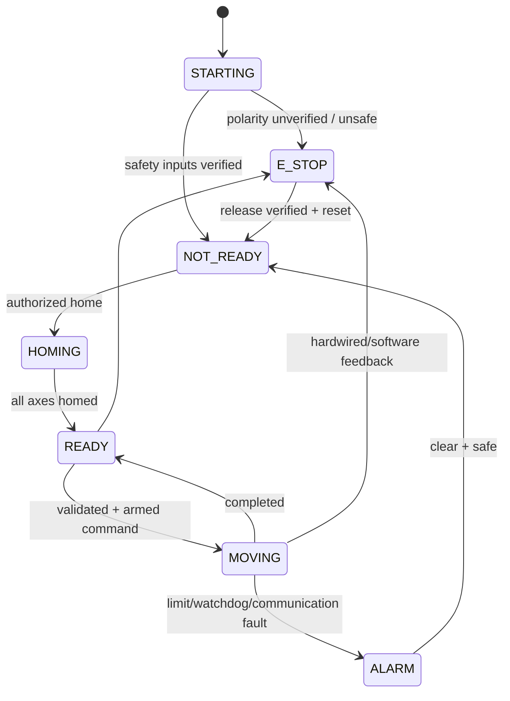

# NARIT Vending — Architecture และสถานะส่งต่องาน

อัปเดต: 3 กันยายน 2026  
สถานะเอกสาร: **แหล่งอ้างอิงหลักของระบบ IRIV + NUCLEO ชุดปัจจุบัน**

เอกสารนี้แทนคำอธิบายรุ่นเก่าที่ใช้ Raspberry Pi GPIO, Galil DMC-4143 หรือ FX5U
สำหรับเครื่องที่กำลัง commission อยู่ หากเอกสารอื่นขัดกับฉบับนี้ ให้หยุดและตรวจ wiring
กับผู้รับผิดชอบก่อน ห้ามเลือกข้อมูลที่สะดวกแล้วสั่ง motion

## 1. Executive status

| ส่วน | สถานะจริง |
|---|---|
| IRIV PiControl | Online, `192.168.70.80`, hostname `iriv` |
| HMI/API | Online ที่ `http://iriv.local/` |
| Controller service | `narit-vending-controller-iriv.service` active |
| Web service | `narit-vending-web-iriv.service` active |
| IRIV IO | Online, Modbus TCP `10.0.0.10:502`, Unit ID `255` |
| Nucleo USB | Online ผ่าน ST-LINK VCP 115200 baud |
| Nucleo LAN | Online, `192.168.70.81`; ping ผ่าน |
| Firmware ที่รันบน Nucleo | safe-link protocol v1, communication only, ไม่มี motion command |
| Motion firmware v2 | Build ผ่านแล้ว เป็น candidate เท่านั้น ยังไม่ flash |
| Machine state | `E_STOP`, ทุกแกนยังไม่ Home, ไม่มี active command |
| การอนุญาตเคลื่อนที่ | **ยังไม่อนุญาต** |

## 2. System context



เส้นประคือเส้นทางที่ยังไม่อนุญาตให้ใช้ควบคุม motion จริง ปัจจุบัน Controller ใช้ Nucleo
เป็น health/readiness gate เท่านั้น และ runtime ยังไม่ส่ง `ARM`/`MOVE` ไปยัง Nucleo

## 3. Network และ transport

| Network | Interface/device | Address | หน้าที่ |
|---|---|---|---|
| Management | IRIV Pi `eth0` | `192.168.70.80/24` | HMI, SSH, deployment, MQTT |
| Management | Nucleo LAN | `192.168.70.81/24` | link/diagnostic เท่านั้น |
| OT | IRIV Pi `eth1` | `10.0.0.2/24` | Modbus TCP |
| OT | IRIV IO | `10.0.0.10/24` | DI0–DI10, DO0–DO3 |
| USB | Nucleo ST-LINK VCP | stable `/dev/serial/by-id/...-if02` | identity/status; control ในอนาคต |

หลักการเลือก transport:

- ใช้ USB serial เป็น control/heartbeat หลัก เพราะผูกกับ device identity ได้แน่นอน
- ใช้ Nucleo LAN สำหรับ diagnostic และ redundancy ในอนาคต ไม่ใช่ control path พร้อมกัน
- ต้องมี control owner เพียงหนึ่งเดียว ห้าม USB และ LAN ส่ง motion command แข่งกัน
- การขาด IRIV IO หรือ Nucleo heartbeat ต้องทำให้ motion ถูก reject/stop แบบ fail-safe

## 4. Application architecture

ระบบบน IRIV Pi แบ่งเป็นสอง process:

```text
Browser / REST ──> Web Process ──> Unix IPC ──> Controller Process
MQTT ─────────────────────────────────────────> Command Bus
                                                ├─ Safety Interlock
                                                ├─ State Machine
                                                ├─ IRIV IO backend
                                                └─ Nucleo health link
```

### Web Process

- ให้บริการ HMI, static files และ REST API
- ไม่เป็นเจ้าของ GPIO, Modbus, serial หรือ MQTT motion execution
- ส่งคำสั่งไป Controller ผ่าน Unix IPC เท่านั้น
- Controller ติดต่อไม่ได้ต้องตอบ 503 และห้ามแสดง READY จากข้อมูลเก่า

### Controller Process

- เป็นเจ้าของ `CommandBus`, `SafetyInterlock`, `StateMachine`, MQTT และ hardware backends
- บังคับ single-flight command execution
- STOP/E-STOP ต้องไม่รอท้าย normal command queue
- สร้าง snapshot กลางชุดเดียวให้ Web/MQTT ใช้

### ข้อจำกัด runtime ปัจจุบัน

- `narit_vending/nucleo.py` ตรวจเฉพาะ `PING/STATUS`; ยังไม่ใช่ motion backend
- `motion.py` ยังมี gpiozero axis implementation จาก architecture เดิม
- `hardware_config.iriv.json` ตั้ง motion backend เป็น mock เพื่อไม่ขับ GPIO ของ Pi
- `NaritVendingV1/narit_vending/nucleo_io.py` เป็นไฟล์ทดลองที่มี `MOVE` แบบไม่ครบ safety
  **ห้ามนำมา wire เข้าระบบหรือ deploy เป็น motion owner**

## 5. Hardware mapping ที่ยืนยันล่าสุด

### Nucleo STEP/DIR

| Axis | STEP/PULSE | DIR | Driver |
|---|---|---|---|
| X | `PA8 / TIM1_CH1` | `PB0` | HBS860H X |
| Y | `PA9 / TIM1_CH2` | `PB1` | HBS860H Y |
| Z | `PA5 / TIM2_CH1` | `PB2` | DM542 Z |

ทุกสัญญาณผ่าน NMOS open-drain/sink ไปยัง `PUL-`/`DIR-`; `PUL+`/`DIR+` ใช้ field
voltage ตาม wiring ล่าสุด ต้องตรวจ input rating ของ driver จริงก่อนจ่าย pulse

`PB0` ชนกับ LED1 ของ Nucleo ดังนั้น motion source ปิด BSP LED init/toggle และไม่เริ่ม
HTTP LED demo เพื่อไม่ให้ X-DIR เปลี่ยนโดยไม่ตั้งใจ

### IRIV IO digital inputs

| DI | Software name | Field signal |
|---|---|---|
| 0 | `x_head_limit` | X Min |
| 1 | `x_tail_limit` | X Max |
| 2 | `y_head_limit` | Y Min |
| 3 | `y_tail_limit` | Y Max |
| 4 | `z_head_limit` | Z Min |
| 5 | `z_tail_limit` | Z Max |
| 6 | `z_home` | Z Home |
| 7 | `product_drop_parking` | Product Drop Parking |
| 8 | `product_drop_sensor` | Product Drop Sensor |
| 9 | `product_pickup_sensor` | Product Pickup Sensor |
| 10 | `estop` | E-stop / safety relay feedback |

ค่าที่อ่านล่าสุด: DI0–DI9 OFF, DI10 ON แต่ polarity ของ DI10 ยังไม่ยืนยันสองสถานะ
จึงตั้ง `polarity_verified=false` และ backend บังคับ E-stop active อยู่เสมอ

### IRIV IO digital outputs

| DO | หน้าที่ | Safe state |
|---|---|---|
| 0 | Ready | OFF |
| 1 | Moving | OFF |
| 2 | Alarm | OFF ที่ระดับ output; policy อาจสั่ง ON เมื่อ fault |
| 3 | Dispense relay | OFF |

IRIV IO เป็น SSR auxiliary output ห้ามใช้สร้าง STEP/DIR

## 6. Firmware states

### Deployed safe-link v1

- รองรับ `PING` และ `STATUS`
- รายงาน identity `NUCLEO-F439ZI`, protocol `1`, `safe=true`
- ไม่มีข้อความ/คำสั่ง `MOVE`
- SHA-256 ของ image ที่ deploy:
  `D1E82B1504A341C833FB9B2AC656DB85E0901158683035485E7F6BCAB34DFDA8`

### Motion candidate v2 — ยังไม่ flash

ไฟล์ `firmware/nucleo_f439zi/nucleo_f439zi_motion_candidate_v2.bin`

- boot แบบ disarmed และบังคับ STEP/DIR LOW
- ต้องรับ `ARM SAFE` ก่อน `MOVE`
- ต้องรับ `HEARTBEAT SAFE` ต่อเนื่อง
- watchdog ขาดเกิน 500 ms จะ stop และ disarm
- `HEARTBEAT UNSAFE`, `STOP`, `DISARM` หยุดทันที
- จำกัด 10–1000 Hz, 1–10000 steps และไม่รับหลายแกนพร้อมกัน
- SHA-256:
  `7D0575A0A32CF320CD30547A1F8BD8044735DB32DD6BF32114A41FA116270944`

watchdog นี้เป็น operational stop ไม่ใช่ safety-rated stop

## 7. Safety invariants

1. E-stop ต้องตัด power/enable ของ driver แบบ hardwired โดยไม่พึ่ง Pi, network หรือ firmware
2. ห้าม auto-home, auto-jog หรือ auto-move ตอน boot/restart/deploy/test
3. ข้อมูล safety ที่ stale, offline, polarity ไม่ทราบ หรือ config invalid ต้องเท่ากับ unsafe
4. ทุกคำสั่งจาก HMI/API/MQTT ต้องผ่าน CommandBus และ SafetyInterlock เดียวกัน
5. ต้องตรวจ limit ก่อนและระหว่าง motion; ห้ามใช้ software soft limit แทน physical limit
6. หลัง E-stop, reset, watchdog หรือ communication loss ต้อง disarm และ Home ใหม่
7. ห้ามเปลี่ยน pin/polarity/direction/steps-per-mm จากการเดา
8. CI/unit test ใช้ mock เท่านั้นและต้องไม่มีคำสั่งถึง hardware จริง

Safety gap ที่ยังค้าง: wiring ล่าสุดให้ KM1 ตัด 60 V ของ X/Y แต่ 24 V ของ Z/DM542
ยังไม่ผ่าน KM1 จึงยังไม่ผ่าน production enablement gate

## 8. State และ command flow



`service_ready=true` หมายถึง software process พร้อมตอบ ไม่ได้หมายความว่าเครื่องพร้อมเคลื่อน
ต้องดู `machine_ready`, E-stop, alarms, communication freshness และ homed state ร่วมกัน

## 9. Configuration ownership

| File | หน้าที่ |
|---|---|
| `machine_config.iriv.json` | travel, speed, homing order, Safe Z, slots |
| `hardware_config.iriv.json` | IRIV IO, Nucleo link และ backend selection |
| `NaritVendingV1/` | profile ที่ deploy ไป `/home/admin/NaritVendingV1` |
| `narit_vending/` | repository-level source |
| `NaritVendingMOCKUP/` | profile เครื่อง mockup เดิม ไม่ใช่ wiring IRIV ปัจจุบัน |

เมื่อแก้ repository-level source ต้อง sync profile อย่างระมัดระวังและ review diff ก่อน deploy
ห้ามให้ไฟล์ mockup ทับ IRIV config

## 10. Deployment และ rollback

ปลายทางจริง:

```text
SSH: pi@iriv.local
Application: /home/admin/NaritVendingV1
Config: /home/admin/NaritVendingV1/hardware_config.iriv.json
Services: narit-vending-controller-iriv.service
          narit-vending-web-iriv.service
```

backup ล่าสุดก่อนเปลี่ยน IRIV mapping:

```text
/home/admin/NaritVending_backups/config_20260903_0413/
```

full Nucleo flash backup:

```text
Local: backups/nucleo/nucleo_f439zi_flash_before_serial_20260902_093645.bin
Pi:    /home/admin/NaritVending_backups/nucleo/nucleo_f439zi_flash_before_serial_20260902_093645.bin
SHA-256: 8af1dd070799844271c25ea3206333722750606e8c2fbdb984c26e5e26e4aef7
```

ห้ามแสดงหรือคัดลอก `/etc/narit-vending.env` ลง log/repository/handoff

## 11. Verification commands (read-only)

```powershell
ssh pi@iriv.local "systemctl is-active narit-vending-controller-iriv.service narit-vending-web-iriv.service"
ssh pi@iriv.local "curl -fsS http://127.0.0.1/api/status"
ssh pi@iriv.local "curl -fsS http://127.0.0.1/health/ready"
ssh pi@iriv.local "ping -c 2 192.168.70.81"
```

local tests ที่ผ่านล่าสุด:

```powershell
.\.venv\Scripts\python.exe -m unittest tests.test_iriv_io tests.test_config_foundation tests.test_nucleo -v
```

ผลล่าสุด 16 tests ผ่าน และ STM32 Release build สำเร็จ (`text=59452`, `data=136`,
`bss=71128`) โดยไม่ได้ flash และไม่ได้ส่ง motion command

## 12. Production enablement gate

ต้องครบทุกข้อก่อน flash/arm/move:

- [ ] อ่าน DI10 ขณะ E-stop ปล่อยและกด แล้วยืนยัน polarity
- [ ] ปรับ `active_state` และ `polarity_verified=true` หลังมีหลักฐานสองสถานะ
- [ ] ให้ safety relay/KM1 ตัดกำลังหรือ enable ของ X, Y และ Z ครบ
- [ ] ตรวจ driver input voltage/current และ NMOS polarity ด้วย dummy load
- [ ] Scope PA8, PA9, PA5 และ PB0, PB1, PB2 โดยยังถอด driver/motor load
- [ ] เพิ่ม Nucleo motion backend ใน Controller; ห้ามใช้ไฟล์ทดลอง `nucleo_io.py`
- [ ] ผูก ARM/heartbeat กับ IRIV IO safety state แบบ fail-safe
- [ ] เพิ่ม limit-stop ระหว่าง pulse และทดสอบ watchdog/USB loss
- [ ] ทดสอบทีละแกนที่ความเร็วต่ำ/ระยะสั้นโดยมีผู้ควบคุม E-stop
- [ ] Calibrate direction, steps/mm, min/max/home และ soft limits
- [ ] ผ่าน HOME/JOG/STOP/E-STOP/power-cycle acceptance test
- [ ] จึงเปิด automatic slot/dispense sequence

## 13. งานถัดไปตามลำดับ

1. ทำ DI10 two-state commissioning โดยไม่ขยับมอเตอร์
2. แก้ hardwired safety gap ของ Z
3. ออกแบบ Nucleo backend ที่เป็น owner เดียวและมี heartbeat thread
4. เพิ่ม Z Home แยกจาก Z Min ใน homing model
5. เพิ่ม product sensor logic DI7–DI9 และ dispense verification
6. bench scope firmware candidate แบบ driver disconnected
7. review/commit dirty worktree เป็นชุดย่อย พร้อมเก็บ backup
8. ทำ controlled low-speed motion acceptance test

## 14. เอกสารส่งต่อ

- [HANDOFF_CURRENT_TH.md](HANDOFF_CURRENT_TH.md) — จุดเริ่มต้นสำหรับผู้รับช่วง
- [IRIV_WIRING_TH.md](IRIV_WIRING_TH.md) — wiring summary ล่าสุด
- [STM32_NMOS_CURRENT_WIRING_TH.md](STM32_NMOS_CURRENT_WIRING_TH.md) — connector/NMOS details
- [API_DOCS.md](API_DOCS.md) — REST API reference; ต้องตรวจ endpoint กับ runtime ก่อนใช้
- [CLAUDE_MQTT_HANDOFF.md](CLAUDE_MQTT_HANDOFF.md) — MQTT background; บางส่วนเป็นข้อมูลรุ่นเดิม

