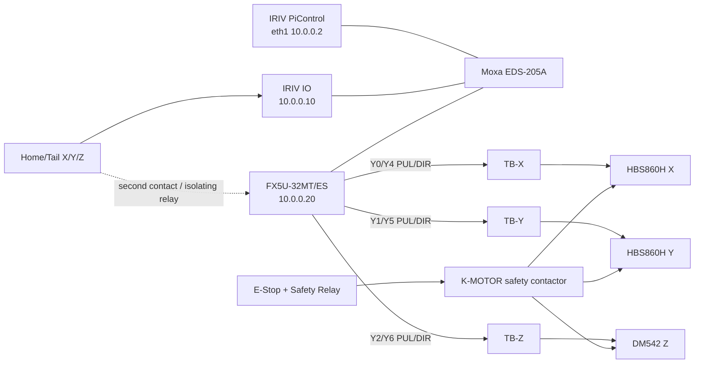
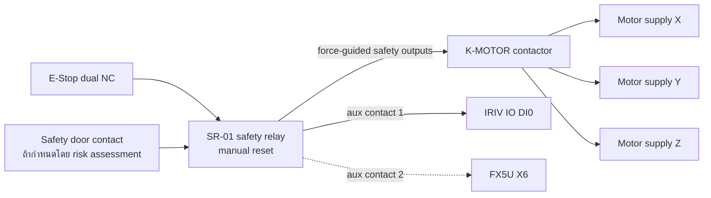

# NARIT Vending — ผังต่อชั่วคราว FX5U-32MT/ES

เอกสารนี้กำหนดการต่อชั่วคราวสำหรับ `FX5U-32MT/ES` เพื่อสร้างสัญญาณ
`PULSE/SIGN` ให้ HBS860H แกน X/Y และ DM542 แกน Z ก่อนเปลี่ยนเป็น
`AS218TX-A` ในอนาคต IRIV PiControl ยังคงเป็น HMI/API/MQTT host และ IRIV IO
รับสถานะ field I/O

> ใช้ได้เฉพาะ `FX5U-32MT/ES` แบบ transistor sink ห้ามใช้ `FX5U-32MR/ES`
> แบบ relay สร้าง pulse ตรวจรหัสเต็มบนป้ายก่อนต่อสาย

> ตัดไฟและทำ Lockout/Tagout ก่อนทำงาน วงจร E-Stop ต้อง hardwired ผ่าน safety
> relay/contactor และต้องตัดการเคลื่อนที่ได้โดยไม่พึ่ง PLC, IRIV, Ethernet หรือ software

## 1. ภาพรวม

เส้นประคือ local limit copy ที่ต้องเพิ่มก่อน production เพื่อให้ PLC หยุด pulse ได้เอง
เมื่อ IRIV/Modbus/Ethernet ขัดข้อง

## 2. ไฟเลี้ยงและกราวด์

| From | To | กฎ |
|---|---|---|
| AC branch ผ่าน breaker/fuse | FX5U `L`, `N` | ใช้แรงดันตามป้ายรุ่น `/ES`; ต่อ protective earth ตามคู่มือ |
| PS-01 `+24V` ผ่าน fuse | IRIV PiControl, IRIV IO, Moxa | แยก branch fuse |
| PS-SIG `+24V` ผ่าน fuse | บัส `+24V-PULSE` | ใช้กับ PUL/DIR หลังยืนยันว่า driver lot จริงรับ 24 V |
| PS-SIG `0V` | PLC `COM0`, `COM1` และบัส `0V-SIGNAL` | สำหรับ transistor sink output |
| Cabinet PE | PLC/IRIV enclosure, driver chassis, motor frames, shield clamp | ห้ามใช้ PE แทน 0 V |

หาก driver ตัวจริงรับเฉพาะ 5 V ให้เปลี่ยน `PS-SIG` เป็น regulated 5 V และตรวจ
input-current/response-time ตามคู่มือ FX5U และ driver ก่อนใช้งาน ห้ามป้อน 24 V โดยอนุมาน

## 3. Ethernet

| Cable | From | To |
|---|---|---|
| NET-OT-01 | IRIV `eth1`, `10.0.0.2/24` | Moxa |
| NET-OT-02 | IRIV IO, `10.0.0.10/24` | Moxa |
| NET-OT-04 | FX5U, proposed `10.0.0.20/24` | Moxa |

ไม่ตั้ง default gateway บน OT network IRIV ส่งคำสั่งระดับสูง เช่น `HOME`, `MOVE`,
`STOP` และอ่าน status ผ่าน protocol ที่กำหนดใน PLC program; PLC เป็นเจ้าของ trajectory,
acceleration, pulse count และ motion fault latch

## 4. FX5U pulse/direction ไป terminal marshalling

ตั้ง positioning output mode เป็น `PULSE/SIGN` ใน GX Works3

| Wire | FX5U output | Marshalling terminal | หน้าที่ |
|---|---|---|---|
| W200 | `Y0` | TB-X `PUL-` | X pulse sink |
| W201 | `Y4` | TB-X `DIR-` | X direction sink |
| W210 | `Y1` | TB-Y `PUL-` | Y pulse sink |
| W211 | `Y5` | TB-Y `DIR-` | Y direction sink |
| W220 | `Y2` | TB-Z `PUL-` | Z pulse sink |
| W221 | `Y6` | TB-Z `DIR-` | Z direction sink |
| W230 | `+24V-PULSE` | TB-X/TB-Y/TB-Z `PUL+` และ `DIR+` | Common-anode signal supply |
| W231 | `0V-SIGNAL` | FX5U `COM0` | Common ของ Y0-Y3 |
| W232 | `0V-SIGNAL` | FX5U `COM1` | Common ของ Y4-Y7 |

`Y3/Y7` สำรองสำหรับแกนที่ 4 ห้ามใช้เป็น auxiliary output หากต้องการเก็บทางย้ายระบบ

## 5. Terminal marshalling ไป driver

| Terminal | Driver terminal |
|---|---|
| TB-X `PUL+ / PUL-` | HBS860H-X `PUL+ / PUL-` |
| TB-X `DIR+ / DIR-` | HBS860H-X `DIR+ / DIR-` |
| TB-Y `PUL+ / PUL-` | HBS860H-Y `PUL+ / PUL-` |
| TB-Y `DIR+ / DIR-` | HBS860H-Y `DIR+ / DIR-` |
| TB-Z `PUL+ / PUL-` | DM542-Z `PUL+ / PUL-` |
| TB-Z `DIR+ / DIR-` | DM542-Z `DIR+ / DIR-` |

ต่อสาย PUL/DIR เป็น shielded twisted pair เดินแยกจาก motor power และต่อ shield ที่
cabinet PE ด้านเดียว

สงวน TB-X/Y/Z `ENA+ / ENA-` ไว้แต่ยังไม่ต่อกับ `Y10/Y11/Y12` จนกว่าจะยืนยันจาก
คู่มือ/การวัดของ driver แต่ละล็อตว่า ENA เป็น run-enable หรือ disable input และกำหนด
de-energized safe state ได้ถูกต้อง Software enable ไม่ใช่วงจร safety

## 6. Limit และ safety feedback เข้า IRIV IO

| Wire | IRIV IO | Field contact | Normal |
|---|---|---|---|
| W001 | DI0 | SR-01 safety-ready auxiliary | ON=safe, OFF=trip/wire break |
| W002 | DI1 | X home/head limit | OFF |
| W003 | DI2 | X tail limit | OFF |
| W004 | DI3 | Y home/head limit | OFF |
| W005 | DI4 | Y tail limit | OFF |
| W006 | DI5 | Z home/head limit | OFF |
| W007 | DI6 | Z tail limit | OFF |
| W008 | DI7 | HBS860H-X alarm healthy ผ่าน interface relay | ON=healthy |
| W009 | DI8 | HBS860H-Y alarm healthy ผ่าน interface relay | ON=healthy |
| W010 | DI9 | DM542-Z alarm | Reserved หากรุ่นจริงไม่มี alarm output |
| W011 | DI10 | Door-safe contact | ON=safe |

IRIV IO ใช้ isolated 24 V active-high ตาม S/S และ DCOM ในคู่มือ ห้ามนำ 24 V เข้า
Nucleo/Raspberry Pi GPIO

### Local limit copy ที่ต้องมีสำหรับ production

Limit ที่อยู่เฉพาะ IRIV IO ไม่สามารถหยุด FX5U แบบ deterministic เมื่อ Modbus หรือ Ethernet
ขาด ให้ใช้ sensor สอง contact หรือ isolating relay ที่มี contact แยก ดังนี้:

| Field limit copy | FX5U input | หน้าที่ local |
|---|---|---|
| X home second contact | `X0` | X reverse/home stop |
| X tail second contact | `X1` | X forward stop |
| Y home second contact | `X2` | Y reverse/home stop |
| Y tail second contact | `X3` | Y forward stop |
| Z home second contact | `X4` | Z reverse/home stop |
| Z tail second contact | `X5` | Z forward stop |
| SR-01 second auxiliary | `X6` | PLC motion permissive feedback |
| Door second safe contact | `X7` | PLC motion permissive feedback |

ห้ามต่อ input ของ IRIV IO และ FX5U ขนานกันตรง ๆ หาก common/isolated-domain ต่างกัน
ให้แยกด้วย dual-contact sensor หรือ interposing relay

## 7. E-Stop hardwired

FX5U-32MT/ES ไม่ใช่ safety PLC การกด E-Stop ต้องตัด drive torque/power ตามผล risk
assessment โดยไม่พึ่ง PLC หลัง reset ต้องอยู่ NOT_READY, clear fault โดยเจตนา และ Home ใหม่

## 8. IRIV IO auxiliary outputs

| IRIV IO | Load |
|---|---|
| DO0 | Ready green lamp |
| DO1 | Moving yellow lamp |
| DO2 | Alarm red lamp/buzzer ผ่าน relay หากจำเป็น |
| DO3 | K-DISP interposing relay |

ห้ามใช้ DO0-DO3 สร้าง PULSE/DIR/ENABLE

## 9. เงื่อนไขก่อนจ่าย pulse

- ยืนยันป้าย PLC เป็น `FX5U-32MT/ES` ไม่ใช่ `MR` หรือ source-output `/ESS`
- ยืนยัน HBS860H ทั้งสองตัวและ DM542 lot จริงรับ 24 V PUL/DIR
- ตรวจ `COM0/COM1`, polarity และ continuity แบบไม่ต่อ driver
- ตรวจ pulse ด้วย oscilloscope ที่ TB-X/Y/Z โดยใช้ dummy optocoupler/test load
- GX Works3 ต้องกำหนด axis 1/2/3 เป็น Y0/Y1/Y2 และ SIGN เป็น Y4/Y5/Y6
- ทดสอบ direction ทีละแกนโดย uncouple load และความเร็วต่ำ
- ทดสอบ local limit copy X0-X5 ก่อนใช้งาน production
- ทดสอบ E-Stop ขณะถอด Ethernet และขณะ PLC/IRIV ค้าง
- Network loss ต้องหยุด pulse, latch fault และห้าม auto-resume

## 10. การย้ายไป AS218TX-A

คงสายจาก TB-X/Y/Z ไป driver และสาย limit/safety field เดิม ถอดเฉพาะ W200-W232 ฝั่ง
FX5U แล้วต่อ PUL/DIR/COM ของ AS218TX-A เข้าที่ TB-X/Y/Z ตาม polarity ที่คู่มือ AS218TX-A
กำหนด ห้ามอนุมานว่า terminal/polarity เหมือน FX5U แม้เป็น NPN output จากนั้นเปลี่ยน IP
`10.0.0.20` ให้ AS218TX-A หลังปิด FX5U เพื่อป้องกัน address conflict
