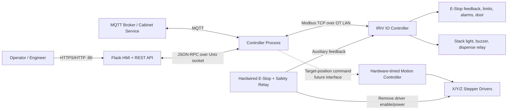
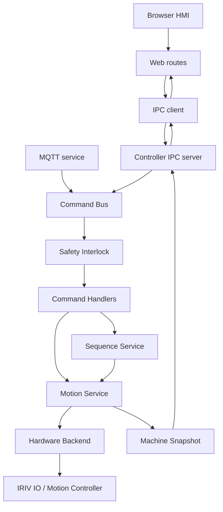
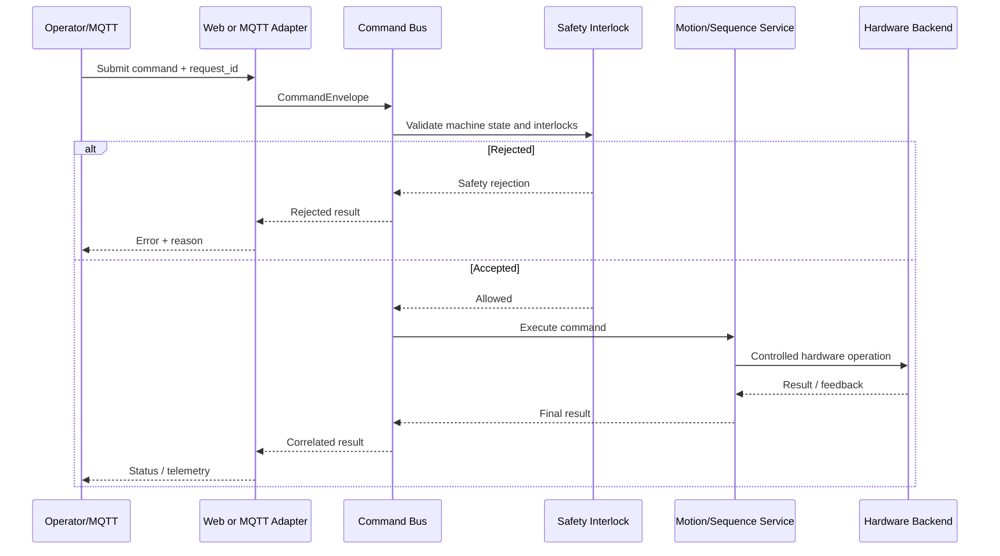
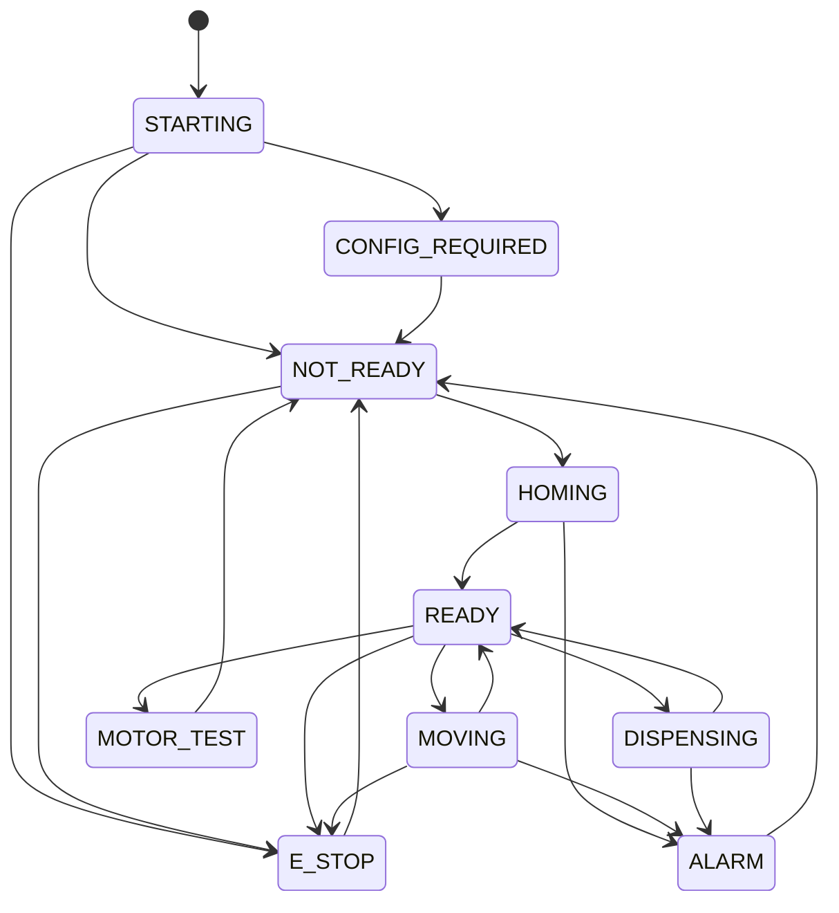

# NARIT Vending — System Architecture

เอกสารฉบับนี้เป็นแหล่งอ้างอิงหลักของสถาปัตยกรรมระบบ NARIT Vending บน
IRIV PiControl CM4 และ IRIV IO Controller อัปเดตล่าสุดวันที่ 13 สิงหาคม 2026

> ขอบเขตเอกสาร: ใช้เฉพาะระบบ IRIV ชุดใหม่ ไม่แทนที่สถาปัตยกรรม Raspberry Pi
> เครื่องเดิม เอกสารเดิมยังอยู่ที่ `ARCHITECTURE_TH.md` และ configuration เดิมยังคงใช้
> `machine_config.json`/`hardware_config.json` ตาม deployment ของเครื่องเดิม

## 1. สถานะปัจจุบัน

| รายการ | ค่าที่ใช้งาน |
|---|---|
| Main controller | IRIV PiControl CM4, hostname `iriv` |
| Management network | `eth0 = 192.168.70.80/24`, HMI ที่ `http://iriv.local/` |
| OT network | `eth1 = 10.0.0.2/24` |
| Remote I/O | IRIV IO Controller, `10.0.0.10:502`, Modbus TCP Unit ID `255` |
| Application path | `/home/admin/NaritVendingV1` |
| Controller service | `narit-vending-controller-iriv.service` |
| Web service | `narit-vending-web-iriv.service` |
| IPC | Unix socket `/run/narit-vending/ctrl.sock` |
| Hardware mode | `GPIOZERO_PIN_FACTORY=mock` — ห้ามสั่งมอเตอร์จริง |

ระบบ HMI, API, configuration, command validation, state machine และ MQTT runtime
ติดตั้งแล้ว แต่ motion output ยังถูกล็อกเป็น mock จนกว่าจะติดตั้ง motion controller ที่สร้าง
STEP/DIR แบบ hardware-timed และผ่าน commissioning ครบทุกข้อ

## 2. System context

เส้นประคือส่วนที่ยังไม่เปิดใช้งานจริง ส่วน Safety Relay เป็นวงจรอิสระจากซอฟต์แวร์และ
ต้องหยุดมอเตอร์ได้แม้ IRIV Pi, Ethernet หรือโปรแกรมไม่ทำงาน

## 3. Application architecture

ระบบแบ่งเป็นสอง process เพื่อให้ Web UI ไม่ได้เป็นเจ้าของ GPIO หรือ motion runtime

### Web process

- ให้บริการ HMI, static assets และ REST API บน port 80
- อ่าน snapshot และส่ง command ผ่าน IPC เท่านั้น
- ไม่เชื่อม MQTT broker และไม่เขียน hardware โดยตรง
- ถ้า Controller ติดต่อไม่ได้ คำสั่งต้อง fail-safe และตอบ HTTP 503

### Controller process

- เป็นเจ้าของ `MotionService`, `StateMachine`, `CommandBus` และ MQTT client เพียงตัวเดียว
- ตรวจ E-Stop, alarm, homing, limit, soft limit, busy state และ motor-test interlock
- ใช้ single-flight command execution เพื่อไม่ให้ motion commands ซ้อนกัน
- สร้าง machine snapshot ชุดเดียวสำหรับ Web และ MQTT telemetry

### Configuration

- `machine_config.iriv.json`: IRIV-only motion/slot configuration
- `hardware_config.iriv.json`: IRIV Pi, Modbus TCP DI0-DI10 and DO0-DO3 mapping
- `scripts/deploy_to_iriv.ps1`: SSH deployment to `pi@iriv.local`
- `NaritVendingV1/`: V1 deployment profile and entry-point script
- `NaritVendingMOCKUP/`: original Pi mockup deployment profile
- The legacy `machine_config.json`, `hardware_config.json`, and
  `scripts/deploy_to_pi.ps1` remain the deployment set for the original Pi.

- `machine_config.json`: travel, speed, acceleration, homing order, Safe Z และตำแหน่ง slot
- `hardware_config.json`: legacy GPIO mapping และ communication settings
- ทุกการบันทึก configuration ต้อง validate ก่อนและสร้าง backup ใน `backups/config/`
- ค่า GPIO ใน `hardware_config.json` เป็น mapping ของเครื่อง Raspberry Pi รุ่นเดิม
  และไม่ใช่ terminal mapping ของ IRIV IO

## 4. Command and safety flow

คำสั่งตำแหน่งจาก HMI ใช้แนวทาง `Validate → Arm → Execute` การเปลี่ยน target หรือ
speed หลัง Arm ทำให้ authorization เดิมใช้ไม่ได้ คำสั่งจาก MQTT ต้องมี `request_id`,
cabinet/slot ที่ถูกต้อง, ไม่หมดอายุ และไม่ซ้ำ

## 5. Machine state model

การออกจาก `E_STOP`, `ALARM` หรือ `MOTOR_TEST` ต้องกลับ `NOT_READY` และ Home ใหม่
ก่อนเข้าสู่ `READY` ห้าม force state ยกเว้นเส้นทาง startup หรือ E-Stop ที่ต้อง fail-safe

## 6. Motion sequence

ลำดับ `RUN_SLOT_SEQUENCE` ที่ระบบรองรับ:

1. ตรวจ configuration, E-Stop, alarm, limits และ homed state
2. เคลื่อน X ไปตำแหน่ง slot
3. เคลื่อน Y ไปตำแหน่ง slot
4. เคลื่อน Z ไปตำแหน่ง slot
5. ตรวจ target และ hold ตามเวลาที่กำหนด
6. Home Z
7. Home Y
8. Home X
9. ตรวจ home completion แล้วจึงรายงานผลสำเร็จ

หากขั้นตอนใดผิดพลาด ต้องยกเลิกขั้นตอนที่เหลือ ปลด motion output และเปลี่ยนสถานะเป็น
`ALARM`, `E_STOP` หรือ `NOT_READY` ตามสาเหตุ

## 7. Network architecture

| Network | Interface | Address | Purpose |
|---|---|---|---|
| Management/IT | IRIV Pi `eth0` | `192.168.70.80/24` | SSH, HMI, deployment, MQTT |
| OT | IRIV Pi `eth1` | `10.0.0.2/24` | Modbus TCP to IRIV IO |
| OT | IRIV IO | `10.0.0.10/24` | Digital/analog I/O |

- ไม่ตั้ง default gateway บน OT network
- ห้ามใช้ IP `.2` และ `.10` ซ้ำ
- จำกัด Modbus TCP port 502 ให้อยู่เฉพาะ OT interface
- การสูญเสีย Modbus communication ต้องทำให้ motion command ถูก reject และ auxiliary
  outputs กลับสู่ safe state

## 8. Hardware boundary

IRIV PiControl และ IRIV IO มี isolated digital output อย่างละ 4 ช่อง แต่เป็น SSR/dry-contact
output สำหรับสัญญาณ auxiliary ไม่ใช่ pulse train สำหรับ stepper driver ระบบสามแกนต้องใช้
STEP/DIR/ENABLE รวม 9 สัญญาณและต้องการ pulse สูงสุดประมาณ 2,000 Hz

ดังนั้น architecture ที่อนุมัติคือ:

- IRIV IO รับ limit, alarm, door และ E-Stop feedback
- IRIV IO ขับ stack light, buzzer และ dispense interposing relay
- Safety relay ตัด enable/power ของ driver แบบ hardwired
- Motion controller เฉพาะทางสร้าง STEP/DIR/ENABLE ให้ X/Y/Z
- IRIV Pi ส่ง target ระดับตำแหน่งไป motion controller และตรวจ feedback ก่อนอัปเดต state

## 9. Health and deployment

| Check | ความหมาย |
|---|---|
| `GET /health/live` | Web process ตอบสนอง |
| `GET /health/ready` | Configuration ถูกต้อง, Controller รับคำสั่งได้ และ IRIV IO communication ยังสดอยู่ |
| `service_ready=true` | Software พร้อม แต่ไม่ได้แปลว่าเครื่องพร้อมเคลื่อน |
| `machine_ready=true` | Interlock ผ่านและทุกแกน Home แล้ว |

การแก้เฉพาะ HMI ใช้ Web-only deployment เพื่อไม่ restart Controller/MQTT การแก้ motion,
safety, controller, dependencies หรือ configuration ใช้ full deployment พร้อม backup,
health check และ rollback plan

## 10. Production enablement gate

ห้ามลบ `GPIOZERO_PIN_FACTORY=mock` จนกว่าจะครบทุกข้อ:

- ติดตั้ง hardware-timed motion controller และกำหนด protocol
- Commission และทดสอบ IRIV IO backend กับสายจริงทุกช่อง
- ตรวจ DI/DO polarity ทีละช่องโดยถอดโหลดกำลัง
- ตรวจ E-Stop ว่าตัด driver ได้โดยไม่พึ่ง software
- ตรวจ limit ทั้งหกตัวและ door interlock
- ทดสอบ direction, enable polarity และ 10 mm travel ของทุกแกนที่ความเร็วต่ำ
- Calibrate steps/mm และยืนยัน soft limit
- ทดสอบ network loss, controller restart และ power-cycle
- ผ่าน homing, jog, slot sequence, STOP และ E-Stop acceptance tests

ดูผังต่อสายและรายการตรวจหน้างานที่ [IRIV_WIRING.md](IRIV_WIRING.md)
