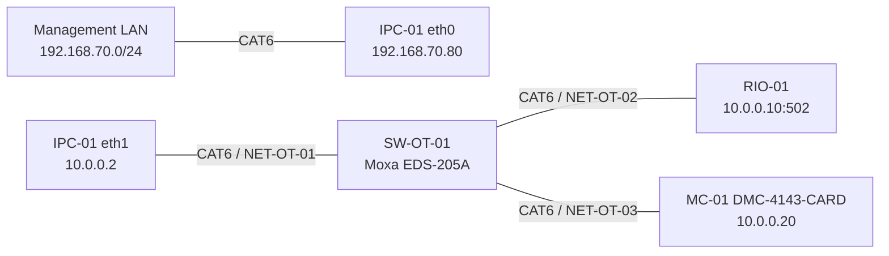
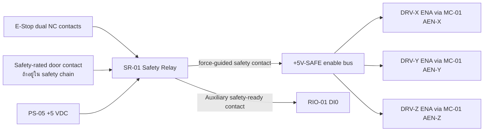

# NARIT Vending — Legacy Wiring Reference

> **ห้ามใช้ตารางในเอกสารนี้ต่อสายตู้ปัจจุบันโดยตรง** บางส่วนยังเป็นแบบ Galil/DI mapping
> รุ่นก่อนหน้า ให้ใช้ [IRIV_WIRING_TH.md](IRIV_WIRING_TH.md) และ
> [STM32_NMOS_CURRENT_WIRING_TH.md](STM32_NMOS_CURRENT_WIRING_TH.md) เป็น wiring
> ล่าสุด และดู safety gate ใน [ARCHITECTURE_TH.md](ARCHITECTURE_TH.md)

เอกสารนี้เป็น wiring schedule สำหรับ IRIV PiControl CM4 และ IRIV IO Controller
ต้องอ่านร่วมกับแบบวงจรกำลัง, คู่มืออุปกรณ์ และ [IRIV_ARCHITECTURE.md](IRIV_ARCHITECTURE.md)

> ขอบเขตเอกสาร: ใช้เฉพาะ IRIV ชุดใหม่ ห้ามนำหมายเลข DI/DO ในเอกสารนี้ไปแทน
> BCM GPIO ของ Raspberry Pi เครื่องเดิม และห้ามแก้สายของเครื่องเดิมตามตารางนี้

> คำเตือน: ตัดไฟและทำ Lockout/Tagout ก่อนต่อสาย E-Stop, motor driver หรือ 24 VDC
> ทุกครั้ง งานนี้ต้องตรวจโดยผู้มีหน้าที่ด้านไฟฟ้า/เครื่องจักร ห้ามใช้ software เป็นวงจร
> E-Stop หลัก

## 1. อุปกรณ์และแหล่งจ่าย

| Tag | อุปกรณ์ | แหล่งจ่าย/การเชื่อมต่อ |
|---|---|---|
| IPC-01 | IRIV PiControl CM4 | DC 24 V ผ่าน fuse ตามคู่มือ |
| RIO-01 | IRIV IO Controller | DC 24 V ผ่าน fuse แยก |
| PS-01 | 24 VDC power supply | จ่าย control circuit, sensors, relays |
| PS-M1 | HBS860H motor supply | 20–70 VAC หรือ 30–100 VDC ตามป้ายเครื่อง; แนะนำหม้อแปลงแยกวงจร 48 VAC หลังคำนวณโหลด |
| PS-M2 | DM542 motor supply | 20–50 VDC ตามป้ายเครื่อง; 24 VDC เดิมใช้ได้เมื่อกำลังจ่ายเพียงพอ |
| SR-01 | Safety relay | รับ E-Stop แบบ dual-channel |
| SW-OT-01 | Moxa EDS-205A unmanaged industrial Ethernet switch | 24 VDC; 5 x 10/100Base-T(X) RJ45 |
| MC-01 | **Galil DMC-4143-CARD**, no internal amplifier | 20–80 VDC; Ethernet; hardware STEP/DIR axes X/Y/Z; W spare |
| TB-MC-X/Y/Z | Galil ICS-48026-M | 26-pin HD D-sub male to screw terminals; one per used axis |
| PS-05 | Mean Well HDR-15-5 | 5 VDC, 2.4 A; external driver-enable supply only |
| DRV-HBS-01 | HBS860H hybrid servo drive | ขับ MOT-HBS-01; **provisional assignment = X** |
| MOT-HBS-01 | 86HBS85 NEMA34 closed-loop stepper | 8.5 N.m, 5.6 A, shaft 14 mm พร้อม encoder |
| DRV-DM-01 | DM542 (32-bit) stepper drive | ขับ ACT-VS-01; **provisional assignment = Z** |
| ACT-VS-01 | V-Slot Mini Actuator 1-axis | ต้องอ่าน rated phase current จากป้ายมอเตอร์ก่อนตั้ง DRV-DM-01 |
| DRV-TBD-01 | Driver ของแกนที่เหลือ | ยังไม่กำหนด ถ้าระบบจริงยังใช้ครบ 3 แกน |
| K-ALM-X | Phoenix Contact PLC-RSC-24DC/21, item 2966171 | Fail-safe HBS860H alarm interface; 24 VDC coil, 1 changeover contact |
| K-DISP | Interposing relay | แยก DO3 ออกจาก dispense actuator |

Axis assignment ด้านล่างเป็น **design assumption** จาก HBS860H/NEMA34 ที่เป็นแกนหนักและ
V-Slot actuator ที่สมมติให้เป็นแกน Z; ยังไม่ใช่ข้อมูลที่ยืนยันจากเครื่องจริง ต้องตรวจการติดป้าย,
กลไก และ motor cable ก่อนเข้าหัวสาย แล้วแก้ทั้งเอกสารและ software mapping ถ้าไม่ตรง:

| ชุดขับ | แกนจริง | Alarm DI | สถานะ |
|---|---|---|---|
| DRV-HBS-01 + MOT-HBS-01 | `X (ASSUMED)` | DI7, fail-safe NC-style alarm healthy loop | ต้องยืนยันที่เครื่องก่อนประกอบ |
| DRV-TBD-01 | `Y (UNCONFIRMED)` | DI8 only if the selected drive has a documented alarm output | **purchase/drive data blocked** |
| DRV-DM-01 + ACT-VS-01 | `Z (ASSUMED)` | DI9 reserved; existing photographed DM542 has no alarm terminal | Keep fail-safe alarm active so production remains blocked until resolved |

## 2. Ethernet wiring

กำหนด MC-01 เป็น static IPv4 `10.0.0.20/24`, ไม่มี default gateway บน OT network และสงวน
TCP port 23 สำหรับ Galil command-and-response connection. IRIV ใช้ `gclib`/Python binding
เปิด `10.0.0.20 --command TCP --timeout 1000`; ห้ามส่ง STEP pulse ผ่าน Ethernet โดยตรง
เพราะ IRIV ส่งเฉพาะ target, speed, arm/stop และ heartbeat ส่วน trajectory/pulse ถูกสร้างใน MC-01

ติดป้ายสาย `NET-IT-01` สำหรับ eth0 และ `NET-OT-01..03` ตามผัง ห้ามสลับพอร์ต

## 3. IRIV IO digital inputs

IRIV IO มี DI0–DI10 แบบ isolated active-high ใช้ 24 V control circuit ตามตัวอย่าง
S/S และ digital common ในคู่มือของ IRIV IO ห้ามต่อ 24 V เข้าขา Raspberry Pi โดยตรง

| Channel | Cable tag | Field signal | Normal | Active | Software meaning |
|---|---|---|---|---|---|
| DI0 | `DI-ESTOP-FB` | SR-01 safety-ready auxiliary contact | ON | OFF เมื่อ E-Stop/fault | `estop_safe` |
| DI1 | `DI-X-HOME` | X home/head limit | OFF | ON | `x_head_limit` |
| DI2 | `DI-X-TAIL` | X tail limit | OFF     | ON | `x_tail_limit` |
| DI3 | `DI-Y-HOME` | Y home/head limit | OFF | ON | `y_head_limit` |
| DI4 | `DI-Y-TAIL` | Y tail limit | OFF | ON | `y_tail_limit` |
| DI5 | `DI-Z-HOME` | Z home/head limit | OFF | ON | `z_head_limit` |
| DI6 | `DI-Z-TAIL` | Z tail limit | OFF | ON | `z_tail_limit` |
| DI7 | `DI-X-ALARM` | DRV-HBS-01 X alarm healthy loop | ON | OFF on drive alarm, loss of drive 24 V, or broken wire | `x_driver_alarm` with `active_state=false` |
| DI8 | `DI-Y-ALARM` | DRV-Y alarm healthy loop, **drive model TBD** | ON | OFF on fault/wire break | `y_driver_alarm`; do not enable until drive is identified |
| DI9 | `DI-Z-ALARM` | **Reserved - no alarm terminal on photographed DRV-DM-01** | N/A | OFF/unwired deliberately trips | keep `z_driver_alarm` fail-safe so production stays blocked |
| DI10 | `DI-DOOR-SAFE` | Door interlock safety contact | ON | OFF เมื่อประตูเปิด | `door_safe` |

ข้อกำหนด:

- ปิด counter mode ของ DI1, DI3, DI5 เพื่อใช้เป็น digital limit input
- E-Stop และ door ใช้แนวคิด de-energize-to-trip: สายขาดต้องอ่านเป็นไม่ปลอดภัย
- DI7 alarm mapping: `+24 V fused -> K-ALM-X coil A1`, `A2 -> HBS860H ALM+`, `ALM- -> 0 V`.
  K-ALM-X NO contact feeds +24 V to DI7 only while the HBS output is low-impedance/healthy. The specified
  relay coil draws 18 mA, below the documented 50 mA HBS860H alarm-output ceiling. Confirm polarity on the
  installed drive; configure the drive so fault, loss of drive control supply, or broken alarm wire drops K-ALM-X.
- DI8 follows the same de-energize-to-trip pattern only after the Y drive model/manual is confirmed.
- Do not bridge DI8/DI9 to imitate a healthy drive. An absent alarm source must be represented as
  `not fitted` in configuration and must block production acceptance if drive-fault feedback is required.
- ใช้ shielded cable สำหรับ limit/alarm ที่เดินคู่กับสายมอเตอร์ และต่อ shield ที่ cabinet PE
  ด้านเดียว

## 4. IRIV IO digital outputs

DO0–DO3 เป็น isolated active-high dry-contact SSR สูงสุดตามคู่มือ 50 V, 500 mA
ให้ใช้ fuse รายวงจรและ interposing relay เมื่อโหลดมี inrush หรือเป็น inductive load

| Channel | Cable tag | Load | Safe state | Wiring rule |
|---|---|---|---|---|
| DO0 | `DO-READY-GRN` | Stack light สีเขียว | OFF | 24 VDC fused control load |
| DO1 | `DO-MOVING-YEL` | Stack light สีเหลือง | OFF | 24 VDC fused control load |
| DO2 | `DO-ALARM-RED` | ไฟแดง/บัซเซอร์ | OFF เมื่อ power-up; ON เมื่อ alarm | ผ่าน relay หากเกิน rating |
| DO3 | `DO-DISPENSE` | Coil ของ K-DISP | OFF | K-DISP contact จ่าย actuator |

ห้ามใช้ DO0–DO3 เป็น STEP, DIR, PWM, driver ENABLE หรือ safety output

## 5. E-Stop hardwired circuit

- Contact หลักแบบ force-guided ของ SR-01 ต้องตัด `+5V-SAFE` ที่ป้อน `ENBL+` ของ JA1/JB1/JC1;
  การเปิด contact ทำให้ optocoupler ENA ของ driver ทั้งสามแกนดับโดยไม่พึ่ง MC-01, Ethernet หรือ IRIV
- ถ้า risk assessment กำหนดให้ตัดพลังงาน motor supply ด้วย ให้เพิ่ม safety contactor แยกต่างหาก;
  วงจร ENA ของ HBS860H/DM542 ไม่ได้ถูกอ้างว่าเป็น STO และเอกสารนี้ไม่กำหนด PL/SIL
- DI0 เป็น feedback สำหรับ software เท่านั้น ไม่ใช่ตัวหยุดหลัก
- Reset safety relay ต้องเป็น manual reset และห้ามทำให้มอเตอร์เริ่มเอง
- หลัง Reset สถานะ software ต้องเป็น `NOT_READY` และต้อง Home ใหม่

## 6. Motion wiring boundary

MC-01 ที่เลือกคือ **Galil DMC-4143-CARD without internal amplifier**. ใช้ axis connectors
`JA1=X`, `JB1=Y`, `JC1=Z`; `JD1=W` เป็น spare. Controller สร้าง STEP/DIR 0–5 VDC,
sink/source 20 mA และรองรับ step pulse สูงสุด 3 MHz ซึ่งสูงกว่าความต้องการปัจจุบัน 2 kHz มาก
Driver HBS860H/DM542 รับ opto-isolated 5 V STEP/DIR จึงต่อแบบ common-cathode ตามตารางนี้
โดยไม่ใช้ differential line-driver เพิ่ม ทั้งนี้ต้องยืนยันป้าย driver lot จริงว่าเลือก logic 5 V แล้ว

ติด `ICS-48026-M` เข้ากับ 26-pin female connector ของแต่ละ axis โดยตรง. เลขด้านล่างคือ
**D-sub pin/ICS screw terminal number** ไม่ใช่ GPIO:

| Machine axis | DMC axis/connector | STEP to driver | DIR to driver | ENABLE to driver | Enable supply |
|---|---|---|---|---|---|
| X (HBS860H assumed) | X / `JA1` + `TB-MC-X` | pin 13 `STP` → `PUL+`; pin 10 `GND` → `PUL-` | pin 3 `DIR` → `DIR+`; pin 14 `GND` → `DIR-` | pin 8 `AEN` → `ENA+`; pin 11 `ENBL-` → `ENA-` | pin 16 `ENBL+` ← `+5V-SAFE` |
| Y (drive TBD) | Y / `JB1` + `TB-MC-Y` | pin 13 `STP` → `PUL+`; pin 10 `GND` → `PUL-` | pin 3 `DIR` → `DIR+`; pin 14 `GND` → `DIR-` | pin 8 `AEN` → `ENA+`; pin 11 `ENBL-` → `ENA-` | pin 16 `ENBL+` ← `+5V-SAFE` |
| Z (DM542 assumed) | Z / `JC1` + `TB-MC-Z` | pin 13 `STP` → `PUL+`; pin 10 `GND` → `PUL-` | pin 3 `DIR` → `DIR+`; pin 14 `GND` → `DIR-` | pin 8 `AEN` → `ENA+`; pin 11 `ENBL-` → `ENA-` | pin 16 `ENBL+` ← `+5V-SAFE` |

Commissioning must configure each axis `JPn1` for **external 5 V, sourcing, high-amp-enable
(HAEN)**. Do not energize the drivers until a point-to-point continuity check proves that `MO`/reset,
DMC watchdog, and opening SR-01 each remove current from ENA. The E-stop opening SR-01 is the
independent hardwired layer; DMC `MO` and the heartbeat program are additional operational stops.

Required resident DMC program behavior:

- IRIV refreshes a heartbeat at least every 100 ms over the TCP command connection.
- If no fresh heartbeat is seen for 500 ms, DMC executes controlled stop where possible, then issues
  motor-off for X/Y/Z,
  clears queued motion and latches `HOST_LOST=1`; reconnect alone must not resume motion.
- DMC startup/reset leaves X/Y/Z motor-off. IRIV must revalidate DI0–DI10, clear the latch explicitly,
  issue servo-here/enable for X/Y/Z, and home again.
- This Ethernet watchdog is not the E-stop and must not be credited as a safety function.

สาย STP/DIR/ENA ใช้ twisted-pair shielded, ต่อ shield ที่ cabinet PE ด้านเดียว และเดินแยก
จากสาย motor power. ห้ามนำ legacy BCM GPIO ต่อออกจาก IRIV PiControl

### 6.1 HBS860H + 86HBS85 closed-loop axis

ใช้สายคู่บิดเกลียวมี shield สำหรับ PUL, DIR, ENA และ encoder แยกจากสาย A/B และสาย AC
ห้ามต่อ encoder เข้ากับ IRIV IO หรือ Raspberry Pi เพราะวงปิดอยู่ระหว่าง 86HBS85 กับ HBS860H

#### สัญญาณควบคุมจาก MC-01

ใช้ JA1 pin 13/10 สำหรับ PUL+/PUL-, pin 3/14 สำหรับ DIR+/DIR- และ pin 8/11 สำหรับ
ENA+/ENA- ตาม master table ในข้อ 6. HBS860H ที่ตรวจเอกสารรองรับ 5–24 V opto input;
**assumption:** unit ในตู้เป็น revision เดียวกัน. ถ้าป้ายหรือคู่มือ serial/lot ระบุไม่ตรง ให้หยุดและ
เพิ่ม interface ที่ผู้ผลิต drive อนุมัติ ห้ามป้อน 24 V เข้าขา STP/DIR ของ DMC

#### มอเตอร์, encoder, alarm และไฟกำลัง

| From | To DRV-HBS-01 | สาย/หน้าที่ | กฎการต่อ |
|---|---|---|---|
| MOT-HBS-01 motor coil A | `A+`, `A-` | คู่ขดลวด A | ยืนยันคู่ขดลวดจาก datasheet/โอห์มมิเตอร์ ห้ามเดาสี |
| MOT-HBS-01 motor coil B | `B+`, `B-` | คู่ขดลวด B | ยืนยันคู่ขดลวดจาก datasheet/โอห์มมิเตอร์ ห้ามเดาสี |
| Encoder B+ | `EB+` | Encoder channel B+ | สีเหลืองตาม sleeve ในภาพ; terminal name เป็นหลัก |
| Encoder B- | `EB-` | Encoder channel B- | สีเขียวตาม sleeve ในภาพ; terminal name เป็นหลัก |
| Encoder A+ | `EA+` | Encoder channel A+ | สีดำตาม sleeve ในภาพ; terminal name เป็นหลัก |
| Encoder A- | `EA-` | Encoder channel A- | สีน้ำตาลตาม sleeve ในภาพ; terminal name เป็นหลัก |
| Encoder supply | `VCC` | Encoder +5 V จาก driver | สีแดง; ห้ามป้อนไฟภายนอก |
| Encoder ground | `EGND` | Encoder signal ground | สีขาว; ห้ามต่อแทน cabinet PE |
| PS-M1 isolated output | `AC`, `AC` | ไฟกำลัง driver | ใช้ 20–70 VAC; fuse/contactor ตาม load calculation |
| `ALM+`, `ALM-` | Interface relay → DI7/8/9 ตามแกน | Driver alarm | ตรวจชนิด/logic ของ output ก่อนต่อ 24 V DI |
| `Pend+`, `Pend-` | Spare terminal | In-position (optional) | แยกหุ้มปลายสายถ้ายังไม่ใช้ |

กรณีจะใช้ 30–100 VDC แทน AC ต้องขอ pin/polarity diagram ของ HBS860H จากผู้ขายรุ่นเดียวกันก่อน
ห้ามสมมติขั้ว DC จากชื่อ `AC/AC` บนตัวเครื่อง สาย alarm ต้องผ่าน isolated interface ที่ทำให้
IRIV IO เห็นสัญญาณ 24 V ตามตาราง DI และต้องทดสอบทั้ง alarm จริงกับกรณีสายขาด

#### DIP/commissioning baseline ของ HBS860H

- ตั้ง `SW6 = ON` เพื่อเลือกมอเตอร์ `86HBS85` ตามข้อความบนตัวเครื่อง
- `SW5` เลือกทิศ motor (`OFF = CCW`, `ON = CW`) ให้ตั้งหลังตรวจทิศทางแบบ uncoupled
- เลือก pulse/rev ให้ตรง `400 pulses/rev` ของ config ปัจจุบัน และบันทึก SW1–SW4 จากตารางบน
  HBS860H ตัวจริงก่อนจ่าย pulse; ห้ามคัดลอกค่าจาก DM542
- ค่า 5.6 A เป็น rated phase current ของมอเตอร์ ไม่ใช่ค่าฟิวส์ด้าน supply โดยตรง
- จ่ายไฟโดยยังไม่ต่อ load แล้วตรวจ `PWR/ALM`, alarm output และ encoder fault ก่อน jog

### 6.2 DM542 + V-Slot Mini Actuator 1-axis

#### สัญญาณควบคุมจาก MC-01

ใช้ JC1 pin 13/10 สำหรับ PUL+/PUL-, pin 3/14 สำหรับ DIR+/DIR- และ pin 8/11 สำหรับ
ENA+/ENA- ตาม master table ในข้อ 6. ตั้ง logic-voltage selector ของ DM542 เป็น 5 V ถ้ารุ่นที่ติดตั้ง
มี selector; ถ้าไม่มี ให้ยืนยันจากคู่มือ serial/lot ว่า input 5 V ใช้ได้ก่อนต่อ

| From | To DRV-DM-01 | หน้าที่ | กฎการต่อ |
|---|---|---|---|
| PS-M2 `+VDC` | `+V` | Motor supply positive | 20–50 VDC ตามป้าย; fuse แยก branch |
| PS-M2 `0V` | `GND` | Motor supply return | ห้ามใช้ PE แทน 0 V |
| ACT-VS-01 coil A | `A+`, `A-` | Motor phase A | หา coil pair ด้วยโอห์มมิเตอร์/เอกสารมอเตอร์ |
| ACT-VS-01 coil B | `B+`, `B-` | Motor phase B | ห้ามสลับสายขณะ driver มีไฟ |
| Cabinet PE | Driver chassis/mounting PE | Protective bonding | ต่อ chassis/ราง DIN เข้าบัส PE |

ค่าเริ่มต้นที่ตรงกับ config IRIV ปัจจุบันคือ `400 pulses/rev`:

| รายการ | DIP setting บน DM542 ตามภาพ | หมายเหตุ |
|---|---|---|
| Pulse/rev 400 | `SW5=OFF, SW6=ON, SW7=ON, SW8=ON` | สอดคล้อง `driver_microsteps=2`, `pulses_per_rev=400` |
| Run current | `SW1–SW3 = TBD` | ต้องทราบ rated phase current ของมอเตอร์ V-Slot ก่อน |
| Idle current | `SW4=OFF` เป็นค่าเริ่มต้นแบบ half-current | เปลี่ยนเป็น full-current เฉพาะเมื่อจำเป็นและตรวจอุณหภูมิแล้ว |

ห้ามตั้ง 4.20 A เพียงเพราะเป็นค่าสูงสุดของ DM542 ให้เลือก peak current ที่สอดคล้องกับมอเตอร์
V-Slot จริง จากนั้น jog แบบ uncoupled ที่ความเร็วต่ำ วัดระยะ 10 mm และแก้ `steps_per_mm`
หากระยะไม่ตรง ห้ามแก้ด้วยการเดา DIP หลายตัวพร้อมกัน

DRV-DM-01 ที่เห็นในโครงการไม่มี terminal `ALM+/ALM-`; จึงไม่มี driver-fault wire ไป DI9.
ห้ามอ้างสถานะ LED หรือ MC-01 commanded position ว่าเป็น drive alarm. Production acceptance
ต้องเลือกอย่างใดอย่างหนึ่งและบันทึก change control: (a) ยอมรับว่า Z ไม่มี drive-fault feedback ตาม
risk assessment, หรือ (b) เปลี่ยนเป็น alarm-capable exact drive แล้วแก้ DI9/BOM/software mapping

BCM mapping เดิมด้านล่างเก็บไว้เพื่ออ้างอิง migration เท่านั้นและ **ห้ามต่อกับ IRIV**:

| Axis | Legacy STEP | Legacy DIR | Legacy EN |
|---|---:|---:|---:|
| X | GPIO16 | GPIO23 | GPIO12 |
| Y | GPIO26 | GPIO24 | GPIO13 |
| Z | GPIO18 | GPIO25 | GPIO19 |

GPIO19/20/21 บน IRIV PiControl ถูกใช้กับ buzzer/LED ภายใน และ GPIO23–26 เชื่อมกับ
isolated DO ของตัว IRIV อยู่แล้ว การใช้ legacy map จะชนกับ hardware ภายใน

## 7. Grounding and EMC

- ต่อ cabinet, IRIV enclosure, motor frames, driver chassis และ cable shields เข้าบัส PE
- แยก PE, 0 VDC control และ isolated I/O common ตามคู่มือ ห้าม bridge โดยไม่ออกแบบ
- เดินสาย motor power แยกจาก Ethernet, limit และ pulse cable
- ใช้ ferrule, terminal marker และ wire number ตรงกับตารางนี้ทั้งสองปลาย
- ใส่ flyback diode หรือ suppression ที่ DC relay coil โดยตรวจ polarity
- ห้ามต่อ shield สองปลายถ้าทำให้เกิด ground loop เว้นแต่แบบ EMC กำหนดไว้

## 8. Terminal/wire schedule template

กรอก terminal จริงระหว่างประกอบตู้ ห้ามปล่อยช่อง From/To คลุมเครือก่อนจ่ายไฟ

| Wire no. | From | To | Signal | Voltage | Test result |
|---|---|---|---|---|---|
| W001 | SR-01 AUX | RIO-01 DI0 | E-Stop safe feedback | 24 VDC | ☐ |
| W002 | X Home sensor | RIO-01 DI1 | X home limit | 24 VDC | ☐ |
| W003 | X Tail sensor | RIO-01 DI2 | X tail limit | 24 VDC | ☐ |
| W004 | Y Home sensor | RIO-01 DI3 | Y home limit | 24 VDC | ☐ |
| W005 | Y Tail sensor | RIO-01 DI4 | Y tail limit | 24 VDC | ☐ |
| W006 | Z Home sensor | RIO-01 DI5 | Z home limit | 24 VDC | ☐ |
| W007 | Z Tail sensor | RIO-01 DI6 | Z tail limit | 24 VDC | ☐ |
| W008 | DRV-HBS-01 ALM± → K-ALM-X | RIO-01 DI7 via K-ALM-X NO | X alarm healthy loop; ON=healthy | 24 VDC | ☐ |
| W009 | DRV-Y alarm output | RIO-01 DI8 | Y alarm healthy loop | **TBD until Y drive identified** | ☐ |
| W010 | No connection; terminal reserved | RIO-01 DI9 | Z alarm unavailable on installed DM542 | N/A; fail-safe input blocks production | ☐ |
| W011 | Door contact | RIO-01 DI10 | Door safe | 24 VDC | ☐ |
| W020 | RIO-01 DO0 | Green lamp | Ready | 24 VDC | ☐ |
| W021 | RIO-01 DO1 | Yellow lamp | Moving | 24 VDC | ☐ |
| W022 | RIO-01 DO2 | Alarm relay/lamp | Alarm | 24 VDC | ☐ |
| W023 | RIO-01 DO3 | K-DISP coil | Dispense | 24 VDC | ☐ |
| W090 | PS-05 +5 V | SR-01 safety contact input | Driver-enable supply | 5 VDC | ☐ |
| W091 | SR-01 safety contact output | JA1 pin16 + JB1 pin16 + JC1 pin16 `ENBL+` | `+5V-SAFE` enable bus | 5 VDC | ☐ |
| W100 | JA1 pin13 `STP` / pin10 `GND` | DRV-HBS-01 `PUL+` / `PUL-` | X pulse | 5 V TTL to isolated input | ☐ |
| W101 | JA1 pin3 `DIR` / pin14 `GND` | DRV-HBS-01 `DIR+` / `DIR-` | X direction | 5 V TTL to isolated input | ☐ |
| W102 | JA1 pin8 `AEN` / pin11 `ENBL-` | DRV-HBS-01 `ENA+` / `ENA-` | X enable, HAEN sourcing | switched 5 V | ☐ |
| W103 | MOT-HBS-01 coil A | DRV-HBS-01 A+/A- | Motor phase A | Motor power | ☐ |
| W104 | MOT-HBS-01 coil B | DRV-HBS-01 B+/B- | Motor phase B | Motor power | ☐ |
| W105 | MOT-HBS-01 encoder | DRV-HBS-01 EB±/EA±/VCC/EGND | Encoder feedback | 5 V จาก driver | ☐ |
| W106 | PS-M1 | DRV-HBS-01 AC/AC | HBS supply | 20–70 VAC | ☐ |
| W107 | DRV-HBS-01 `ALM±` | K-ALM-X coil, then K-ALM-X NO → DI7 | X alarm healthy loop | 24 VDC | ☐ |
| W110 | JB1 pin13 `STP` / pin10 `GND` | DRV-Y `PUL+` / `PUL-` | Y pulse | **hold until drive model confirmed** | ☐ |
| W111 | JB1 pin3 `DIR` / pin14 `GND` | DRV-Y `DIR+` / `DIR-` | Y direction | **hold until drive model confirmed** | ☐ |
| W112 | JB1 pin8 `AEN` / pin11 `ENBL-` | DRV-Y `ENA+` / `ENA-` | Y enable | switched 5 V; hold until confirmed | ☐ |
| W120 | JC1 pin13 `STP` / pin10 `GND` | DRV-DM-01 `PUL+` / `PUL-` | Z pulse | 5 V TTL to isolated input | ☐ |
| W121 | JC1 pin3 `DIR` / pin14 `GND` | DRV-DM-01 `DIR+` / `DIR-` | Z direction | 5 V TTL to isolated input | ☐ |
| W122 | JC1 pin8 `AEN` / pin11 `ENBL-` | DRV-DM-01 `ENA+` / `ENA-` | Z enable, HAEN sourcing | switched 5 V | ☐ |
| W123 | ACT-VS-01 coil A | DRV-DM-01 A+/A- | Motor phase A | Motor power | ☐ |
| W124 | ACT-VS-01 coil B | DRV-DM-01 B+/B- | Motor phase B | Motor power | ☐ |
| W125 | PS-M2 | DRV-DM-01 +V/GND | DM542 supply | 20–50 VDC | ☐ |

## 9. Purchase-ready bill of materials

ขอบเขต BOM นี้คือของใหม่ที่ต้องซื้อเพื่อเพิ่ม MC-01 เข้ากับ IRIV ที่มีอยู่ ไม่รวม IRIV PiControl,
IRIV IO, HBS860H, DM542, motors, safety relay เดิม, motor supplies และตู้. ราคา/stock เป็นข้อมูล
ผันผวน ให้ใช้ manufacturer part number เป็นตัวสั่งซื้อและขอ quotation ก่อนออก PO:

| Item | Manufacturer part number | Qty to install / order | Purchase description | Acceptance note |
|---|---|---:|---|---|
| MC-01 | **Galil DMC-4143-CARD, no internal amplifier** | 1 / 1 | 4-axis DMC-4103-series Ethernet motion controller, card-level, external drives | PO/quote must say `DMC-4143-CARD`, no D3xxx/D4xxx internal amplifier; obtain current manual and firmware revision |
| Axis breakouts | **Galil ICS-48026-M** | 3 / 3 | 26-pin HD male D-sub to screw terminals | One each for JA1/JB1/JC1; Galil lists USD 79 each before freight/tax at document update |
| OT switch | **Moxa EDS-205A** | 1 / 1 | 5-port 10/100Base-T(X) unmanaged industrial Ethernet switch, standard -10…60 °C model | Do not substitute fiber suffix; feed from fused 24 VDC branch |
| 5 V enable PSU | **Mean Well HDR-15-5** | 1 / 1 | DIN-rail PSU, 5 VDC, 2.4 A | Dedicated to `+5V-SAFE`; set and meter 5.00 V before connecting ENBL+ |
| X alarm relay | **Phoenix Contact PLC-RSC-24DC/21**, item **2966171** | 1 / 10-pack minimum | 24 VDC coil, 1 changeover contact, DIN rail relay module | 18 mA coil is within HBS alarm-output rating; keep remaining pieces as spares or source an authorized single-unit pack |
| Motion cable | **Belden 8777.0030** | 1 / 1 reel | 30 m reel, 3 individually shielded twisted pairs, 22 AWG | One pair each STP, DIR, ENA; cut to measured lengths for X/Y/Z; shield cabinet end only |
| OT patch cords | Industrial CAT6 F/UTP, RJ45-RJ45, 1 m | 3 / 3 | IPC→switch, switch→RIO, switch→MC | Final length is an assumption; remeasure cabinet before PO |
| Circuit protection | IEC/DC-rated fuse holders + fuses sized from measured load | 3 branches / TBD | Separate fused branches for MC-01 24 V, SW-OT-01 24 V and PS-05 input | **Not purchase-ready until existing PS-01 capacity, upstream voltage and conductor size are recorded** |

Items intentionally blocked from PO:

- `DRV-Y`: motor nameplate current, supply voltage and alarm-terminal requirement are unknown.
- Any Z alarm interface: the installed DM542 revision shown in the project has no alarm terminal.
- A replacement safety relay or motor-power contactor: required safety category/PL/SIL and stop category have
  not been supplied. A qualified machine-safety designer must validate SR-01 contact ratings and architecture.

### 9.1 Assumption and uncertainty register

| ID | Uncertain assumption used in this schedule | Consequence if wrong | Required closure before production |
|---|---|---|---|
| A1 | HBS860H/86HBS85 is physical X; DM542/V-Slot is physical Z | Axis moves or alarm DI are crossed | Trace cables mechanically, label both ends, update table/config and sign off |
| A2 | The unidentified remaining drive is physical Y | JB1 wiring/BOM may be wrong | Record maker, exact model, serial/lot, motor current and alarm terminals |
| A3 | Installed HBS860H and DM542 control inputs accept 5 V common-cathode signals | Missed steps or input damage | Check nameplate/manual for each serial/lot; bench-test with motor uncoupled |
| A4 | HBS860H ALM is low-impedance healthy and high-impedance on fault, ≤50 mA | DI7 logic is inverted or relay never drops | Meter healthy/fault/wire-break states before connecting K-ALM-X |
| A5 | SR-01 has a suitable force-guided safety contact available to interrupt the 5 V enable bus | E-stop circuit may not meet required risk reduction | Validate contact allocation, current, DC rating, PL/SIL and stop category by qualified designer |
| A6 | Driver ENA removal provides an acceptable stop for this machine | Axis could coast/drop; ENA is not claimed STO | Risk assessment; add rated motor-power contactor/brake if required |
| A7 | Existing 24 V control supply has capacity for DMC-4143, EDS-205A, PS-05 input and relays | Brownout/reset or undersized protection | Measure load and inrush; size conductors/fuses and update BOM |
| A8 | 1 m Ethernet cords and one 30 m motion-cable reel cover cabinet routing | Procurement quantity may be short | Measure installed routes plus service loops before PO |
| A9 | Static IP `10.0.0.20` and TCP port 23 are unused/allowed | Address conflict or blocked command channel | Scan OT network and approve firewall/IP register |
| A10 | A 100 ms heartbeat and 500 ms timeout are acceptable operational-stop timings | Nuisance trips or excessive travel after host loss | Calculate stopping distance at maximum speed and validate on machine |
| A11 | Current application can add a Galil backend and resident heartbeat program | Hardware cannot enter production mode yet | Implement, review and test backend; keep `GPIOZERO_PIN_FACTORY=mock` until complete |
| A12 | Galil will supply current DMC-4143-CARD with the connector/jumper behavior in the quoted manual revision | Pinout/configuration may differ | Require submittal/manual with quotation; compare revision before releasing panel wiring |

## 10. Commissioning checklist

### ก่อนจ่ายไฟ

- [ ] ตรวจ PE continuity และ polarity ของ 24 VDC
- [ ] ตรวจ fuse และ current rating ทุก branch
- [ ] กรอก axis assignment ของ DRV-HBS-01 และ DRV-DM-01 พร้อมติดป้ายทั้งสองปลายสาย
- [ ] ยืนยัน PS-M1/PS-M2 voltage ขณะ no-load อยู่ในช่วงบนป้าย driver
- [ ] วัด coil pair ของ MOT-HBS-01 และ ACT-VS-01 โดย driver/encoder ยังไม่ต่อไฟ
- [ ] ตั้ง HBS860H `SW6=ON` สำหรับ 86HBS85 และบันทึก DIP ทุกตัว
- [ ] อ่าน rated phase current ของมอเตอร์ V-Slot แล้วตั้ง DM542 SW1–SW4
- [ ] ตั้ง DM542 400 pulse/rev (`SW5=OFF, SW6=ON, SW7=ON, SW8=ON`)
- [ ] ถอด motor coupling/load หรือทำให้แกนเคลื่อนได้อย่างปลอดภัย
- [ ] ตรวจ E-Stop dual-channel และ safety relay reset
- [ ] ยืนยันว่า `/etc/narit-vending.env` ยังเป็น `GPIOZERO_PIN_FACTORY=mock`

### I/O test โดยไม่ต่อโหลดกำลัง

- [ ] อ่าน DI0–DI10 ทีละช่องและยืนยัน polarity
- [ ] ยืนยันสายขาดของ E-Stop/door แสดง unsafe
- [ ] สั่ง DO0–DO3 ทีละช่องโดยใช้ test lamp/relay เท่านั้น
- [ ] ตัดสาย Ethernet OT และยืนยัน software แสดง communication fault

### Motion commissioning หลังติดตั้ง MC-01

- [ ] ตรวจ driver enable polarity โดยยังไม่ส่ง pulse
- [ ] ตรวจ `JA1/JB1/JC1 JPn1 = external 5 V, sourcing, HAEN` กับคู่มือ revision ที่มากับสินค้า
- [ ] กด E-Stop ขณะ IRIV และ MC-01 ค้าง/ถอด Ethernet แล้ววัดว่า ENA ทุกแกนไม่มี current
- [ ] หยุด heartbeat 500 ms แล้วยืนยัน MC-01 motor-off และไม่ resume เมื่อ network กลับมา
- [ ] ตรวจ HBS860H encoder/alarm โดยถอด encoderเพื่อจำลอง fault และยืนยันแกนเป็น NOT_READY
- [ ] ตรวจ interface alarm ของ HBS860H ทั้ง alarm จริงและสาย feedback ขาด
- [ ] ทดสอบ X/Y/Z ทีละแกนที่ความเร็วต่ำ
- [ ] ยืนยัน home/tail limit หยุดแกนในทิศทางที่ถูกต้อง
- [ ] วัดคำสั่ง 10 mm เทียบระยะจริงและปรับ steps/mm
- [ ] ทดสอบ STOP, E-Stop, door open และ communication watchdog
- [ ] Home ตามลำดับ Z → Y → X
- [ ] ทดสอบ slot sequence แบบไม่มีสินค้า ก่อนทดสอบพร้อมโหลด

ห้ามเปลี่ยนจาก mock เป็น production backend จนกว่าผู้ตรวจรับลงชื่อใน commissioning record

## 11. แหล่งอ้างอิงและลำดับความสำคัญ

1. ป้าย terminal/current/pulse table บนอุปกรณ์ HBS860H และ DM542 ในภาพของเครื่องนี้
2. Datasheet ของมอเตอร์ 86HBS85 และมอเตอร์ที่มากับ V-Slot lot ที่ติดตั้งจริง
3. [Leadshine DM542E User Manual](https://www.leadshine.com/upfiles/downloads/d5375bf4c28b5c75b2d150c9762781c9_1651052967281.pdf)
   ใช้ตรวจแนวทางทั่วไปของตระกูล DM542 เท่านั้น เพราะตัวในภาพระบุ `DM542` และหน้าป้าย/DIP
   อาจต่างจาก `DM542E`
4. [Galil DMC-4103 product page](https://www.galil.com/motion-controllers/dmc-4103) และ
   [DMC-41x3 user manual](https://www.galil.com/download/manual/dmc-4103-r13j-manual.pdf):
   model family, 20–80 VDC supply, Ethernet, axis I/O, STEP/DIR electrical limits, JA1–JD1 pinout,
   configurable amplifier-enable circuit and watchdog behavior
5. [Galil gclib](https://www.galil.com/resources/software/gclib): Linux/Raspberry Pi and Python support;
   use TCP command-and-response connection on the isolated OT network
6. [Moxa EDS-205A](https://www.moxa.com/en/products/industrial-network-infrastructure/ethernet-switches/unmanaged-switches/eds-205a-series/eds-205a),
   [Mean Well HDR-15-5](https://www.meanwell.com/Upload/PDF/HDR-15/HDR-15-SPEC.PDF),
   [Phoenix Contact 2966171](https://www.phoenixcontact.com/pc/products/2966171), and
   [Belden 8777](https://www.belden.com/products/cable/electronic-wire-cable/multi-pair-cable/8777)
   are the purchasing references for the exact auxiliary parts in section 9

หากข้อมูลขัดกัน ให้หยุดงานและใช้ป้ายบนอุปกรณ์จริงร่วมกับคู่มือจากผู้ขายของ serial/lot เดียวกัน
เป็นหลัก ห้ามใช้ค่า DIP หรือ voltage จากคู่มือคนละ revision โดยอนุมานเอง
