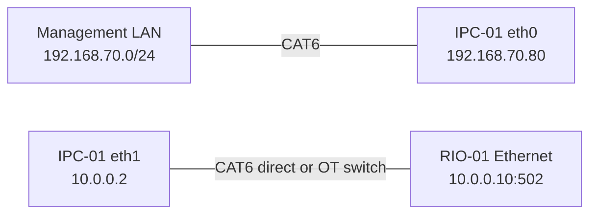
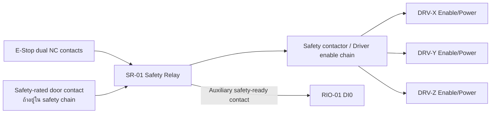

# NARIT Vending — IRIV Wiring Schedule

เอกสารนี้เป็น wiring schedule สำหรับ IRIV PiControl CM4 และ IRIV IO Controller
ต้องอ่านร่วมกับแบบวงจรกำลัง, คู่มืออุปกรณ์ และ [IRIV_ARCHITECTURE.md](IRIV_ARCHITECTURE.md)

> ขอบเขตเอกสาร: ใช้เฉพาะ IRIV ชุดใหม่ ห้ามนำหมายเลข DI/DO ในเอกสารนี้ไปแทน
> BCM GPIO ของ Raspberry Pi เครื่องเดิม และห้ามแก้สายของเครื่องเดิมตามตารางนี้

> คำเตือน: ตัดไฟและทำ Lockout/Tagout ก่อนต่อสาย E-Stop, motor driver หรือ 24 VDC
> ทุกครั้ง งานนี้ต้องตรวจโดยผู้มีหน้าที่ด้านไฟฟ้า/เครื่องจักร ห้ามใช้ software เป็นวงจร
> E-Stop หลัก

## 1. อุปกรณ์และแหล่งจ่าย

| Tag | อุปกรณ์ | แหล่งจ่าย/การเชื่อมต่อ |
|---|---|---|
| IPC-01 | IRIV PiControl CM4 | DC 24 V ผ่าน fuse ตามคู่มือ |
| RIO-01 | IRIV IO Controller | DC 24 V ผ่าน fuse แยก |
| PS-01 | 24 VDC power supply | จ่าย control circuit, sensors, relays |
| SR-01 | Safety relay | รับ E-Stop แบบ dual-channel |
| MC-01 | Hardware-timed motion controller | STEP/DIR/ENABLE สำหรับ X/Y/Z — ยังไม่กำหนดรุ่น |
| DRV-X/Y/Z | Stepper drivers | รับ pulse จาก MC-01 |
| K-DISP | Interposing relay | แยก DO3 ออกจาก dispense actuator |

## 2. Ethernet wiring

ติดป้ายสาย `NET-IT-01` สำหรับ eth0 และ `NET-OT-01` สำหรับ eth1 ห้ามสลับพอร์ต

## 3. IRIV IO digital inputs

IRIV IO มี DI0–DI10 แบบ isolated active-high ใช้ 24 V control circuit ตามตัวอย่าง
S/S และ digital common ในคู่มือของ IRIV IO ห้ามต่อ 24 V เข้าขา Raspberry Pi โดยตรง

| Channel | Cable tag | Field signal | Normal | Active | Software meaning |
|---|---|---|---|---|---|
| DI0 | `DI-ESTOP-FB` | SR-01 safety-ready auxiliary contact | ON | OFF เมื่อ E-Stop/fault | `estop_safe` |
| DI1 | `DI-X-HOME` | X home/head limit | OFF | ON | `x_head_limit` |
| DI2 | `DI-X-TAIL` | X tail limit | OFF | ON | `x_tail_limit` |
| DI3 | `DI-Y-HOME` | Y home/head limit | OFF | ON | `y_head_limit` |
| DI4 | `DI-Y-TAIL` | Y tail limit | OFF | ON | `y_tail_limit` |
| DI5 | `DI-Z-HOME` | Z home/head limit | OFF | ON | `z_head_limit` |
| DI6 | `DI-Z-TAIL` | Z tail limit | OFF | ON | `z_tail_limit` |
| DI7 | `DI-X-ALARM` | Driver X alarm output | OFF | ON | `x_driver_alarm` |
| DI8 | `DI-Y-ALARM` | Driver Y alarm output | OFF | ON | `y_driver_alarm` |
| DI9 | `DI-Z-ALARM` | Driver Z alarm output | OFF | ON | `z_driver_alarm` |
| DI10 | `DI-DOOR-SAFE` | Door interlock safety contact | ON | OFF เมื่อประตูเปิด | `door_safe` |

ข้อกำหนด:

- ปิด counter mode ของ DI1, DI3, DI5 เพื่อใช้เป็น digital limit input
- E-Stop และ door ใช้แนวคิด de-energize-to-trip: สายขาดต้องอ่านเป็นไม่ปลอดภัย
- ถ้า alarm output ของ driver เป็น active-low ให้ใช้ interposing relay หรือ invert ที่ backend
  หลังยืนยันด้วยมิเตอร์ ห้ามเดาจากสีสาย
- ใช้ shielded cable สำหรับ limit/alarm ที่เดินคู่กับสายมอเตอร์ และต่อ shield ที่ cabinet PE
  ด้านเดียว

## 4. IRIV IO digital outputs

DO0–DO3 เป็น isolated active-high dry-contact SSR สูงสุดตามคู่มือ 50 V, 500 mA
ให้ใช้ fuse รายวงจรและ interposing relay เมื่อโหลดมี inrush หรือเป็น inductive load

| Channel | Cable tag | Load | Safe state | Wiring rule |
|---|---|---|---|---|
| DO0 | `DO-READY-GRN` | Stack light สีเขียว | OFF | 24 VDC fused control load |
| DO1 | `DO-MOVING-YEL` | Stack light สีเหลือง | OFF | 24 VDC fused control load |
| DO2 | `DO-ALARM-RED` | ไฟแดง/บัซเซอร์ | OFF เมื่อ power-up; ON เมื่อ alarm | ผ่าน relay หากเกิน rating |
| DO3 | `DO-DISPENSE` | Coil ของ K-DISP | OFF | K-DISP contact จ่าย actuator |

ห้ามใช้ DO0–DO3 เป็น STEP, DIR, PWM, driver ENABLE หรือ safety output

## 5. E-Stop hardwired circuit

- Contact หลักของ SR-01 ต้องปลด enable หรือกำลังของ driver ทั้งสามแกน
- DI0 เป็น feedback สำหรับ software เท่านั้น ไม่ใช่ตัวหยุดหลัก
- Reset safety relay ต้องเป็น manual reset และห้ามทำให้มอเตอร์เริ่มเอง
- หลัง Reset สถานะ software ต้องเป็น `NOT_READY` และต้อง Home ใหม่

## 6. Motion wiring boundary

ยังไม่อนุมัติหมายเลข terminal ของ STEP/DIR/ENABLE จนกว่าจะเลือกรุ่น MC-01
เพื่อป้องกันการต่อผิด ห้ามนำ legacy BCM GPIO ต่อออกจาก IRIV PiControl

| Axis | MC-01 output ที่ต้องมี | Driver input | Electrical requirement |
|---|---|---|---|
| X | `X_STEP`, `X_DIR`, `X_EN` | DRV-X PUL/DIR/ENA | Differential/isolated ตามคู่มือ driver |
| Y | `Y_STEP`, `Y_DIR`, `Y_EN` | DRV-Y PUL/DIR/ENA | Differential/isolated ตามคู่มือ driver |
| Z | `Z_STEP`, `Z_DIR`, `Z_EN` | DRV-Z PUL/DIR/ENA | Differential/isolated ตามคู่มือ driver |

ค่าที่ต้องรองรับ:

- อย่างน้อย 3 axes และ 2,000 pulses/s ต่อแกน
- Pulse width และ voltage level ตรงกับ DM442/DM542 หรือ driver ที่ติดตั้งจริง
- ENABLE ต้องเข้าสู่ safe state เมื่อ MC-01 reboot, communication loss หรือ watchdog timeout
- สาย pulse/direction ใช้ twisted pair shielded และแยกจากสายกำลังมอเตอร์

BCM mapping เดิมด้านล่างเก็บไว้เพื่ออ้างอิง migration เท่านั้นและ **ห้ามต่อกับ IRIV**:

| Axis | Legacy STEP | Legacy DIR | Legacy EN |
|---|---:|---:|---:|
| X | GPIO16 | GPIO23 | GPIO12 |
| Y | GPIO26 | GPIO24 | GPIO13 |
| Z | GPIO18 | GPIO25 | GPIO19 |

GPIO19/20/21 บน IRIV PiControl ถูกใช้กับ buzzer/LED ภายใน และ GPIO23–26 เชื่อมกับ
isolated DO ของตัว IRIV อยู่แล้ว การใช้ legacy map จะชนกับ hardware ภายใน

## 7. Grounding and EMC

- ต่อ cabinet, IRIV enclosure, motor frames, driver chassis และ cable shields เข้าบัส PE
- แยก PE, 0 VDC control และ isolated I/O common ตามคู่มือ ห้าม bridge โดยไม่ออกแบบ
- เดินสาย motor power แยกจาก Ethernet, limit และ pulse cable
- ใช้ ferrule, terminal marker และ wire number ตรงกับตารางนี้ทั้งสองปลาย
- ใส่ flyback diode หรือ suppression ที่ DC relay coil โดยตรวจ polarity
- ห้ามต่อ shield สองปลายถ้าทำให้เกิด ground loop เว้นแต่แบบ EMC กำหนดไว้

## 8. Terminal/wire schedule template

กรอก terminal จริงระหว่างประกอบตู้ ห้ามปล่อยช่อง From/To คลุมเครือก่อนจ่ายไฟ

| Wire no. | From | To | Signal | Voltage | Test result |
|---|---|---|---|---|---|
| W001 | SR-01 AUX | RIO-01 DI0 | E-Stop safe feedback | 24 VDC | ☐ |
| W002 | X Home sensor | RIO-01 DI1 | X home limit | 24 VDC | ☐ |
| W003 | X Tail sensor | RIO-01 DI2 | X tail limit | 24 VDC | ☐ |
| W004 | Y Home sensor | RIO-01 DI3 | Y home limit | 24 VDC | ☐ |
| W005 | Y Tail sensor | RIO-01 DI4 | Y tail limit | 24 VDC | ☐ |
| W006 | Z Home sensor | RIO-01 DI5 | Z home limit | 24 VDC | ☐ |
| W007 | Z Tail sensor | RIO-01 DI6 | Z tail limit | 24 VDC | ☐ |
| W008 | DRV-X Alarm | RIO-01 DI7 | X alarm | 24 VDC/interface relay | ☐ |
| W009 | DRV-Y Alarm | RIO-01 DI8 | Y alarm | 24 VDC/interface relay | ☐ |
| W010 | DRV-Z Alarm | RIO-01 DI9 | Z alarm | 24 VDC/interface relay | ☐ |
| W011 | Door contact | RIO-01 DI10 | Door safe | 24 VDC | ☐ |
| W020 | RIO-01 DO0 | Green lamp | Ready | 24 VDC | ☐ |
| W021 | RIO-01 DO1 | Yellow lamp | Moving | 24 VDC | ☐ |
| W022 | RIO-01 DO2 | Alarm relay/lamp | Alarm | 24 VDC | ☐ |
| W023 | RIO-01 DO3 | K-DISP coil | Dispense | 24 VDC | ☐ |

## 9. Commissioning checklist

### ก่อนจ่ายไฟ

- [ ] ตรวจ PE continuity และ polarity ของ 24 VDC
- [ ] ตรวจ fuse และ current rating ทุก branch
- [ ] ถอด motor coupling/load หรือทำให้แกนเคลื่อนได้อย่างปลอดภัย
- [ ] ตรวจ E-Stop dual-channel และ safety relay reset
- [ ] ยืนยันว่า `/etc/narit-vending.env` ยังเป็น `GPIOZERO_PIN_FACTORY=mock`

### I/O test โดยไม่ต่อโหลดกำลัง

- [ ] อ่าน DI0–DI10 ทีละช่องและยืนยัน polarity
- [ ] ยืนยันสายขาดของ E-Stop/door แสดง unsafe
- [ ] สั่ง DO0–DO3 ทีละช่องโดยใช้ test lamp/relay เท่านั้น
- [ ] ตัดสาย Ethernet OT และยืนยัน software แสดง communication fault

### Motion commissioning หลังติดตั้ง MC-01

- [ ] ตรวจ driver enable polarity โดยยังไม่ส่ง pulse
- [ ] ทดสอบ X/Y/Z ทีละแกนที่ความเร็วต่ำ
- [ ] ยืนยัน home/tail limit หยุดแกนในทิศทางที่ถูกต้อง
- [ ] วัดคำสั่ง 10 mm เทียบระยะจริงและปรับ steps/mm
- [ ] ทดสอบ STOP, E-Stop, door open และ communication watchdog
- [ ] Home ตามลำดับ Z → Y → X
- [ ] ทดสอบ slot sequence แบบไม่มีสินค้า ก่อนทดสอบพร้อมโหลด

ห้ามเปลี่ยนจาก mock เป็น production backend จนกว่าผู้ตรวจรับลงชื่อใน commissioning record
