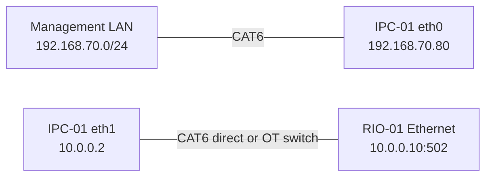
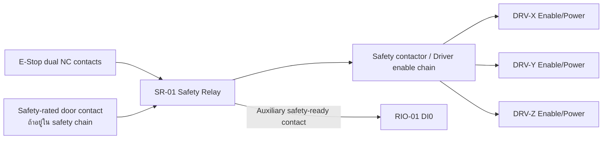

# NARIT Vending — IRIV Wiring Schedule

เอกสารนี้เป็น wiring schedule สำหรับ IRIV PiControl CM4 และ IRIV IO Controller
ต้องอ่านร่วมกับแบบวงจรกำลัง, คู่มืออุปกรณ์ และ [IRIV_ARCHITECTURE.md](IRIV_ARCHITECTURE.md)

> ขอบเขตเอกสาร: ใช้เฉพาะ IRIV ชุดใหม่ ห้ามนำหมายเลข DI/DO ในเอกสารนี้ไปแทน
> BCM GPIO ของ Raspberry Pi เครื่องเดิม และห้ามแก้สายของเครื่องเดิมตามตารางนี้

> คำเตือน: ตัดไฟและทำ Lockout/Tagout ก่อนต่อสาย E-Stop, motor driver หรือ 24 VDC
> ทุกครั้ง งานนี้ต้องตรวจโดยผู้มีหน้าที่ด้านไฟฟ้า/เครื่องจักร ห้ามใช้ software เป็นวงจร
> E-Stop หลัก

## 1. อุปกรณ์และแหล่งจ่าย

| Tag | อุปกรณ์ | แหล่งจ่าย/การเชื่อมต่อ |
|---|---|---|
| IPC-01 | IRIV PiControl CM4 | DC 24 V ผ่าน fuse ตามคู่มือ |
| RIO-01 | IRIV IO Controller | DC 24 V ผ่าน fuse แยก |
| PS-01 | 24 VDC power supply | จ่าย control circuit, sensors, relays |
| PS-M1 | HBS860H motor supply | 20–70 VAC หรือ 30–100 VDC ตามป้ายเครื่อง; แนะนำหม้อแปลงแยกวงจร 48 VAC หลังคำนวณโหลด |
| PS-M2 | DM542 motor supply | 20–50 VDC ตามป้ายเครื่อง; 24 VDC เดิมใช้ได้เมื่อกำลังจ่ายเพียงพอ |
| SR-01 | Safety relay | รับ E-Stop แบบ dual-channel |
| MC-01 | Hardware-timed motion controller | STEP/DIR/ENABLE สำหรับ X/Y/Z — ยังไม่กำหนดรุ่น |
| DRV-HBS-01 | HBS860H hybrid servo drive | ขับ MOT-HBS-01; รอระบุแกน X/Y/Z |
| MOT-HBS-01 | 86HBS85 NEMA34 closed-loop stepper | 8.5 N.m, 5.6 A, shaft 14 mm พร้อม encoder |
| DRV-DM-01 | DM542 (32-bit) stepper drive | ขับ ACT-VS-01; รอระบุแกน X/Y/Z |
| ACT-VS-01 | V-Slot Mini Actuator 1-axis | ต้องอ่าน rated phase current จากป้ายมอเตอร์ก่อนตั้ง DRV-DM-01 |
| DRV-TBD-01 | Driver ของแกนที่เหลือ | ยังไม่กำหนด ถ้าระบบจริงยังใช้ครบ 3 แกน |
| K-DISP | Interposing relay | แยก DO3 ออกจาก dispense actuator |

ก่อนเข้าหัวสาย ให้กรอกตาราง assignment นี้และแก้ tag `DRV-X/Y/Z` บนตู้ให้ตรงกัน:

| ชุดขับ | แกนจริง | Alarm DI | สถานะ |
|---|---|---|---|
| DRV-HBS-01 + MOT-HBS-01 | `TBD: X / Y / Z` | `TBD: DI7 / DI8 / DI9` | ห้ามสั่งเคลื่อนที่จนกว่าจะกรอก |
| DRV-DM-01 + ACT-VS-01 | `TBD: X / Y / Z` | ไม่มี alarm output บนรุ่นตามภาพ | ห้ามสั่งเคลื่อนที่จนกว่าจะกรอก |
| DRV-TBD-01 | `TBD` | `TBD` | ต้องกำหนดเมื่อใช้งานครบ 3 แกน |

## 2. Ethernet wiring

ติดป้ายสาย `NET-IT-01` สำหรับ eth0 และ `NET-OT-01` สำหรับ eth1 ห้ามสลับพอร์ต

## 3. IRIV IO digital inputs

IRIV IO มี DI0–DI10 แบบ isolated active-high ใช้ 24 V control circuit ตามตัวอย่าง
S/S และ digital common ในคู่มือของ IRIV IO ห้ามต่อ 24 V เข้าขา Raspberry Pi โดยตรง

| Channel | Cable tag | Field signal | Normal | Active | Software meaning |
|---|---|---|---|---|---|
| DI0 | `DI-ESTOP-FB` | SR-01 safety-ready auxiliary contact | ON | OFF เมื่อ E-Stop/fault | `estop_safe` |
| DI1 | `DI-X-HOME` | X home/head limit | OFF | ON | `x_head_limit` |
| DI2 | `DI-X-TAIL` | X tail limit | OFF     | ON | `x_tail_limit` |
| DI3 | `DI-Y-HOME` | Y home/head limit | OFF | ON | `y_head_limit` |
| DI4 | `DI-Y-TAIL` | Y tail limit | OFF | ON | `y_tail_limit` |
| DI5 | `DI-Z-HOME` | Z home/head limit | OFF | ON | `z_head_limit` |
| DI6 | `DI-Z-TAIL` | Z tail limit | OFF | ON | `z_tail_limit` |
| DI7 | `DI-X-ALARM` | Driver X alarm output | OFF | ON | `x_driver_alarm` |
| DI8 | `DI-Y-ALARM` | Driver Y alarm output | OFF | ON | `y_driver_alarm` |
| DI9 | `DI-Z-ALARM` | Driver Z alarm output | OFF | ON | `z_driver_alarm` |
| DI10 | `DI-DOOR-SAFE` | Door interlock safety contact | ON | OFF เมื่อประตูเปิด | `door_safe` |

ข้อกำหนด:

- ปิด counter mode ของ DI1, DI3, DI5 เพื่อใช้เป็น digital limit input
- E-Stop และ door ใช้แนวคิด de-energize-to-trip: สายขาดต้องอ่านเป็นไม่ปลอดภัย
- ถ้า alarm output ของ driver เป็น active-low ให้ใช้ interposing relay หรือ invert ที่ backend
  หลังยืนยันด้วยมิเตอร์ ห้ามเดาจากสีสาย
- ใช้ shielded cable สำหรับ limit/alarm ที่เดินคู่กับสายมอเตอร์ และต่อ shield ที่ cabinet PE
  ด้านเดียว

## 4. IRIV IO digital outputs

DO0–DO3 เป็น isolated active-high dry-contact SSR สูงสุดตามคู่มือ 50 V, 500 mA
ให้ใช้ fuse รายวงจรและ interposing relay เมื่อโหลดมี inrush หรือเป็น inductive load

| Channel | Cable tag | Load | Safe state | Wiring rule |
|---|---|---|---|---|
| DO0 | `DO-READY-GRN` | Stack light สีเขียว | OFF | 24 VDC fused control load |
| DO1 | `DO-MOVING-YEL` | Stack light สีเหลือง | OFF | 24 VDC fused control load |
| DO2 | `DO-ALARM-RED` | ไฟแดง/บัซเซอร์ | OFF เมื่อ power-up; ON เมื่อ alarm | ผ่าน relay หากเกิน rating |
| DO3 | `DO-DISPENSE` | Coil ของ K-DISP | OFF | K-DISP contact จ่าย actuator |

ห้ามใช้ DO0–DO3 เป็น STEP, DIR, PWM, driver ENABLE หรือ safety output

## 5. E-Stop hardwired circuit

- Contact หลักของ SR-01 ต้องปลด enable หรือกำลังของ driver ทั้งสามแกน
- DI0 เป็น feedback สำหรับ software เท่านั้น ไม่ใช่ตัวหยุดหลัก
- Reset safety relay ต้องเป็น manual reset และห้ามทำให้มอเตอร์เริ่มเอง
- หลัง Reset สถานะ software ต้องเป็น `NOT_READY` และต้อง Home ใหม่

## 6. Motion wiring boundary

ยังไม่อนุมัติหมายเลข terminal ของ STEP/DIR/ENABLE จนกว่าจะเลือกรุ่น MC-01
เพื่อป้องกันการต่อผิด ห้ามนำ legacy BCM GPIO ต่อออกจาก IRIV PiControl

| Axis | MC-01 output ที่ต้องมี | Driver input | Electrical requirement |
|---|---|---|---|
| X | `X_STEP`, `X_DIR`, `X_EN` | DRV-X PUL/DIR/ENA | Differential/isolated ตามคู่มือ driver |
| Y | `Y_STEP`, `Y_DIR`, `Y_EN` | DRV-Y PUL/DIR/ENA | Differential/isolated ตามคู่มือ driver |
| Z | `Z_STEP`, `Z_DIR`, `Z_EN` | DRV-Z PUL/DIR/ENA | Differential/isolated ตามคู่มือ driver |

ค่าที่ต้องรองรับ:

- อย่างน้อย 3 axes และ 2,000 pulses/s ต่อแกน
- Pulse width และ voltage level ตรงกับ DM442/DM542 หรือ driver ที่ติดตั้งจริง
- ENABLE ต้องเข้าสู่ safe state เมื่อ MC-01 reboot, communication loss หรือ watchdog timeout
- สาย pulse/direction ใช้ twisted pair shielded และแยกจากสายกำลังมอเตอร์

### 6.1 HBS860H + 86HBS85 closed-loop axis

ใช้สายคู่บิดเกลียวมี shield สำหรับ PUL, DIR, ENA และ encoder แยกจากสาย A/B และสาย AC
ห้ามต่อ encoder เข้ากับ IRIV IO หรือ Raspberry Pi เพราะวงปิดอยู่ระหว่าง 86HBS85 กับ HBS860H

#### สัญญาณควบคุมจาก MC-01

| From MC-01 | To DRV-HBS-01 | หน้าที่ | ข้อกำหนด |
|---|---|---|---|
| `AXIS-HBS_STEP+` | `PUL+` | Pulse positive | Differential/isolated output |
| `AXIS-HBS_STEP-` | `PUL-` | Pulse negative | จับคู่กับ STEP+ |
| `AXIS-HBS_DIR+` | `DIR+` | Direction positive | คงค่าก่อน pulse ตามคู่มือ |
| `AXIS-HBS_DIR-` | `DIR-` | Direction negative | จับคู่กับ DIR+ |
| `AXIS-HBS_EN+` | `ENA+` | Enable positive | ผ่าน safety enable chain |
| `AXIS-HBS_EN-` | `ENA-` | Enable negative | ต้อง disable เมื่อ MC-01/watchdog fault |

ถ้า MC-01 มีเฉพาะ single-ended output ให้เพิ่ม isolated differential line driver ที่ออกแบบสำหรับ
STEP/DIR ห้ามเดาการต่อแบบ common-anode/common-cathode และห้ามนำ 24 V ต่อเข้าขา control
จนกว่าจะยืนยันรุ่น MC-01 กับคู่มือของ HBS860H ตัวที่ติดตั้ง

#### มอเตอร์, encoder, alarm และไฟกำลัง

| From | To DRV-HBS-01 | สาย/หน้าที่ | กฎการต่อ |
|---|---|---|---|
| MOT-HBS-01 motor coil A | `A+`, `A-` | คู่ขดลวด A | ยืนยันคู่ขดลวดจาก datasheet/โอห์มมิเตอร์ ห้ามเดาสี |
| MOT-HBS-01 motor coil B | `B+`, `B-` | คู่ขดลวด B | ยืนยันคู่ขดลวดจาก datasheet/โอห์มมิเตอร์ ห้ามเดาสี |
| Encoder B+ | `EB+` | Encoder channel B+ | สีเหลืองตาม sleeve ในภาพ; terminal name เป็นหลัก |
| Encoder B- | `EB-` | Encoder channel B- | สีเขียวตาม sleeve ในภาพ; terminal name เป็นหลัก |
| Encoder A+ | `EA+` | Encoder channel A+ | สีดำตาม sleeve ในภาพ; terminal name เป็นหลัก |
| Encoder A- | `EA-` | Encoder channel A- | สีน้ำตาลตาม sleeve ในภาพ; terminal name เป็นหลัก |
| Encoder supply | `VCC` | Encoder +5 V จาก driver | สีแดง; ห้ามป้อนไฟภายนอก |
| Encoder ground | `EGND` | Encoder signal ground | สีขาว; ห้ามต่อแทน cabinet PE |
| PS-M1 isolated output | `AC`, `AC` | ไฟกำลัง driver | ใช้ 20–70 VAC; fuse/contactor ตาม load calculation |
| `ALM+`, `ALM-` | Interface relay → DI7/8/9 ตามแกน | Driver alarm | ตรวจชนิด/logic ของ output ก่อนต่อ 24 V DI |
| `Pend+`, `Pend-` | Spare terminal | In-position (optional) | แยกหุ้มปลายสายถ้ายังไม่ใช้ |

กรณีจะใช้ 30–100 VDC แทน AC ต้องขอ pin/polarity diagram ของ HBS860H จากผู้ขายรุ่นเดียวกันก่อน
ห้ามสมมติขั้ว DC จากชื่อ `AC/AC` บนตัวเครื่อง สาย alarm ต้องผ่าน isolated interface ที่ทำให้
IRIV IO เห็นสัญญาณ 24 V ตามตาราง DI และต้องทดสอบทั้ง alarm จริงกับกรณีสายขาด

#### DIP/commissioning baseline ของ HBS860H

- ตั้ง `SW6 = ON` เพื่อเลือกมอเตอร์ `86HBS85` ตามข้อความบนตัวเครื่อง
- `SW5` เลือกทิศ motor (`OFF = CCW`, `ON = CW`) ให้ตั้งหลังตรวจทิศทางแบบ uncoupled
- เลือก pulse/rev ให้ตรง `400 pulses/rev` ของ config ปัจจุบัน และบันทึก SW1–SW4 จากตารางบน
  HBS860H ตัวจริงก่อนจ่าย pulse; ห้ามคัดลอกค่าจาก DM542
- ค่า 5.6 A เป็น rated phase current ของมอเตอร์ ไม่ใช่ค่าฟิวส์ด้าน supply โดยตรง
- จ่ายไฟโดยยังไม่ต่อ load แล้วตรวจ `PWR/ALM`, alarm output และ encoder fault ก่อน jog

### 6.2 DM542 + V-Slot Mini Actuator 1-axis

#### สัญญาณควบคุมจาก MC-01

| From MC-01 | To DRV-DM-01 | หน้าที่ | ข้อกำหนด |
|---|---|---|---|
| `AXIS-VS_STEP+` | `PUL+` | Pulse positive | 5–24 V opto input ตามป้ายเครื่อง |
| `AXIS-VS_STEP-` | `PUL-` | Pulse negative | จับคู่กับ STEP+ |
| `AXIS-VS_DIR+` | `DIR+` | Direction positive | 5–24 V opto input ตามป้ายเครื่อง |
| `AXIS-VS_DIR-` | `DIR-` | Direction negative | จับคู่กับ DIR+ |
| `AXIS-VS_EN+` | `ENA+` | Enable positive | 5–24 V opto input; ผ่าน safety chain |
| `AXIS-VS_EN-` | `ENA-` | Enable negative | ต้อง disable เมื่อ controller fault |

| From | To DRV-DM-01 | หน้าที่ | กฎการต่อ |
|---|---|---|---|
| PS-M2 `+VDC` | `+V` | Motor supply positive | 20–50 VDC ตามป้าย; fuse แยก branch |
| PS-M2 `0V` | `GND` | Motor supply return | ห้ามใช้ PE แทน 0 V |
| ACT-VS-01 coil A | `A+`, `A-` | Motor phase A | หา coil pair ด้วยโอห์มมิเตอร์/เอกสารมอเตอร์ |
| ACT-VS-01 coil B | `B+`, `B-` | Motor phase B | ห้ามสลับสายขณะ driver มีไฟ |
| Cabinet PE | Driver chassis/mounting PE | Protective bonding | ต่อ chassis/ราง DIN เข้าบัส PE |

ค่าเริ่มต้นที่ตรงกับ config IRIV ปัจจุบันคือ `400 pulses/rev`:

| รายการ | DIP setting บน DM542 ตามภาพ | หมายเหตุ |
|---|---|---|
| Pulse/rev 400 | `SW5=OFF, SW6=ON, SW7=ON, SW8=ON` | สอดคล้อง `driver_microsteps=2`, `pulses_per_rev=400` |
| Run current | `SW1–SW3 = TBD` | ต้องทราบ rated phase current ของมอเตอร์ V-Slot ก่อน |
| Idle current | `SW4=OFF` เป็นค่าเริ่มต้นแบบ half-current | เปลี่ยนเป็น full-current เฉพาะเมื่อจำเป็นและตรวจอุณหภูมิแล้ว |

ห้ามตั้ง 4.20 A เพียงเพราะเป็นค่าสูงสุดของ DM542 ให้เลือก peak current ที่สอดคล้องกับมอเตอร์
V-Slot จริง จากนั้น jog แบบ uncoupled ที่ความเร็วต่ำ วัดระยะ 10 mm และแก้ `steps_per_mm`
หากระยะไม่ตรง ห้ามแก้ด้วยการเดา DIP หลายตัวพร้อมกัน

BCM mapping เดิมด้านล่างเก็บไว้เพื่ออ้างอิง migration เท่านั้นและ **ห้ามต่อกับ IRIV**:

| Axis | Legacy STEP | Legacy DIR | Legacy EN |
|---|---:|---:|---:|
| X | GPIO16 | GPIO23 | GPIO12 |
| Y | GPIO26 | GPIO24 | GPIO13 |
| Z | GPIO18 | GPIO25 | GPIO19 |

GPIO19/20/21 บน IRIV PiControl ถูกใช้กับ buzzer/LED ภายใน และ GPIO23–26 เชื่อมกับ
isolated DO ของตัว IRIV อยู่แล้ว การใช้ legacy map จะชนกับ hardware ภายใน

## 7. Grounding and EMC

- ต่อ cabinet, IRIV enclosure, motor frames, driver chassis และ cable shields เข้าบัส PE
- แยก PE, 0 VDC control และ isolated I/O common ตามคู่มือ ห้าม bridge โดยไม่ออกแบบ
- เดินสาย motor power แยกจาก Ethernet, limit และ pulse cable
- ใช้ ferrule, terminal marker และ wire number ตรงกับตารางนี้ทั้งสองปลาย
- ใส่ flyback diode หรือ suppression ที่ DC relay coil โดยตรวจ polarity
- ห้ามต่อ shield สองปลายถ้าทำให้เกิด ground loop เว้นแต่แบบ EMC กำหนดไว้

## 8. Terminal/wire schedule template

กรอก terminal จริงระหว่างประกอบตู้ ห้ามปล่อยช่อง From/To คลุมเครือก่อนจ่ายไฟ

| Wire no. | From | To | Signal | Voltage | Test result |
|---|---|---|---|---|---|
| W001 | SR-01 AUX | RIO-01 DI0 | E-Stop safe feedback | 24 VDC | ☐ |
| W002 | X Home sensor | RIO-01 DI1 | X home limit | 24 VDC | ☐ |
| W003 | X Tail sensor | RIO-01 DI2 | X tail limit | 24 VDC | ☐ |
| W004 | Y Home sensor | RIO-01 DI3 | Y home limit | 24 VDC | ☐ |
| W005 | Y Tail sensor | RIO-01 DI4 | Y tail limit | 24 VDC | ☐ |
| W006 | Z Home sensor | RIO-01 DI5 | Z home limit | 24 VDC | ☐ |
| W007 | Z Tail sensor | RIO-01 DI6 | Z tail limit | 24 VDC | ☐ |
| W008 | DRV-X Alarm | RIO-01 DI7 | X alarm | 24 VDC/interface relay | ☐ |
| W009 | DRV-Y Alarm | RIO-01 DI8 | Y alarm | 24 VDC/interface relay | ☐ |
| W010 | DRV-Z Alarm | RIO-01 DI9 | Z alarm | 24 VDC/interface relay | ☐ |
| W011 | Door contact | RIO-01 DI10 | Door safe | 24 VDC | ☐ |
| W020 | RIO-01 DO0 | Green lamp | Ready | 24 VDC | ☐ |
| W021 | RIO-01 DO1 | Yellow lamp | Moving | 24 VDC | ☐ |
| W022 | RIO-01 DO2 | Alarm relay/lamp | Alarm | 24 VDC | ☐ |
| W023 | RIO-01 DO3 | K-DISP coil | Dispense | 24 VDC | ☐ |
| W100 | MC-01 AXIS-HBS STEP pair | DRV-HBS-01 PUL+/PUL- | HBS pulse | ตาม interface MC-01 | ☐ |
| W101 | MC-01 AXIS-HBS DIR pair | DRV-HBS-01 DIR+/DIR- | HBS direction | ตาม interface MC-01 | ☐ |
| W102 | Safety enable/MC-01 | DRV-HBS-01 ENA+/ENA- | HBS enable | ตาม interface MC-01 | ☐ |
| W103 | MOT-HBS-01 coil A | DRV-HBS-01 A+/A- | Motor phase A | Motor power | ☐ |
| W104 | MOT-HBS-01 coil B | DRV-HBS-01 B+/B- | Motor phase B | Motor power | ☐ |
| W105 | MOT-HBS-01 encoder | DRV-HBS-01 EB±/EA±/VCC/EGND | Encoder feedback | 5 V จาก driver | ☐ |
| W106 | PS-M1 | DRV-HBS-01 AC/AC | HBS supply | 20–70 VAC | ☐ |
| W107 | DRV-HBS-01 ALM± | Interface relay → assigned DI | HBS alarm | isolated/24 V DI | ☐ |
| W110 | MC-01 AXIS-VS STEP pair | DRV-DM-01 PUL+/PUL- | V-Slot pulse | 5–24 V control | ☐ |
| W111 | MC-01 AXIS-VS DIR pair | DRV-DM-01 DIR+/DIR- | V-Slot direction | 5–24 V control | ☐ |
| W112 | Safety enable/MC-01 | DRV-DM-01 ENA+/ENA- | V-Slot enable | 5–24 V control | ☐ |
| W113 | ACT-VS-01 coil A | DRV-DM-01 A+/A- | Motor phase A | Motor power | ☐ |
| W114 | ACT-VS-01 coil B | DRV-DM-01 B+/B- | Motor phase B | Motor power | ☐ |
| W115 | PS-M2 | DRV-DM-01 +V/GND | DM542 supply | 20–50 VDC | ☐ |

## 9. Commissioning checklist

### ก่อนจ่ายไฟ

- [ ] ตรวจ PE continuity และ polarity ของ 24 VDC
- [ ] ตรวจ fuse และ current rating ทุก branch
- [ ] กรอก axis assignment ของ DRV-HBS-01 และ DRV-DM-01 พร้อมติดป้ายทั้งสองปลายสาย
- [ ] ยืนยัน PS-M1/PS-M2 voltage ขณะ no-load อยู่ในช่วงบนป้าย driver
- [ ] วัด coil pair ของ MOT-HBS-01 และ ACT-VS-01 โดย driver/encoder ยังไม่ต่อไฟ
- [ ] ตั้ง HBS860H `SW6=ON` สำหรับ 86HBS85 และบันทึก DIP ทุกตัว
- [ ] อ่าน rated phase current ของมอเตอร์ V-Slot แล้วตั้ง DM542 SW1–SW4
- [ ] ตั้ง DM542 400 pulse/rev (`SW5=OFF, SW6=ON, SW7=ON, SW8=ON`)
- [ ] ถอด motor coupling/load หรือทำให้แกนเคลื่อนได้อย่างปลอดภัย
- [ ] ตรวจ E-Stop dual-channel และ safety relay reset
- [ ] ยืนยันว่า `/etc/narit-vending.env` ยังเป็น `GPIOZERO_PIN_FACTORY=mock`

### I/O test โดยไม่ต่อโหลดกำลัง

- [ ] อ่าน DI0–DI10 ทีละช่องและยืนยัน polarity
- [ ] ยืนยันสายขาดของ E-Stop/door แสดง unsafe
- [ ] สั่ง DO0–DO3 ทีละช่องโดยใช้ test lamp/relay เท่านั้น
- [ ] ตัดสาย Ethernet OT และยืนยัน software แสดง communication fault

### Motion commissioning หลังติดตั้ง MC-01

- [ ] ตรวจ driver enable polarity โดยยังไม่ส่ง pulse
- [ ] ตรวจ HBS860H encoder/alarm โดยถอด encoderเพื่อจำลอง fault และยืนยันแกนเป็น NOT_READY
- [ ] ตรวจ interface alarm ของ HBS860H ทั้ง alarm จริงและสาย feedback ขาด
- [ ] ทดสอบ X/Y/Z ทีละแกนที่ความเร็วต่ำ
- [ ] ยืนยัน home/tail limit หยุดแกนในทิศทางที่ถูกต้อง
- [ ] วัดคำสั่ง 10 mm เทียบระยะจริงและปรับ steps/mm
- [ ] ทดสอบ STOP, E-Stop, door open และ communication watchdog
- [ ] Home ตามลำดับ Z → Y → X
- [ ] ทดสอบ slot sequence แบบไม่มีสินค้า ก่อนทดสอบพร้อมโหลด

ห้ามเปลี่ยนจาก mock เป็น production backend จนกว่าผู้ตรวจรับลงชื่อใน commissioning record

## 10. แหล่งอ้างอิงและลำดับความสำคัญ

1. ป้าย terminal/current/pulse table บนอุปกรณ์ HBS860H และ DM542 ในภาพของเครื่องนี้
2. Datasheet ของมอเตอร์ 86HBS85 และมอเตอร์ที่มากับ V-Slot lot ที่ติดตั้งจริง
3. [Leadshine DM542E User Manual](https://www.leadshine.com/upfiles/downloads/d5375bf4c28b5c75b2d150c9762781c9_1651052967281.pdf)
   ใช้ตรวจแนวทางทั่วไปของตระกูล DM542 เท่านั้น เพราะตัวในภาพระบุ `DM542` และหน้าป้าย/DIP
   อาจต่างจาก `DM542E`

หากข้อมูลขัดกัน ให้หยุดงานและใช้ป้ายบนอุปกรณ์จริงร่วมกับคู่มือจากผู้ขายของ serial/lot เดียวกัน
เป็นหลัก ห้ามใช้ค่า DIP หรือ voltage จากคู่มือคนละ revision โดยอนุมานเอง
