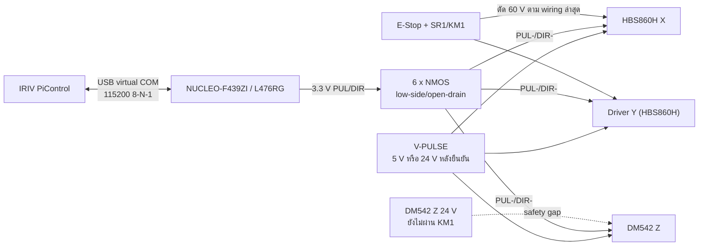
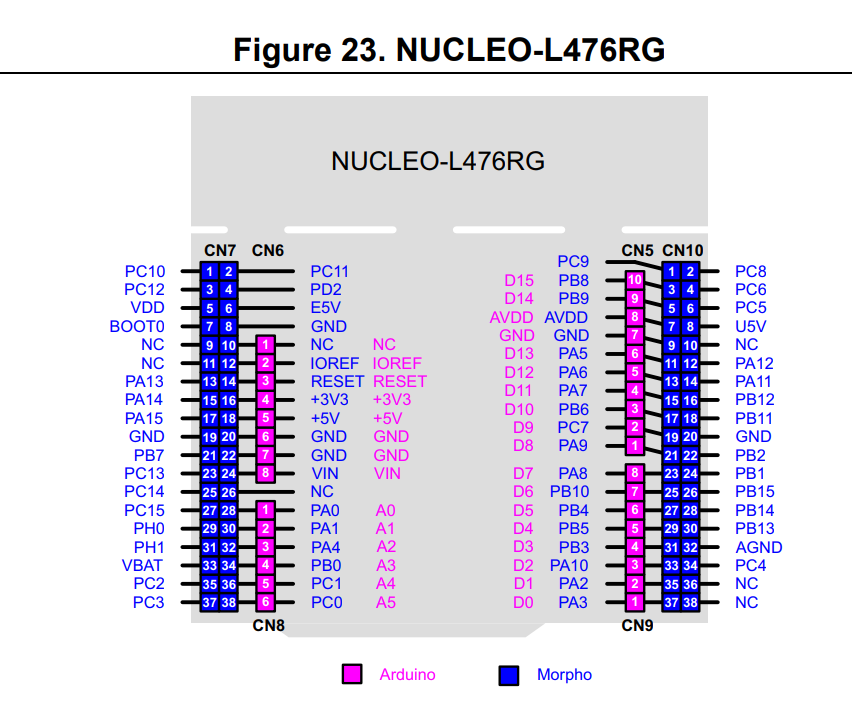

# NARIT Vending - ผังต่อ STM32 + NMOS ที่ใช้งานปัจจุบัน

เอกสารนี้แยกเฉพาะทางเดินสัญญาณ `PULSE/DIRECTION` จาก
`NUCLEO-F439ZI` (Nucleo-144) หรือ `NUCLEO-L476RG` (Nucleo-64) ผ่าน NMOS แบบ low-side/open-drain ไปยังไดรเวอร์มอเตอร์ X/Y/Z
โดยไม่รวม FX5U, Galil หรือ AS218TX-A

> **สถานะเอกสาร: AS-CONNECTED แบบ provisional (รองรับ NUCLEO-F439ZI และ NUCLEO-L476RG)**
>
> ตารางขา STM32 ด้านล่างยืนยันจาก source code ปัจจุบัน (`nucleo_motion.c`), คู่มือ ST UM1974 (Nucleo-144)
> และคู่มือ ST UM1724 (Nucleo-64 Figure 23)
> ส่วนรุ่น NMOS, ค่า resistor, แรงดัน `V-PULSE` และ terminal ฝั่ง driver ต้องตรวจจาก
> อุปกรณ์/สายจริงก่อนเปลี่ยนสถานะเป็น VERIFIED AS-BUILT

> ตัดไฟและทำ Lockout/Tagout ก่อนวัด continuity หรือแก้สาย ห้ามใช้ STM32, NMOS,
> USB หรือ software เป็นวงจร E-Stop

## 1. ขอบเขตและสถานะระบบ



- STM32 สร้าง pulse ด้วย hardware timer output compare ไม่ใช่ Raspberry Pi GPIO
- NMOS แต่ละตัวทำหน้าที่ sink กระแสของ optocoupler input ฝั่ง driver
- ใช้ NMOS แยกหนึ่งตัวต่อหนึ่งสัญญาณ รวม 6 ตัวสำหรับ `PUL/DIR` สามแกน
- `ENA`, limit, alarm และ E-Stop **ไม่ได้ต่อเข้า Nucleo โดยตรงในโมดูล motion ปัจจุบัน**
- วงจร safety ต้อง hardwired แยกต่างหาก
- **ไฟ LED บนบอร์ด (LED conflict warning):**
  - บน `NUCLEO-F439ZI`: ขา `PB0` เป็นตำแหน่ง LED1 (Green) จึงต้องปิด LED toggle ในโค้ดไม่ให้กระทบ `X_DIR`
  - บน `NUCLEO-L476RG`: ขา `PA5` เป็นตำแหน่ง LD2 (Green User LED) ซึ่งตรงกับ `Z_PUL` โดยไฟ LD2 จะกะพริบตามจังหวะก้าวแกน Z **ห้ามใส่โค้ด blink/toggle LD2 ในระบบเด็ดขาด** เพื่อไม่ให้สร้างสัญญาณก้าวหลอกเข้าแกน Z

## 2. STM32 Pin Map เปรียบเทียบ F439ZI (Nucleo-144) vs L476RG (Nucleo-64)

ทั้งสองบอร์ดใช้ขา MCU พอร์ต/พินเดียวกันและ Timer เดียวกันในเฟิร์มแวร์ จึงไม่ต้องแก้โค้ดสัญญาณใน `nucleo_motion.c` แต่ตำแหน่งคอนเนกเตอร์บนบอร์ดจริงแตกต่างกันอย่างสิ้นเชิง:

### 2.1 ตาราง Pin Mapping

| แกน | สัญญาณ | STM32 MCU Pin | Timer / ฟังก์ชัน | NUCLEO-F439ZI<br>(Nucleo-144) | NUCLEO-L476RG<br>(Nucleo-64 Morpho) | NUCLEO-L476RG<br>(Arduino Headers) | NMOS Channel | ไดรเวอร์ปลายทาง |
|---|---|---|---|---|---|---|---|---|
| X | `X_PUL_MCU` | `PA8` | `TIM1_CH1` | `CN12 pin 23` | **`CN10 pin 23`** (แถวใน) | `CN9 pin 8` (`D7`) | Q1 (Gate) | HBS860H X `PUL−` |
| X | `X_DIR_MCU` | `PB0` | GPIO output | `CN10 pin 31` / `D33` | **`CN7 pin 34`** (แถวใน) | `CN8 pin 4` (`A3`) | Q2 (Gate) | HBS860H X `DIR−` |
| Y | `Y_PUL_MCU` | `PA9` | `TIM1_CH2` | `CN12 pin 21` | **`CN10 pin 21`** (แถวใน) | `CN5 pin 1` (`D8`) | Q3 (Gate) | HBS860H Y `PUL−` |
| Y | `Y_DIR_MCU` | `PB1` | GPIO output | `CN10 pin 7` / `A6` | **`CN10 pin 24`** (แถวนอก) | *(ไม่มีบน Arduino)* | Q4 (Gate) | HBS860H Y `DIR−` |
| Z | `Z_PUL_MCU` | `PA5` | `TIM2_CH1` | `CN12 pin 11` / `CN7 pin 10` | **`CN10 pin 11`** (แถวใน) | `CN5 pin 6` (`D13`) | Q5 (Gate) | DM542 Z `PUL−` |
| Z | `Z_DIR_MCU` | `PB2` | GPIO output | `CN10 pin 15` / `D27` | **`CN10 pin 22`** (แถวนอก) | *(ไม่มีบน Arduino)* | Q6 (Gate) | DM542 Z `DIR−` |
| Common | `MCU_GND` | GND | Reference | `CN10 pin 5/17/27` | **`CN10 pin 9 หรือ 20`**<br>(หรือ CN7 pin 19/20) | `CN5 pin 7` หรือ `CN6 pin 6/7` | Q1-Q6 Source | `0V-SIGNAL` |

### 2.2 แผนผังตำแหน่งบนบอร์ด NUCLEO-L476RG (อ้างอิง UM1724 Figure 23)



```text
                     [ NUCLEO-L476RG ]
           ฝั่งซ้าย                               ฝั่งขวา
        (CN7 / CN8 / CN6)                   (CN10 / CN5 / CN9)
    ┌───────────────────────┐           ┌───────────────────────┐
    │                       │           │                       │
    │                       │           │ CN10-11 (D13) ──> Z_PUL (PA5)
    │                       │           │   :                   │
    │                       │           │ CN10-20 (GND) ──> MCU_GND
    │                       │           │ CN10-21 (D8)  ──> Y_PUL (PA9)
    │                       │           │ CN10-22       ──> Z_DIR (PB2)
    │                       │           │ CN10-23 (D7)  ──> X_PUL (PA8)
    │                       │           │ CN10-24       ──> Y_DIR (PB1)
    │                       │           │                       │
    │ CN7-34 (A3) ──> X_DIR (PB0)       │                       │
    └───────────────────────┘           └───────────────────────┘
```

> **ข้อควรระวังสำคัญอย่างยิ่งเมื่อย้ายมาใช้ NUCLEO-L476RG:**
> 1. **บอร์ด L476RG ไม่มีคอนเนกเตอร์ CN11 และ CN12** (สัญญาณพัลส์เดิมบน CN12 ต้องย้ายมาเสียบ CN10 ทั้งหมด)
> 2. **ห้ามเสียบ `PB0` ที่ CN10 pin 31** (บน L476RG พินนั้นคือ `PB3` / ให้เสียบที่ **`CN7 pin 34`** หรือ **`A3`** ฝั่งซ้าย)
> 3. **ห้ามเสียบ `PB1` ที่ CN10 pin 7** (บน L476RG พินนั้นคือไฟเลี้ยง `AVDD 3.3V` ซึ่งจะทำให้ Y_DIR ค้าง HIGH / ให้เสียบที่ **`CN10 pin 24`**)
> 4. **ห้ามเสียบ `PB2` ที่ CN10 pin 15** (บน L476RG พินนั้นคือ `PA7` / ให้เสียบที่ **`CN10 pin 22`**)
> 5. **ห้ามเสียบกราวด์ที่ CN10 pin 5, 17, 27** (บน L476RG พินเหล่านี้คือขา GPIO `PB9`, `PB6`, `PB4` เสียบแล้วจะช็อตขา MCU / ให้เสียบที่ **`CN10 pin 9 หรือ 20`** เท่านั้น)

## 3. วงจร NMOS ต่อหนึ่งสัญญาณ

ใช้ topology เดียวกันกับ Q1-Q6:

```text
STM32 GPIO 3.3 V ---- Rg ---- Gate  Qn
                              |
                            Rpd
                              |
MCU GND -------------------- Source Qn -------- 0V-SIGNAL
                              |
                            Drain
                              |
Driver PUL- หรือ DIR- --------+

V-PULSE ---------------------- Driver PUL+ หรือ DIR+
```

| อุปกรณ์ | หน้าที่ | ค่าที่ต้องยืนยันจากของจริง |
|---|---|---|
| Q1-Q6 | N-channel MOSFET, low-side switch | ต้องเป็น logic-level ที่ขับด้วย 3.3 V ได้ และ `VDS` สูงกว่า `V-PULSE` พร้อม margin |
| `Rg` | จำกัดกระแสชาร์จ gate/ลด ringing | บันทึกค่าที่ติดตั้งจริง; ค่าออกแบบทั่วไป 100-330 ohm แต่ห้ามถือเป็นค่า as-built |
| `Rpd` | ดึง gate ลงเมื่อ MCU reset/สายหลุด | บันทึกค่าที่ติดตั้งจริง; ค่าออกแบบทั่วไป 47-100 kohm แต่ห้ามถือเป็นค่า as-built |
| `V-PULSE` | แหล่งจ่าย optocoupler input ของ driver | ใช้ 5 V หรือ 24 V ตามป้าย/selector/คู่มือของ driver lot จริงเท่านั้น |

ข้อกำหนด:

- Source ของ Q1-Q6, `0V-SIGNAL` และ GND ของ STM32 ต้องอ้างอิงร่วมกัน
- ห้ามป้อน `V-PULSE` เข้า GPIO ของ STM32 ไม่ว่าโดยตรงหรือผ่าน pull-up
- ต้องวัด `VGS`, drain voltage และ input current ของ driver ขณะ ON/OFF ก่อนต่อมอเตอร์
- ถ้าใช้ breakout NMOS module ให้ตรวจว่ามี optocoupler, LED, resistor หรือ logic inversion
  ภายในหรือไม่ เพราะอาจทำให้ pulse width/polarity ต่างจากวงจรข้างต้น
- STM32 HIGH ทำให้ NMOS ON และกระแสไหลผ่าน optocoupler ของ driver แม้แรงดันที่ `PUL-`/`DIR-`
  จะถูกดึงลงต่ำ ดังนั้นให้ตรวจ polarity จากกระแสที่ input ไม่ใช่ดูชื่อ active-high อย่างเดียว

## 4. ตารางต่อสาย STM32 -> NMOS -> driver

หมายเลข `S3xx` ด้านล่างเป็น local signal tag ของเอกสารนี้

| Tag | From (F439ZI) | From (L476RG) | Via | To | หน้าที่ |
|---|---|---|---|---|---|
| S300 | `PA8`, CN12-23 | `PA8`, **CN10-23** (D7) | Rg -> Q1 Gate | - | X pulse command |
| S301 | Q1 Drain | Q1 Drain | - | TB-X/Driver X `PUL-` | X pulse sink |
| S302 | `PB0`, CN10-31 | `PB0`, **CN7-34** (A3) | Rg -> Q2 Gate | - | X direction command |
| S303 | Q2 Drain | Q2 Drain | - | TB-X/Driver X `DIR-` | X direction sink |
| S310 | `PA9`, CN12-21 | `PA9`, **CN10-21** (D8) | Rg -> Q3 Gate | - | Y pulse command |
| S311 | Q3 Drain | Q3 Drain | - | TB-Y/Driver Y `PUL-` | Y pulse sink |
| S312 | `PB1`, CN10-7 | `PB1`, **CN10-24** | Rg -> Q4 Gate | - | Y direction command |
| S313 | Q4 Drain | Q4 Drain | - | TB-Y/Driver Y `DIR-` | Y direction sink |
| S320 | `PA5`, CN12-11 | `PA5`, **CN10-11** (D13) | Rg -> Q5 Gate | - | Z pulse command |
| S321 | Q5 Drain | Q5 Drain | - | TB-Z/DM542 `PUL-` | Z pulse sink |
| S322 | `PB2`, CN10-15 | `PB2`, **CN10-22** | Rg -> Q6 Gate | - | Z direction command |
| S323 | Q6 Drain | Q6 Drain | - | TB-Z/DM542 `DIR-` | Z direction sink |
| S330 | `V-PULSE` ผ่าน fuse | `V-PULSE` ผ่าน fuse | terminal distribution | X/Y/Z `PUL+` และ `DIR+` | common-anode signal supply |
| S331 | MCU GND (CN10-5) | MCU GND (**CN10-20/9**) | Q1-Q6 Source | `0V-SIGNAL` | signal reference |

ต่อ PUL และ DIR เป็น shielded twisted pair แยกจากสายมอเตอร์และสาย AC ต่อ shield ที่
cabinet PE ฝั่งตู้เพียงด้านเดียว เว้นแต่คู่มือ driver lot จริงกำหนดต่างออกไป

## 5. Driver assignment ปัจจุบัน

| แกน | Driver | PUL/DIR | สถานะยืนยัน |
|---|---|---|---|
| X | HBS860H | common-anode ผ่าน Q1/Q2 | แกนและ logic voltage ต้องตรวจป้าย/สายจริง |
| Y | HBS860H | common-anode ผ่าน Q3/Q4 | ยืนยันจาก wiring ล่าสุด; ยังต้องตรวจป้ายและ input rating ของตัวจริง |
| Z | DM542 ที่ติดตั้ง | common-anode ผ่าน Q5/Q6 | ต้องยืนยันว่าเป็น DM542 revision ใดและรับ 5/24 V แบบใด |

`ENA+/-` ไม่ได้ถูกกำหนดใน `nucleo_motion.c` ห้ามผูก ENA เป็น ON ถาวรโดยอ้างเอกสารนี้
วงจร E-Stop/safety relay ต้องปลด torque หรือ power ตาม risk assessment โดยไม่พึ่ง STM32

## 6. Firmware ที่พบใน workspace

มี source สองสถานะซึ่งต้องไม่สับสน:

1. [`firmware/nucleo_f439zi/README.md`](../firmware/nucleo_f439zi/README.md) ระบุว่า
   safe-link binary รองรับเฉพาะ `PING/STATUS` และไม่เปิด motion output
2. [`NaritVendingV1/stm32/Src/nucleo_serial_link.c`](../NaritVendingV1/stm32/Src/nucleo_serial_link.c)
   มี source command `MOVE X|Y|Z dir steps speed` และเรียก `Stepper_Move()`
3. Binary `nucleo_f439zi_safe_link.bin` ที่พบใน workspace **ไม่มีข้อความ `MOVE `** แต่มี
   `PING`, `STATUS` และ `UNKNOWN_COMMAND` จึงต้องถือว่า binary นี้ไม่ขับ motion

ห้ามสรุปว่าบอร์ดที่เสียบอยู่กำลังรัน motion firmware จาก source code เพียงอย่างเดียว
ก่อนทดสอบต้องบันทึก SHA-256 ของ binary ที่ flash, อ่าน firmware identity/version และตรวจ
pulse ด้วย oscilloscope ที่ Gate/Drain โดยยังไม่ต่อ driver

## 7. ข้อจำกัดด้าน motion และ safety

source candidate `nucleo_motion.c` ปัจจุบันมี default-disarmed, จำกัดคำสั่งที่
`10-1000 Hz` และไม่เกิน `10000 steps`, ป้องกันสั่งแกนซ้อน และ watchdog 500 ms
ซึ่งหยุด output เมื่อ heartbeat ขาด อย่างไรก็ตามยังไม่มี:

- hardware E-Stop input และ immediate timer-output shutdown
- head/tail limit inputs ของ X/Y/Z
- driver alarm inputs
- ENA outputs หรือ hardwired enable-permissive feedback
- acceleration/deceleration profile
- safety permissive แบบ hardwired ที่เข้าขา interrupt ของ STM32 โดยตรง

watchdog เป็นเพียง operational stop ไม่ใช่ safety function ดังนั้นวงจรนี้เหมาะสำหรับ bench
test แบบ uncoupled/ความเร็วต่ำเท่านั้น จนกว่าฟังก์ชันข้างต้น
จะถูกออกแบบ ทดสอบ และมีวงจร safety hardwired ผ่านการตรวจรับ

## 8. Checklist ยืนยัน AS-BUILT

- [ ] ถ่ายรูปด้านบน/ล่างของ NMOS board และอ่าน part number Q1-Q6
- [ ] วัดและบันทึกค่า Rg/Rpd ทุกช่อง
- [ ] วัด `V-PULSE` และยืนยัน selector/resistor ของ HBS860H, driver Y และ DM542
- [ ] continuity จาก CN10/CN7 ไป Gate และจาก Drain ไป terminal driver ทีละเส้น
- [ ] ยืนยัน Source ทั้งหกต่อ `0V-SIGNAL` และ STM32 GND จริง
- [ ] เปิดไฟเฉพาะ logic วัดว่า Drain ทุกช่องอยู่ OFF ระหว่าง reset/boot
- [ ] ทดสอบ PUL/DIR ด้วย dummy optocoupler แล้วตรวจ pulse width/frequency/polarity
- [ ] ยืนยัน binary ที่ flash มี hash/version ตรงกับ release ที่อนุมัติ
- [ ] ทดสอบ E-Stop โดยถอด USB/network และจำลอง firmware hang
- [ ] ตรวจว่า reset หรือ communication กลับมาไม่ทำให้มอเตอร์เริ่มเอง
- [ ] หลังยืนยันครบ เปลี่ยนหัวเอกสารจาก provisional เป็น VERIFIED AS-BUILT พร้อมวันที่/ผู้ตรวจ

## 9. แหล่งอ้างอิง

- [STMicroelectronics UM1974, STM32 Nucleo-144 boards (MB1137)](https://www.st.com/resource/en/user_manual/dm00244518-stm32-nucleo-144-boards-mb1137-stmicroelectronics.pdf),
  ตาราง pin assignment สำหรับ NUCLEO-F429ZI/F439ZI
- [STMicroelectronics UM1724, STM32 Nucleo-64 boards (MB1136)](https://www.st.com/resource/en/user_manual/um1724-stm32-nucleo64-boards-stmicroelectronics.pdf),
  Figure 23 และตาราง pin assignment สำหรับ NUCLEO-L476RG
- `NaritVendingV1/stm32/Src/nucleo_motion.c` สำหรับ timer และ GPIO mapping
- `firmware/nucleo_f439zi/README.md` และ binary safe-link สำหรับสถานะ firmware ที่ deploy ได้
- ป้าย terminal/logic-voltage และคู่มือของ driver serial/lot ที่ติดตั้งจริงเป็นข้อมูลลำดับสูงสุด
