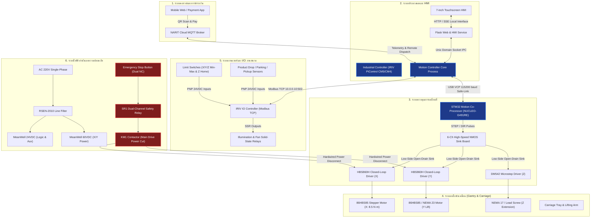
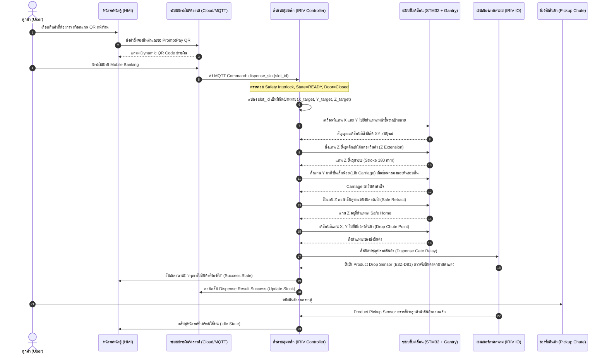
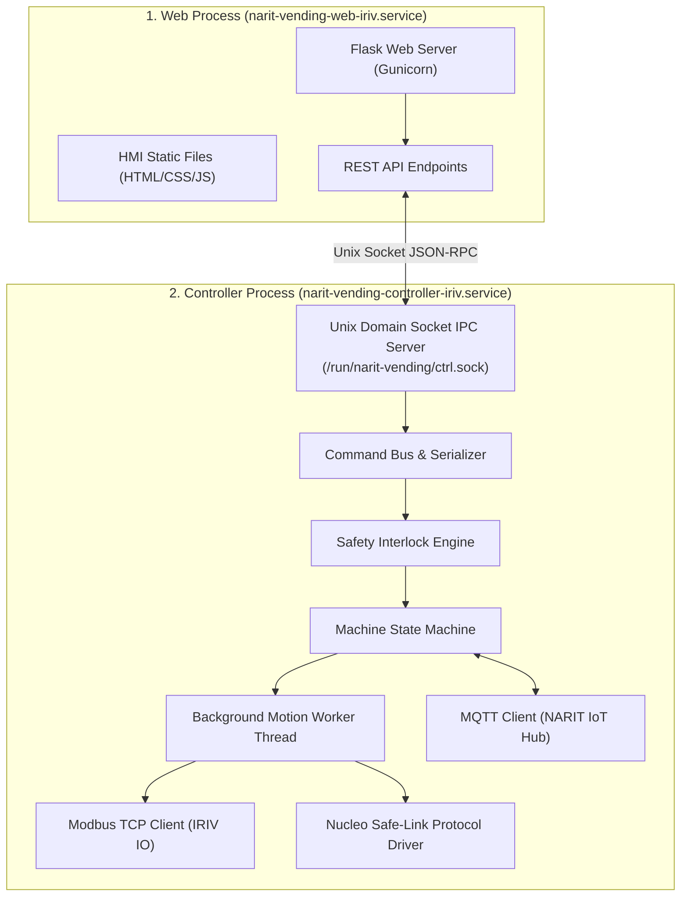
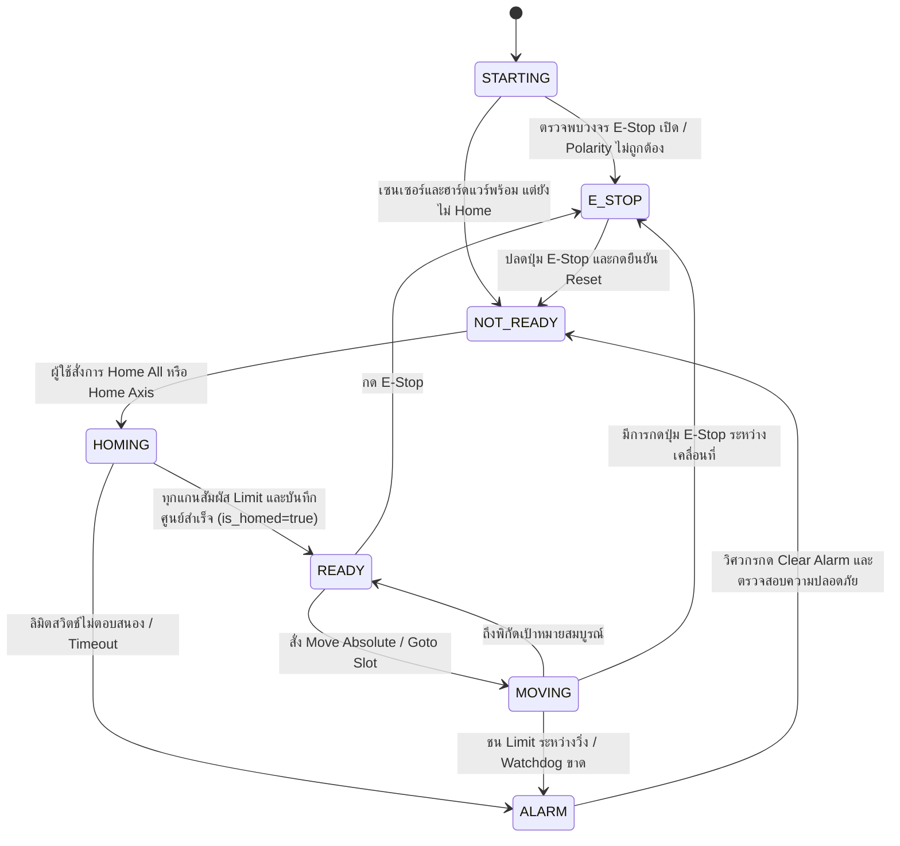

# เอกสารอธิบายหลักการทำงานของระบบย่อยแต่ละระบบ
## (System Description Document : SDD)
### โครงการตู้จำหน่ายสินค้าอัตโนมัติอัจฉริยะ (NARIT Smart Vending Machine)
**สถาบันวิจัยดาราศาสตร์แห่งชาติ (องค์การมหาชน) — National Astronomical Research Institute of Thailand (NARIT)**  
**ศูนย์ปฏิบัติการหอดูดาวและวิศวกรรม | ห้องปฏิบัติการเทคโนโลยีเมคาทรอนิกส์ (Mechatronics Laboratory)**

---

## ข้อมูลการควบคุมเอกสาร (Document Control)

| รายการ | รายละเอียด |
| :--- | :--- |
| **ชื่อเอกสาร** | เอกสารอธิบายหลักการทำงานของระบบย่อยแต่ละระบบ (System Description Document) |
| **รหัสเอกสาร** | NARIT-VEND-ENG-SDD-001 |
| **เวอร์ชัน (Revision)** | Rev 1.0 (Compiled Official Release) |
| **วันที่ประกาศใช้** | กันยายน 2026 |
| **สถานะเอกสาร** | Approved Baseline Document (Phase 1 Deliverable) |
| **หน่วยงานเจ้าของโครงการ** | ห้องปฏิบัติการเทคโนโลยีเมคาทรอนิกส์ ศูนย์ปฏิบัติการหอดูดาวและวิศวกรรม (NARIT) |
| **ขอบเขตการใช้งาน** | วิศวกรรมระบบ, ออกแบบกลไก, ไฟฟ้าควบคุม, การพัฒนาซอฟต์แวร์/เฟิร์มแวร์ และการซ่อมบำรุง |

---

## สารบัญ (Table of Contents)

1. [บทนำและภาพรวมสถาปัตยกรรมระบบ (Introduction & Architecture Overview)](#1-บทนำและภาพรวมสถาปัตยกรรมระบบ)
2. [ระบบโครงสร้างเชิงกลและชั้นวางสินค้า (Mechanical & Shelf Subsystem)](#2-ระบบโครงสร้างเชิงกลและชั้นวางสินค้า)
3. [ระบบขับเคลื่อนเชิงกลและแกนพิกัด 3 แกน (3-Axis Cartesian Motion Subsystem)](#3-ระบบขับเคลื่อนเชิงกลและแกนพิกัด-3-แกน)
4. [ระบบไฟฟ้ากำลังและการจ่ายพลังงาน (Power Electronics & Electrical Subsystem)](#4-ระบบไฟฟ้ากำลังและการจ่ายพลังงาน)
5. [ระบบควบคุมอิเล็กทรอนิกส์และอินพุต/เอาต์พุต (Electronic Control & IO Subsystem)](#5-ระบบควบคุมอิเล็กทรอนิกส์และอินพุตเอาต์พุต)
6. [ระบบซอฟต์แวร์และเฟิร์มแวร์ควบคุม (Software & Firmware Subsystem)](#6-ระบบซอฟต์แวร์และเฟิร์มแวร์ควบคุม)
7. [ระบบส่วนต่อประสานผู้ใช้ เครือข่าย และคลาวด์ (HMI, Network & Cloud Subsystem)](#7-ระบบส่วนต่อประสานผู้ใช้-เครือข่าย-และคลาวด์)
8. [ระบบความปลอดภัยและการกู้คืนข้อผิดพลาด (Safety & Recovery Subsystem)](#8-ระบบความปลอดภัยและการกู้คืนข้อผิดพลาด)
9. [ตารางสรุปคุณสมบัติทางวิศวกรรมรวม (Overall Technical Specifications)](#9-ตารางสรุปคุณสมบัติทางวิศวกรรมรวม)

---

## 1. บทนำและภาพรวมสถาปัตยกรรมระบบ

### 1.1 ความเป็นมาและวัตถุประสงค์
โครงการ **NARIT Smart Vending Machine** ริเริ่มขึ้นโดยห้องปฏิบัติการเทคโนโลยีเมคาทรอนิกส์ ศูนย์ปฏิบัติการหอดูดาวและวิศวกรรม สถาบันวิจัยดาราศาสตร์แห่งชาติ (องค์การมหาชน) เพื่อพัฒนาตู้จำหน่ายสินค้าที่ระลึกอัตโนมัติอัจฉริยะภายใต้แนวคิด **"Explore the Universe"** ประจำอุทยานดาราศาสตร์สิรินธร (ASTROPARK) 

ตู้จำหน่ายสินค้าทั่วไปมักใช้กลไกคอยล์สปริงหมุน (Spiral Coil) ซึ่งมีข้อจำกัดด้านขนาดและรูปทรงของสินค้า ไม่สามารถจ่ายสินค้าประเภทหนังสือ เสื้อผ้า ร่ม หรืออุปกรณ์ดาราศาสตร์ที่มีมูลค่าและบรรจุภัณฑ์ทรงแบน/เหลี่ยมได้ โครงการนี้จึงได้พัฒนา **ระบบหุ่นยนต์พิกัดฉาก 3 แกน (Cartesian Gantry X-Y-Z)** ร่วมกับ **ชุดตักยกสินค้า (Carriage End-Effector)** เข้ามาทำหน้าที่หยิบสินค้าจากชั้นวางลาดเอียงและนำมาส่งมอบที่ช่องรับสินค้าอย่างนุ่มนวล แม่นยำ และปลอดภัย

### 1.2 สถาปัตยกรรมระดับภาพรวม (High-Level System Context)

ระบบประกอบด้วยการเชื่อมประสานระหว่าง 8 ระบบย่อยหลัก ดังแสดงในแผนภาพ:



### 1.3 ลำดับกระบวนการทำงานหลัก (End-to-End Operation Sequence)



---

## 2. ระบบโครงสร้างเชิงกลและชั้นวางสินค้า (Mechanical & Shelf Subsystem)

### 2.1 โครงสร้างตู้หลัก (Frame & Cabinet Structure)
- **วัสดุโครงสร้างหลัก:** อลูมิเนียมโปรไฟล์อุตสาหกรรม (Aluminium Extrusion Profile) ขนาด 30×30 mm และ 40×40 mm สำหรับเสารับน้ำหนักหลัก
- **ขนาดมิติตู้ภายนอก (Overall Dimensions):** 
  - ความสูงรวม ($H$): 2,000 mm (2.0 เมตร)
  - ความกว้างรวม ($W$): 1,465 mm
  - ความลึกรวม ($D$): 1,006.92 mm (~1.0 เมตร)
- **การจัดสรรพื้นที่ภายใน:** แบ่งเป็น 3 โซนหลัก ได้แก่
  1. **Storage Zone:** พื้นที่ชั้นวางสินค้าลาดเอียง 8 ระดับความสูง
  2. **Gantry Motion Corridor:** ช่องว่างด้านหน้าชั้นวางสำหรับชุด Gantry และ Carriage เคลื่อนที่ได้อย่างอิสระ
  3. **Control & Drop Zone:** พื้นที่ด้านล่างและด้านข้างสำหรับติดตั้งตู้ควบคุมไฟ (Control Box VMC-3000) และรางปล่อยสินค้า (Delivery Chute)

### 2.2 โครงสร้างชั้นวางสินค้าแบบลาดเอียง (Gravity-Fed Sloped Shelves)
ชั้นวางสินค้าได้รับการออกแบบทางวิศวกรรมให้มีความลาดเอียงเพื่อให้กล่องบรรจุภัณฑ์สินค้าไหลลงมาด้วยแรงโน้มถ่วงมาชิดขอบกั้นด้านหน้าเสมอ ทำให้ตำแหน่งปลายกล่องมีความคงที่สำหรับการตักหยิบ:
- **มุมเอียงของชั้นวาง ($\theta$):** **25 องศา (25°)** (ปรับจูนจากค่าตั้งต้น 30° เพื่อให้ได้สมดุลระหว่างแรงไหลของกล่องและการใช้พื้นที่แนวดิ่งอย่างคุ้มค่า)
- **ความลึกของชั้นวาง:** 640 – 700 mm
- **แผ่นกั้นหน้าราง (Front Retaining Lip):** ออกแบบเป็นรูปตัว L สูง 20 mm (2.0 cm) ทำหน้าที่สกัดไม่ให้กล่องสินค้าไหลตก แต่มีความสูงพอเหมาะให้ชุด Carriage สอดเข้าช้อนใต้กล่องและยกข้ามได้
- **คานปรับระดับและสล็อตยึด:** แผ่นกั้นช่องแบ่งสินค้าทำมุม 25° ยึดเข้ากับโครงสร้างเสาด้วย T-Nut และฉากยึดที่ปรับระยะห่างได้ตามความกว้างของขนาดกล่อง

```text
               [โครงชั้นวางสินค้า มุมเอียง 25 องศา]
         \
          \  กล่องสินค้า (ไหลลงตามแรงโน้มถ่วง)
           \┌────────────────────┐
            │      PRODUCT       │ ====> ไหลชิดขอบหน้า
            └────────────────────┴──┐
                                    │ แผ่นกั้น L-Lip สูง 2 cm
────────────────────────────────────┘
                  ▲
           [แผ่นช้อน Carriage สอดเข้าใต้กล่องและยกขึ้น]
```

### 2.3 บรรจุภัณฑ์สินค้าและความจุของตู้ (Packaging & Shelf Capacity)
ตู้รองรับกล่องบรรจุภัณฑ์มาตรฐาน 3 รูปแบบ ซึ่งผลิตจากอะคริลิกใส (Clear Acrylic Sheet) หนา 3 มม. ลบมุมและขัดผิวเรียบเพื่อลดแรงเสียดทาน:

| รหัสกล่อง | ขนาดภายนอก (กว้าง $\times$ ยาว $\times$ สูง) | ประเภทสินค้าที่จัดเก็บ | ความจุต่อชั้นวาง (Max) | ความจุรวมตู้ (8 ชั้น) |
| :---: | :---: | :---: | :---: | :---: |
| **D (Large)** | $220 \times 350 \times 140\text{ mm}$ ($22 \times 35 \times 14\text{ cm}$) | หนังสือดาราศาสตร์, เสื้อยืด, เสื้อฮู้ด, ร่ม | 36 ชิ้น | 288 ชิ้น |
| **2B (Medium)** | $170 \times 250 \times 90\text{ mm}$ ($17 \times 25 \times 9\text{ cm}$) | สมุดบันทึกดวงดาว, โมเดลกล้อง, แก้วน้ำ | 48 ชิ้น | 384 ชิ้น |
| **2A (Small)** | $140 \times 200 \times 60\text{ mm}$ ($14 \times 20 \times 6\text{ cm}$) | พวงกุญแจ, แผ่นแม่เหล็ก, แหวนโทรศัพท์, ปากกา | 95 ชิ้น | 760 ชิ้น |
| **รวมเฉลี่ย** | — | — | **179 ชิ้น / ชั้น** | **สูงสุด 1,432 ชิ้น** |

### 2.4 กลไกชุดตักสินค้า (Carriage End-Effector) และระยะปลอดภัย (Clearance)
- **หลักการทำงานของชุดช้อน (Fork-Scoop Mechanism):** ชุด Carriage ประกอบด้วยแผ่นรองรับสแตนเลส/อลูมิเนียมที่มีช่องสล็อตตรงกับร่องใต้กล่องสินค้า 
- **การคำนวณระยะเคลื่อนที่และการป้องกันการชน (Clearance Calculations):**
  - **ระยะความลึกรวมทั้งหมด:** ตั้งแต่ขอบหลังชั้นวางจนถึงปลายสุดของโครงสร้าง Carriage คือ **1,000 mm (100 cm)**
  - **ระยะปลอดภัยแนวนอน (Horizontal Safety Clearance):** ช่องว่างระหว่างขอบหน้าของกล่องสินค้ากับตัว Carriage ขณะเคลื่อนที่ผ่านชั้นวางคือ **80 mm (8 cm)** เพื่อป้องกันไม่ให้ชิ้นส่วนของ Carriage เกี่ยวโดนกล่องสินค้าในชั้นอื่นขณะเคลื่อนที่ในแนวแกน X-Y
  - **ระยะยกข้ามแผ่นกั้น (Vertical Lift Stroke):** เมื่อแกน Z ยื่นเข้าใต้กล่องแล้ว แกน Y จะต้องยกขึ้นอย่างน้อย **38 mm (3.8 cm)** (เผื่อระยะกั้น 20 mm + ระยะคลายตัว 18 mm) เพื่อยกกล่องข้าม L-Lip ก่อนดึงกลับ
  - **ระยะต่ำสุดของ Carriage เหนือพื้นตู้:** 190 mm (19 cm) จากพื้นถึงจุดต่ำสุดของแขนกล เพื่อให้มีพื้นที่เพียงพอสำหรับทางลาดส่งสินค้า (Drop Chute)

---

## 3. ระบบขับเคลื่อนเชิงกลและแกนพิกัด 3 แกน (3-Axis Cartesian Motion Subsystem)

ระบบขับเคลื่อนของ NARIT Smart Vending Machine เป็นระบบหุ่นยนต์พิกัดฉาก 3 แกนอิสระ ($X, Y, Z$) ติดตั้งบนโครงสร้าง Gantry อุตสาหกรรม

```text
               [Y Axis: เสายกแนวดิ่ง Vertical Lift]
                     ▲
                     │  (ระยะเคลื่อนที่ใช้งาน 1,440 mm)
                     │
                     │       [Z Axis: แขนตักยื่น Extension]
                     │            ▲ (Stroke 180 mm)
                     │           /
                     │          /
                     ▼         ▼
    ─────────────────┼──────────────────► [X Axis: แนวนอน Horizontal]
                     │                    (ระยะเคลื่อนที่ใช้งาน 1,200 mm)
```

### 3.1 คุณสมบัติทางเทคนิคของมอเตอร์และชุดขับเคลื่อนแยกตามแกน

#### 1) แกน X (แนวนอน — Horizontal Axis)
ทำหน้าที่เลื่อนชุดเสายกและ Carriage ไปตามความกว้างของตู้เพื่อเลือกแถวของสินค้า
- **มอเตอร์ขับเคลื่อน:** **86HBS85** (Hybrid Closed-Loop Stepper Motor, ขนาดเฟรม NEMA 34)
- **แรงบิดสูงสุด (Holding Torque):** $8.5\text{ N}\cdot\text{m}$ (รองรับน้ำหนักเสาและโหลดได้อย่างมั่นคงโดยสเต็ปไม่หลุด)
- **กระแสใช้งาน (Rated Current):** $5.6\text{ A}$ ต่อเฟส
- **ตัวขับเคลื่อน (Driver):** **HBS860H** (DSP Closed-Loop Digital Stepper Driver พร้อม Encoder Feedback ป้องกันสเต็ปตกหล่น)
- **กลไกส่งกำลัง:** สายพานไทม์มิ่งอุตสาหกรรมเสริมลวดเหล็ก (HTD/GT2 High-Torque Timing Belt) ร่วมกับลิเนียร์ไกด์
- **ระยะพิตช์สมมูล (Pitch):** $8\text{ mm}$ ต่อการหมุน 1 รอบ
- **ความเร็วรอบกำหนด (Rated Speed):** $1,000\text{ RPM}$ (ความเร็วรอบสูงสุด $1,500 - 2,000\text{ RPM}$)
- **ระยะชักสูงสุดทางกล (Mechanical Max Travel):** $1,465\text{ mm}$ (ระยะชน Stopper)
- **ระยะชักใช้งานจริง (Operational Travel):** **$1,200\text{ mm}$**
- **เวลาเดินทางเต็มระยะ:** **$9.12\text{ วินาที}$** (ที่ความเร็วปกติ) และสามารถทำความเร็วสูงสุดได้ใน **$6.0 - 7.5\text{ วินาที}$**

#### 2) แกน Y (แนวดิ่ง — Vertical Lift Axis)
ทำหน้าที่ยกระดับ Carriage ขึ้น-ลงตามความสูง 8 ระดับของชั้นวางสินค้า และส่งสินค้าลงช่องจ่าย
- **มอเตอร์ขับเคลื่อน:** **86HBS85** (Hybrid Closed-Loop Stepper Motor, NEMA 34, $8.5\text{ N}\cdot\text{m}$)
- **ตัวขับเคลื่อน (Driver):** **HBS860H** (ไฟเลี้ยง 60 VDC)
- **กลไกส่งกำลัง:** บอลสกรูความแม่นยำสูง (Ballscrew) หรือชุดสายพานทดรอบกำลังสูงคู่กับ Counter-weight
- **ระยะพิตช์ (Pitch):** $8\text{ mm/rev}$
- **ระยะชักสูงสุดทางกล:** $1,328\text{ mm}$ (ระยะชน Stopper)
- **ระยะชักใช้งานจริง (Operational Travel):** **$1,440\text{ mm}$** (ครอบคลุม 8 ชั้นวาง ชั้นละ $180\text{ mm}$)
- **เวลาเดินทางเต็มระยะ:** **$8.29\text{ วินาที}$**
- **ระบบเบรกเชิงกล (Holding Brake):** มีระบบเบรกไฟฟ้าหรือความฝืดทางกลป้องกันชุด Carriage ร่วงตกเมื่อถูกตัดไฟฟ้ากระทันหัน

#### 3) แกน Z (แนวลึก/ยื่นช้อน — Reach/Extension Axis)
ทำหน้าที่ยื่นแผ่นช้อนเข้าใต้กล่องสินค้า และดึงกล่องสินค้าเข้ามาวางบน Carriage
- **โครงสร้างกลไก:** **V-Slot Mini Actuator 1-Axis Slide Unit** (ชุดรางสไลด์อลูมิเนียมคอมแพกต์)
- **มอเตอร์ขับเคลื่อน:** **17HS4401S** (NEMA 17 Stepper Motor, แรงบิด $42\text{ N}\cdot\text{cm}$, กระแส $1.5\text{ A}$) หรือ **CTM28-0601-200** (Linear Stepper NEMA 11 Lead Screw)
- **ตัวขับเคลื่อน (Driver):** **DM542** Digital Microstep Driver (ไฟเลี้ยง 24 VDC)
- **ระยะลีดสกรู (Lead/Pitch):** $1.0\text{ mm}$ หรือ $2.0\text{ mm}$ ต่อรอบ
- **ระยะชักสูงสุด (Total Stroke):** **$180\text{ mm}$** (ความยาวรวมตัวราง $300\text{ mm}$)
- **การจัดสรรระยะชักใช้งาน (Stroke Breakdown):**
  - ระยะเปิดประตูตู้สินค้า (Door Clear): $50\text{ mm}$
  - ระยะช่องว่างระหว่างรางถึงชั้นวาง (Gap Clearance): $80\text{ mm}$
  - ระยะเกี่ยวช้อนสินค้า (Engagement Stroke): $50\text{ mm}$
  - รวมระยะเคลื่อนที่สมบูรณ์: $50 + 80 + 50 = 180\text{ mm}$
- **เวลาในการเคลื่อนที่สุดระยะ:** **$1.08\text{ วินาที}$** (ที่ความเร็วรอบ $2,000\text{ RPM}$)

### 3.2 ตารางสรุปพารามิเตอร์ระบบขับเคลื่อน 3 แกน

| พารามิเตอร์ | แกน X (Horizontal) | แกน Y (Vertical Lift) | แกน Z (Reach Extension) |
| :--- | :---: | :---: | :---: |
| **มอเตอร์** | 86HBS85 (NEMA 34 Closed-Loop) | 86HBS85 (NEMA 34 Closed-Loop) | 17HS4401S (NEMA 17) |
| **แรงบิด (Torque)** | $8.5\text{ N}\cdot\text{m}$ | $8.5\text{ N}\cdot\text{m}$ | $0.42\text{ N}\cdot\text{m}$ ($42\text{ N}\cdot\text{cm}$) |
| **ไดรเวอร์** | HBS860H | HBS860H | DM542 |
| **แรงดันใช้งานไดรเวอร์** | $60\text{ VDC}$ | $60\text{ VDC}$ | $24\text{ VDC}$ |
| **Microstep Configuration** | 1,600 steps/rev (8x) | 1,600 steps/rev (8x) | 400 steps/rev (2x) |
| **ระยะต่อรอบ (Lead/Pitch)** | $8\text{ mm/rev}$ | $8\text{ mm/rev}$ | $1.0\text{ mm/rev}$ |
| **Steps per mm** | $200\text{ steps/mm}$ | $200\text{ steps/mm}$ | $400\text{ steps/mm}$ |
| **ระยะชักสูงสุดทางกล** | $1,465\text{ mm}$ | $1,328\text{ mm}$ | $180\text{ mm}$ |
| **ระยะชักใช้งานจริง** | $1,200\text{ mm}$ | $1,440\text{ mm}$ | $180\text{ mm}$ |
| **ความเร็วเชิงเส้นสูงสุด** | $200\text{ mm/s}$ | $200\text{ mm/s}$ | $166\text{ mm/s}$ |
| **เวลาเคลื่อนที่เต็มระยะ** | $\approx 9.12\text{ s}$ | $\approx 8.29\text{ s}$ | $\approx 1.08\text{ s}$ |

### 3.3 โพรไฟล์การเคลื่อนที่และการควบคุมความเร่ง (Motion Profile)
ระบบใช้สมการเร่งความเร็วรูปสี่เหลี่ยมคางหมู (**Trapezoidal Acceleration Profile**) เพื่อป้องกันแรงกระชาก (Jerk) ที่อาจทำให้โครงสร้างสั่นไหวหรือสินค้าเลื่อนหลุดจาก Carriage:
1. **ช่วงเร่งความเร็ว (Acceleration Phase):** คำนวณเพิ่มความถี่พัลส์ทีละขั้น ($f_i = f_0 + a \cdot t_i$) จำนวน 150 สเต็ปแรก
2. **ช่วงความเร็วคงที่ (Constant Velocity Phase):** จ่ายพัลส์ที่ความถี่สูงสุดคงที่ ($f_{\text{max}} = v_{\text{target}} \times \text{STEPS\_PER\_MM}$)
3. **ช่วงชะลอความเร็ว (Deceleration Phase):** ลดความถี่พัลส์ลงสู่ความเร็วเริ่มต้นก่อนหยุด ณ พิกัดเป้าหมายพอดิบพอดี

---

## 4. ระบบไฟฟ้ากำลังและการจ่ายพลังงาน (Power Electronics & Electrical Subsystem)

### 4.1 แหล่งจ่ายไฟฟ้าและโครงสร้างการแปลงแรงดัน
ระบบรองรับกระแสไฟฟ้าสลับ 1 เฟส จากโครงข่ายไฟฟ้าหลัก:
- **อินพุตไฟฟ้ากระแสสลับ:** AC 220V $\pm 10\%$, 50 Hz พร้อมสายดินป้องกัน (PE)
- **เบรกเกอร์ป้องกันกระแสเกิน (Main MCB / QF1):** Miniature Circuit Breaker ขนาด 16A 2P ติดตั้งหน้าตู้ควบคุม
- **ตัวกรองสัญญาณรบกวนคลื่นแม่เหล็กไฟฟ้า (EMI Line Filter):** **TDK-Lambda RSEN-2010** (พิกัด 10A, 250VAC) เพื่อกรองสัญญาณฮาร์มอนิกและคลื่นรบกวนความถี่สูงที่เกิดจากการสวิตชิ่งของสเต็ปเปอร์ไดรเวอร์ ไม่ให้ย้อนกลับสู่ระบบไฟฟ้าภายนอก

```text
[AC 220V Mains] ──> [MCB QF1 (16A)] ──> [EMI Filter RSEN-2010] ──┬──> [PS1: MeanWell 24VDC]
                                                                   └──> [PS2: MeanWell 60VDC]
```

### 4.2 แหล่งจ่ายไฟกระแสตรง (DC Power Supply Units - PSU)
การจ่ายไฟภายในตู้แยกออกเป็น 2 วงจรแรงดันเด็ดขาด เพื่อป้องกันสัญญาณรบกวนเหนี่ยวนำข้ามระบบ:
1. **Power Supply 1 (PS1 - 24VDC):** **MeanWell SPV-150-24 / LSR-35-24** (24V, 6.3A - 150W)
   - จ่ายไฟให้บอร์ดคอมพิวเตอร์อุตสาหกรรม Cytron IRIV PiControl (ผ่าน Internal DC-DC)
   - จ่ายไฟให้บอร์ดขยาย Cytron IRIV IO Controller
   - จ่ายไฟให้สเต็ปเปอร์ไดรเวอร์แกน Z (**DM542 - 24V**)
   - จ่ายไฟเลี้ยงเซนเซอร์ Limit Switches และ Photoelectric Sensors ทั้งหมดในระบบ
   - จ่ายไฟเลี้ยงพัดลมระบายความร้อน 24VDC ขนาด 3 นิ้ว และแถบไฟ LED Neon Flex
2. **Power Supply 2 (PS2 - 60VDC):** **MeanWell 60V High-Power PSU** (60VDC, $\ge 500\text{ W}$)
   - จ่ายพลังงานขับเคลื่อนแรงบิดสูงให้ไดรเวอร์แกน X และแกน Y (**HBS860H**) โดยเฉพาะ
   - เส้นทางไฟฟ้าผ่านคอนแทกเตอร์ตัดกำลัง **KM1** เพื่อการตัดวงจรฉุกเฉินระดับฮาร์ดแวร์

> [!CAUTION]
> **ข้อกำหนดด้านความปลอดภัยทางไฟฟ้า:** ห้ามนำแรงดันไฟ 60 VDC ของ PS2 ไปต่อเข้ากับไดรเวอร์ DM542 หรือเซนเซอร์โดยเด็ดขาด เนื่องจากอุปกรณ์รองรับแรงดันสูงสุดไม่เกิน 36 VDC

### 4.3 วงจรความปลอดภัยแบบฮาร์ดแวร์ (Hardwired Safety Circuit)
ความปลอดภัยของระบบได้รับการออกแบบตามมาตรฐานความปลอดภัยเครื่องจักรกล (ISO 13849-1 / IEC 60204-1) โดยไม่พึ่งพาซอฟต์แวร์ในการหยุดฉุกเฉิน:

```text
[+24V Field] ──── [E-Stop ปุ่มฉุกเฉิน Dual NC Contacts] ────> [SR1 Safety Relay]
                                                                      │
                                                           (NO Safety Contacts)
                                                                      │
                                                                      ▼
[PS2 +60VDC] ── [Fuse X/Y] ── [KM1 Main Contactors] ──> [HBS860H X/Y Power V+]
                                                                      │
                                                        [KM1 Aux Contact Feedback]
                                                                      │
                                                                      ▼
                                                            [IRIV IO DI10 E-Stop]
```

- **ปุ่มหยุดฉุกเฉิน (Emergency Stop Button):** ปุ่มกดดอกเห็ดสีแดงพร้อมกลไก Twist-to-Reset ติดตั้งหน้าตู้ และสวิตช์ตรวจจับเปิดประตูตู้ (Door Interlock) ใช้หน้าสัมผัสคู่แบบ Normally Closed (Dual NC)
- **รีเลย์ความปลอดภัย (Safety Relay SR1):** ตรวจสอบความพร้อมของวงจร Dual-Channel หากสวิตช์ตัวใดตัวหนึ่งเปิดวงจร รีเลย์จะปลดวงจรทันทีภายในเวลาไม่เกิน 20 ms
- **แมกเนติกคอนแทกเตอร์ (KM1 Contactor):** ทำหน้าที่ตัดสายไฟบวก (+60V) ของไดรเวอร์แกน X และ Y ทันที ทำให้มอเตอร์สูญเสียแรงบิดและหยุดการเคลื่อนที่เชิงกายภาพ 100%
- **E-Stop Diagnostic Feedback:** หน้าสัมผัสช่วย (Auxiliary Contact) ของ KM1 จะส่งสัญญาณ 24VDC เข้าช่อง `DI10` ของบอร์ด IRIV IO เพื่อให้ซอฟต์แวร์ทราบสถานะว่าเกิดการ E-Stop ทางฮาร์ดแวร์

### 4.4 ระบบสายดินและการจัดการสัญญาณรบกวน (Earthing & Grounding Architecture)
เพื่อป้องกันสัญญาณรบกวนสะสม (Ground Loop) และป้องกันความเสียหายจากกระแสเหนี่ยวนำย้อนกลับ:
- **Protective Earth (PE):** เชื่อมต่อโครงสร้างตู้โลหะ โครงอะลูมิเนียมโปรไฟล์ กล่องตู้ไฟ และขั้วกราวด์ของ PSU ทั้งหมดลงบัสบาร์ทองแดงหลักของอาคาร
- **Field 0V / DCGND:** เป็นจุดอ้างอิงแรงดันของระบบไฟฟ้า 24 VDC และสัญญาณควบคุมเซนเซอร์ แยกต่างหากจาก PE โดยเด็ดขาด
- **Cable Shielding:** สายสัญญาณพัลส์ (STEP/DIR) และสายสัญญาณ Encoder ของมอเตอร์ 86HBS85 ใช้สายชีลด์ถัก (Braided Shielded Twisted-Pair) โดยต่อชีลด์ลงกราวด์เพียงจุดเดียว (Single-Point Earth) ที่ฝั่งตู้ควบคุม

---

## 5. ระบบควบคุมอิเล็กทรอนิกส์และอินพุต/เอาต์พุต (Electronic Control & I/O Subsystem)

### 5.1 บอร์ดควบคุมหลัก (Industrial Main Controller)
- **อุปกรณ์:** **Cytron IRIV PiControl** ขับเคลื่อนด้วย **Raspberry Pi Compute Module 4/5 (CM4/CM5)**
- **ระบบปฏิบัติการ:** Linux Debian 64-bit (Raspberry Pi OS) ปรับแต่งสำหรับงานอุตสาหกรรม
- **บทบาทหน้าที่:**
  - รันระบบบริการหลัก (Web API Service, Central Motion Controller Process)
  - ประมวลผลตรรกะความปลอดภัยระดับซอฟต์แวร์ (Safety Interlock Engine)
  - ให้บริการ Local HMI Web Application ผ่านพอร์ต HTTP 80
  - จัดการฐานข้อมูลพิกัดช่องจำหน่าย (`slots.json`, `machine_config.iriv.json`)
  - เชื่อมต่อสื่อสารกับระบบคลาวด์ภายนอกผ่านโปรโตคอล MQTT / HTTPS

### 5.2 บอร์ดขยาย I/O ภาคสนาม (Industrial Field I/O Controller)
- **อุปกรณ์:** **Cytron IRIV IO Controller**
- **การเชื่อมต่อสื่อสาร (Bus Interface):** สื่อสารผ่านโปรโตคอล **Modbus TCP** บนสายเคเบิลอีเธอร์เน็ตอุตสาหกรรม (พอร์ต OT: IP `10.0.0.10:502`, Unit ID: `255`)
- **คุณสมบัติทางไฟฟ้า:** รับอินพุตแรงดัน 24 VDC ชนิด PNP (Sink/Source กำหนดได้ผ่านขา S/S) พร้อมวงจร Optocoupler แยกสัญญาณรบกวน (Galvanic Isolation)

#### ตารางการจัดสรรขาดิจิทัลอินพุต (Digital Inputs Mapping - IRIV IO)

| พอร์ต | ชื่อสัญญาณในระบบ | ประเภทอุปกรณ์เซนเซอร์ | หน้าที่และการทำงาน |
| :---: | :--- | :--- | :--- |
| **DI0** | `x_head_limit` | Proximity Inductive Sensor (PNP NC) | ตรวจจับขอบเขตแกน X ฝั่งหัว (X Min / Home) |
| **DI1** | `x_tail_limit` | Proximity Inductive Sensor (PNP NC) | ตรวจจับขอบเขตแกน X ฝั่งท้าย (X Max Limit) |
| **DI2** | `y_head_limit` | Proximity Inductive Sensor (PNP NC) | ตรวจจับขอบเขตแกน Y ฝั่งล่างสุด (Y Min / Drop Level) |
| **DI3** | `y_tail_limit` | Proximity Inductive Sensor (PNP NC) | ตรวจจับขอบเขตแกน Y ฝั่งบนสุด (Y Max Limit) |
| **DI4** | `z_head_limit` | Proximity Inductive Sensor (PNP NC) | ตรวจจับขอบเขตแกน Z ฝั่งหดสุด (Z Min / Retract Limit) |
| **DI5** | `z_tail_limit` | Proximity Inductive Sensor (PNP NC) | ตรวจจับขอบเขตแกน Z ฝั่งยื่นสุด (Z Max / Extension Limit) |
| **DI6** | `z_home` | Proximity Inductive Sensor (PNP NO) | ตำแหน่งอ้างอิงศูนย์สำหรับกระบวนการ Homing แกน Z |
| **DI7** | `product_drop_parking` | Proximity Switch (PNP NO) | ตรวจจับว่า Carriage อยู่ตรงตำแหน่งช่องปล่อยสินค้าหรือไม่ |
| **DI8** | `product_drop_sensor` | Photoelectric Sensor (Omron E3Z-D81) | ลำแสงอินฟราเรดตรวจจับสินค้าตกผ่านท่อจ่ายสินค้า |
| **DI9** | `product_pickup_sensor`| Photoelectric Sensor (Omron E3Z-D81) | ลำแสงตรวจจับว่าผู้ใช้นำสินค้าออกจากช่องรับสินค้าแล้ว |
| **DI10**| `estop_feedback` | Auxiliary Contact จาก KM1 / SR1 | สัญญาณยืนยันสถานะวงจรฮาร์ดแวร์หยุดฉุกเฉิน E-Stop |

#### ตารางการจัดสรรขาดิจิทัลเอาต์พุต (Digital Outputs Mapping - IRIV IO)

| พอร์ต | ชื่อสัญญาณในระบบ | ชนิดเอาต์พุต | หน้าที่และการทำงาน |
| :---: | :--- | :--- | :--- |
| **DO0** | `ready_indicator` | Solid-State Relay (SSR) 24V | ไฟแสดงสถานะตู้พร้อมให้บริการ (Green Light) |
| **DO1** | `moving_indicator` | Solid-State Relay (SSR) 24V | ไฟแสดงสถานะกลไกกำลังเคลื่อนที่ (Blue/Yellow Light) |
| **DO2** | `alarm_indicator` | Solid-State Relay (SSR) 24V | ไฟสัญญาณเตือนข้อผิดพลาด/E-Stop (Red Strobe/Alarm) |
| **DO3** | `dispense_relay` | Relay Dry-Contact 5A 24VDC | ควบคุมโซลินอยด์ปลดล็อกประตูช่องรับสินค้า |

### 5.3 บอร์ดกำเนิดสัญญาณพัลส์ความเร็วสูง (High-Speed Motion Co-Processor)
เนื่องจากระบบปฏิบัติการ Linux ทั่วไปบน Raspberry Pi เป็นแบบ Time-Sharing ไม่ใช่ Real-Time OS การสร้างพัลส์ความถี่สูงผ่านซอฟต์แวร์ GPIO โดยตรงจะเกิดความคลาดเคลื่อนทางเวลา (Pulse Jitter) ส่งผลให้มอเตอร์สั่นหรือสูญเสียแรงบิดในความเร็วสูง โครงการจึงใช้ไมโครคอนโทรลเลอร์เฉพาะทางทำหน้าที่เป็น Motion Co-Processor:
- **ไมโครคอนโทรลเลอร์:** **STM32 NUCLEO-G491RE** (ARM Cortex-M4 @ 170 MHz)
- **การเชื่อมต่อกับ Pi:** เชื่อมต่อผ่าน **USB Virtual COM Port (ST-LINK VCP - LPUART1)** ความเร็ว **115,200 baud, 8-N-1**
- **วงจรแปลงระดับสัญญาณ (6-Channel Logic-Level NMOS Sink Interface):**
  - สัญญาณจากพิน GPIO ของ STM32 มีระดับแรงดัน 3.3V ในขณะที่อินพุตของออปโต้คัปเปลอร์ในไดรเวอร์ HBS860H/DM542 ต้องการสัญญาณ 24VDC Sink
  - ใช้บอร์ดขับ **N-Channel Logic-Level MOSFET** (เช่น 2N7002, BSS138 หรือเทียบเท่า พิกัด $V_{\text{DS}} \ge 40\text{ V}$) ทำหน้าที่เป็น Low-Side Open-Drain Switch ดึงกระแสลงกราวด์ ($0\text{V}$) เมื่อรับ Logic HIGH จาก STM32

```text
[Field +24VDC] ───────────────> Driver PUL+ / DIR+
                                      │
Driver PUL− / DIR− ───────────> Drain (D) ของ N-MOSFET
                                      │
STM32 GPIO ── [Rg 100Ω] ──────> Gate (G) 
                                      │
                              [Rpd 10kΩ] ──> STM32 GND
                                      │
Source (S) ───────────────────> Field 0VDC / DCGND
```

#### ตารางการจับคู่ขาสัญญาณพัลส์และทิศทาง (STEP / DIR Pinout)

| แกนขับเคลื่อน | ขาสัญญาณพัลส์ (STEP/PUL) | ขาสัญญาณทิศทาง (DIR) | วงจรขับสวิตช์ | อุปกรณ์ปลายทาง |
| :---: | :---: | :---: | :---: | :---: |
| **แกน X** | `PA8` (Hardware Timer `TIM1_CH1`) | `PB0` (GPIO Output) | NMOS Ch 1 & 2 | ไดรเวอร์ HBS860H (X) |
| **แกน Y** | `PA9` (Hardware Timer `TIM1_CH2`) | `PB1` (GPIO Output) | NMOS Ch 3 & 4 | ไดรเวอร์ HBS860H (Y) |
| **แกน Z** | `PA5` (Hardware Timer `TIM2_CH1`) | `PB2` (GPIO Output) | NMOS Ch 5 & 6 | ไดรเวอร์ DM542 (Z) |

*(หมายเหตุ: ขา `PB0` บนบอร์ด Nucleo ถูกแยกการใช้งานจากวงจรหลอด LED1 บนบอร์ด เพื่อไม่ให้เกิดการเปลี่ยนระดับลอจิกทิศทางโดยไม่ตั้งใจ)*

---

## 6. ระบบซอฟต์แวร์และเฟิร์มแวร์ควบคุม (Software & Firmware Subsystem)

### 6.1 สถาปัตยกรรมระดับโพรเซสและบริการบน Linux (System Services)
ระบบซอฟต์แวร์บน IRIV PiControl ถูกออกแบบตามหลักการ **Single Source of Truth** และ **Separation of Concerns** โดยแยกการทำงานออกเป็น 2 Systemd Services อิสระ:



1. **Web Service (`narit-vending-web-iriv.service`):**
   - ทำหน้าที่รับ HTTP Requests จาก HMI Touchscreen และส่งกลับไฟล์เว็บ UI
   - ไม่ถือสิทธิ์การควบคุมฮาร์ดแวร์ GPIO หรือ Serial พอร์ตโดยตรง ป้องกันข้อผิดพลาด Resource Contention
   - สื่อสารส่งคำสั่งและอ่านสถานะจาก Controller Process ผ่าน **Unix Domain Socket** (`/run/narit-vending/ctrl.sock`)
2. **Controller Service (`narit-vending-controller-iriv.service`):**
   - เป็นเจ้าของทรัพยากรฮาร์ดแวร์ทั้งหมด (IRIV IO Modbus TCP, STM32 Serial Port, MQTT Connection)
   - ควบคุมคิวคำสั่ง (Command Queue) และป้องกันไม่ให้เกิดคำสั่งเคลื่อนที่ซ้ำซ้อนด้วยสถาปัตยกรรม **Worker Thread** แบบไม่บล็อก HTTP Request Thread (แก้ไขประเด็น Safety Finding #1 และ #3 จากผลการรีวิว)

### 6.2 สเตตแมชชีนของเครื่องจักร (Machine State Machine)
การเปลี่ยนสถานะของเครื่องจักรดำเนินไปตามเงื่อนไขความปลอดภัยอย่างเคร่งครัด:



- **`STARTING`:** เครื่องกำลังบูตระบบ ตรวจสอบการเชื่อมต่อ Modbus TCP และ Serial VCP
- **`NOT_READY`:** ระบบสื่อสารพร้อม แต่พิกัดตำแหน่งยังไม่ทราบแน่ชัด บังคับให้ต้องทำการ Home ก่อนจึงจะสั่งเคลื่อนที่แบบระบุพิกัดได้
- **`HOMING`:** กำลังค้นหาตำแหน่งศูนย์เชิงกลตามลำดับ: **Z ถอยสุดก่อน $\rightarrow$ X $\rightarrow$ Y** เพื่อความปลอดภัยสูงสุด
- **`READY`:** ทุกแกน Homed สมบูรณ์ เครื่องพร้อมรับคำสั่งหยิบจ่ายสินค้า
- **`MOVING`:** แกนขับเคลื่อนกำลังขยับไปยังพิกัดเป้าหมาย (ระบบปฏิเสธคำสั่งเคลื่อนที่ใหม่ซ้อน)
- **`ALARM`:** เกิดข้อผิดพลาดทางเทคนิค เช่น ชน Limit นอกช่วง หรือขาดการสื่อสาร
- **`E_STOP`:** มีการตัดไฟฉุกเฉิน ทุกฟังก์ชันการเคลื่อนที่ถูกระงับทันที

### 6.3 โปรโตคอลควบคุมความปลอดภัย STM32 (Safe-Link Protocol v3)
การสื่อสารระหว่าง IRIV PiControl และบอร์ด STM32 ผ่านสาย USB Serial ใช้โปรโตคอล ASCII ที่มีกลไกความปลอดภัยสูง:
- **คำสั่ง `PING`:** ตรวจสอบการเชื่อมต่อ บอร์ดตอบกลับ `PONG`
- **คำสั่ง `STATUS`:** อ่านพิกัดสเต็ปปัจจุบันของแกน X, Y, Z และสถานะ Armed
- **คำสั่ง `ARM SAFE`:** สั่งให้บอร์ด STM32 ปลดล็อกไดรเวอร์และเปิดระบบสร้างพัลส์ โดยต้องส่งก่อนคำสั่งเคลื่อนที่เสมอ
- **คำสั่ง `MOVE <AXIS> <STEPS> <FREQ_HZ> <DIR>`:** สั่งจ่ายพัลส์ตามจำนวนสเต็ปและความถี่ที่กำหนด
  - ขีดจำกัดความถี่ปลอดภัย: $10\text{ Hz} \le f \le 50,000\text{ Hz}$
  - ขีดจำกัดสเต็ปสูงสุดต่อคำสั่ง: $\le 1,000,000\text{ steps}$
- **คำสั่ง `STOP` / `DISARM`:** บังคับหยุดการสร้างพัลส์ทันที และปลดสถานะ Armed
- **กลไกความปลอดภัย Heartbeat Watchdog (500 ms):**
  - ตัวควบคุม Pi จะต้องส่งคำสั่ง `HEARTBEAT SAFE` ไปยัง STM32 อย่างต่อเนื่องทุกๆ 200 ms
  - หากสายสัญญาณหลุด หรือโปรแกรมบน Pi ค้าง เกินกว่า **500 ms** ไทเมอร์บน STM32 จะเกิด Timeout ตัดสัญญาณพัลส์ทั้งหมดลงระดับ LOW ทันที (Fail-Safe Disarm)

---

## 7. ระบบส่วนต่อประสานผู้ใช้ เครือข่าย และคลาวด์ (HMI, Network & Cloud Subsystem)

### 7.1 สถาปัตยกรรมเครือข่ายคู่ขนาน (Dual-Network Architecture)
เพื่อความมั่นคงปลอดภัยทางไซเบอร์และการส่งสัญญาณที่มีเสถียรภาพ ระบบได้แยกพอร์ตเครือข่าย 2 วงอย่างเด็ดขาด:

| เครือข่าย | พอร์ตฮาร์ดแวร์ | ไอพีแอดเดรส | ซับเน็ตมาสก์ | บทบาทและหน้าที่ |
| :--- | :---: | :---: | :---: | :--- |
| **Management & User LAN** | `eth0` (RJ-45) | `192.168.70.80` | `255.255.255.0` | การแสดงผลหน้าจอ HMI, รีโมตจัดการระบบผ่าน SSH, การเชื่อมต่ออินเทอร์เน็ตไปยัง MQTT Broker |
| **Operational Technology (OT)**| `eth1` (RJ-45) | `10.0.0.2` | `255.255.255.0` | เครือข่ายควบคุมเครื่องจักรภายใน เชื่อมต่อแบบจุดต่อจุด (Point-to-Point) กับ IRIV IO Controller (`10.0.0.10`) เท่านั้น |

### 7.2 หน้าจอส่วนต่อประสานผู้ใช้หน้าตู้ (Touchscreen Local HMI)
- **อุปกรณ์จอแสดงผล:** จอสีระบบสัมผัสขนาด 7 นิ้ว แบบ **Capacitive Touch IPS Display** ความละเอียด $800 \times 480$ พิกเซล เชื่อมต่อผ่านพอร์ต MIPI DSI หรือ HDMI
- **การออกแบบส่วนติดต่อผู้ใช้ (Next-Gen 7-Zone Layout):**
  1. **Zone 1 - Header Bar:** แสดงชื่อตู้, นาฬิกา, สถานะการเชื่อมต่อ และปุ่ม **SOFTWARE STOP** ขนาดใหญ่สีแดงเด่นชัด
  2. **Zone 2 - Status Strip:** แถบแสดงสถานะเครื่อง (`IDLE`, `MOVING`, `SUCCESS`, `ALARM`), แบนเนอร์แสดงข้อความ Error ล่าสุด และปุ่ม Clear Alarm
  3. **Zone 3 - Real-Time Coordinate Readout:** แสดงพิกัดแกน $X, Y, Z$ แบบมิลลิเมตร ด้วยตัวเลขขนาดใหญ่ฟอนต์ Monospace พร้อมไอคอนบ่งชี้สถานะการ Home
  4. **Zone 4 - Jog Motion Panel:** แผงควบคุมการขยับแกนแบบแมนนวล (Step Jog: 1mm, 10mm, 50mm) พร้อมปุ่ม Home แต่ละแกนและ Home All
  5. **Zone 5 - Slot Management Table:** ตารางแสดงรายการช่องสินค้า 1-30+ พร้อมปุ่มสั่งไปยังช่องสินค้า (Go to Slot) และปุ่มบันทึกพิกัดปัจจุบันลงช่อง (Teach & Save)
  6. **Zone 6 - Manual Absolute Move:** แผงทดสอบระบุพิกัดตัวเลขโดยตรง พร้อมแถบคำนวณระยะทางและเวลาที่คาดว่าจะใช้
  7. **Zone 7 - System Log Console:** หน้าต่างแสดงข้อความบันทึกเหตุการณ์ (Tail Log Stream) สำหรับการตรวจสอบและซ่อมบำรุงหน้างาน

### 7.3 ระบบพิกัดช่องจำหน่ายแบบไดนามิก (Dynamic Slot Management)
ระบบจัดการพิกัดช่องสินค้าถูกจัดเก็บลงในไฟล์ `machine_config.iriv.json` และสำรองข้อมูลอัตโนมัติลงใน `backups/config/` ทุกครั้งที่มีการแก้ไข:
- **รูปแบบโครงสร้างพิกัด:**
  ```json
  {
    "slots": {
      "1": { "name": "Book AstroPark Vol.1", "x": 120.5, "y": 180.0, "z": 150.0 },
      "2": { "name": "T-Shirt Meteor Size L", "x": 340.0, "y": 180.0, "z": 150.0 },
      "30": { "name": "Space Pen Special Ed.", "x": 1100.0, "y": 1260.0, "z": 120.0 }
    },
    "safe_z_mm": 0.0
  }
  ```
- **กลไกความปลอดภัย Safe Z Retraction:** ก่อนที่ระบบจะเคลื่อนที่แกน X หรือ Y ไปยังช่องสินค้าใดๆ ระบบซอฟต์แวร์จะบังคับให้แกน Z ถอยร่นกลับมาที่พิกัด `safe_z_mm` ($0.0\text{ mm}$) เสมอ เพื่อป้องกันไม่ให้แขนตักไปเกี่ยวชนกับโครงสร้างชั้นวางหรือสินค้าในช่องข้างเคียง

### 7.4 ระบบการเชื่อมต่อคลาวด์และสารสนเทศ IoT (MQTT Messaging)
ระบบรองรับการเชื่อมต่อกับแพลตฟอร์มศูนย์ควบคุมของ NARIT ผ่านโปรโตคอล MQTT (Message Queuing Telemetry Transport) โดยมีการเข้ารหัสความปลอดภัย:
- **Client ID:** `narit_vending_cabinet_01`
- **Prefix หัวข้อการสื่อสาร:** `vending/narit_vending_cabinet_01/`
- **รายการ Topics ที่ใช้งาน:**
  - `telemetry/status` (Publish ทุก 1 วินาที หรือเมื่อสถานะเปลี่ยน): ส่งข้อมูลพิกัด $X, Y, Z$, สเตตของเครื่อง, อุณหภูมิ และระดับสัญญาณ
  - `telemetry/event` (Publish เมื่อเกิดเหตุการณ์): ส่งบันทึกการจ่ายสินค้าสำเร็จ (`DISPENSE_SUCCESS`), ประตูถูกเปิด, หรือการกด E-Stop
  - `cmd/dispense` (Subscribe): รับคำสั่งจ่ายสินค้าจากแอปพลิเคชันคลาวด์ พร้อมเลขอ้างอิงการชำระเงิน
  - `cmd/stop` (Subscribe): รับคำสั่งหยุดการทำงานฉุกเฉินจากศูนย์ควบคุมระยะไกล

---

## 8. ระบบความปลอดภัยและการกู้คืนข้อผิดพลาด (Safety & Recovery Subsystem)

### 8.1 กฎเหล็กด้านความปลอดภัยของระบบ (Safety Invariants)
วิศวกรและผู้ปฏิบัติงานต้องยึดถือกฎความปลอดภัย 8 ข้ออย่างเคร่งครัด:
1. **Hardwired Disconnect First:** การกดปุ่ม E-Stop ต้องตัดไฟกำลังขับเคลื่อนของมอเตอร์ผ่านคอนแทกเตอร์ KM1 ในระดับฮาร์ดแวร์โดยตรงเสมอ โดยไม่ขึ้นกับซอฟต์แวร์หรือสถานะของบอร์ดประมวลผล
2. **No Auto-Motion on Boot:** ห้ามให้ระบบทำการ Auto-Home หรือขยับแกนโดยอัตโนมัติขณะเปิดเครื่อง รีสตาร์ต หรือหลังการแฟลชโปรแกรมใหม่เด็ดขาด
3. **Fail-Safe Sensor Interpretation:** ข้อมูลจากเซนเซอร์ที่ขาดหาย (Timeout), มีสถานะไม่ชัดเจน (Unverified Polarity), หรือสายหลุด ต้องถูกตีความว่าเป็นสถานะ **"อันตราย (Unsafe)"** และสั่งหยุดระบบทันที
4. **Unified Command Gateway:** คำสั่งควบคุมการเคลื่อนที่ทุกช่องทาง (Web HMI, REST API, MQTT, Jog Panel) ต้องถูกส่งผ่าน `CommandBus` และ `SafetyInterlock` ตัวเดียวกันเท่านั้น
5. **Physical Limits Enforcement:** ซอฟต์แวร์ต้องตรวจสอบสถานะลิมิตสวิตช์ทางกายภาพอย่างต่อเนื่อง และตัดการทำงานทันทีหากชนลิมิต ห้ามใช้เพียงการนับพิกัดซอฟต์แวร์ (Soft Limit) ทดแทน
6. **Re-Homing Mandate:** หลังการเกิดเหตุการณ์ E-Stop, ระบบไฟดับ, หรือเกิดข้อผิดพลาดในการเคลื่อนที่ ระบบจะปลดสถานะ Homed และบังคับให้ผู้ควบคุมต้องสั่งทำ Homing ใหม่ทั้งหมดก่อนรับงาน
7. **No Parameter Guessing:** ห้ามแก้ไขค่าการแมปพิน, ทิศทางมอเตอร์ (Direction), หรือค่าสัดส่วนพัลส์ (Steps/mm) โดยไม่มีผลการวัดยืนยันทางวิศวกรรม
8. **Isolated Testing:** การทดสอบฟังก์ชันในระดับ Unit Test หรือ CI ต้องทำบน Mock Environment เท่านั้น และต้องไม่มีการส่งสัญญาณจริงไปยังฮาร์ดแวร์มอเตอร์

### 8.2 ลำดับขั้นตอนการสอบเทียบตำแหน่งศูนย์ (Homing Procedure)
เพื่อป้องกันการชนกันของอุปกรณ์ภายในตู้ การทำ Homing จะต้องดำเนินไปตามลำดับขั้นความปลอดภัยดังนี้:

```text
[เริ่มขั้นตอน Homing]
        │
        ▼
[ขั้นตอนที่ 1: แกน Z] ──> สั่งมอเตอร์ Z ถอยหลังเข้าหาเซนเซอร์ Z Home / Z Min
                          ตรวจพบสัญญาณ Limit ──> ถอยออกเล็กน้อย ──> บันทึกศูนย์ Z = 0.0 mm
        │
        ▼
[ขั้นตอนที่ 2: แกน X] ──> สั่งมอเตอร์ X เลื่อนไปทางซ้าย (X Min Limit)
                          ตรวจพบสวิตช์ชนขอบ ──> ถอยออก 2 mm ──> บันทึกศูนย์ X = 0.0 mm
        │
        ▼
[ขั้นตอนที่ 3: แกน Y] ──> สั่งมอเตอร์ Y เลื่อนลงสู่ตำแหน่งล่างสุด (Y Min Limit)
                          ตรวจพบสวิตช์ชนขอบ ──> ถอยออก 2 mm ──> บันทึกศูนย์ Y = 0.0 mm
        │
        ▼
[เสร็จสิ้นกระบวนการ] ──> ตั้งค่า is_homed = true ในระบบ ──> ปรับสถานะเครื่องเป็น READY
```

### 8.3 กระบวนการตรวจสอบความพร้อมก่อนเริ่มเดินเครื่องจริง (Production Enablement Gate)
ก่อนที่จะอนุญาตให้ตู้เริ่มทำงานในโหมดอัตโนมัติเต็มระบบ (Full Automatic Mode) จะต้องผ่านการทดสอบตามเกณฑ์ความปลอดภัยครบทุกข้อ:
- [x] ตรวจสอบความถูกต้องของการต่อสายสัญญาณพัลส์ STEP/DIR ทุกแกนผ่านวงจร NMOS Sink
- [ ] ทดสอบอ่านค่าเซนเซอร์ `DI10` (E-Stop Feedback) ใน 2 สถานะ (ขณะกดปุ่ม E-Stop และขณะปลดปุ่ม) เพื่อยืนยันขั้วสัญญาณ (Polarity Verified)
- [ ] ยืนยันว่าการตัดไฟของคอนแทกเตอร์ KM1 ครอบคลุมการตัดไฟขับเคลื่อนของทั้ง 3 แกน ($X, Y, Z$)
- [ ] ตรวจสอบสัญญาณพัลส์จากขา `PA8, PA9, PA5` ด้วยออสซิลโลสโคป (Oscilloscope) ขณะยังไม่ต่อโหลดมอเตอร์ เพื่อยืนยันรูปคลื่นและความถี่ที่ถูกต้อง
- [ ] ทดสอบกลไก Watchdog ขาดการสื่อสารเกิน 500 ms บนเฟิร์มแวร์ STM32 ว่าสามารถหยุดการสร้างพัลส์ได้ทันที
- [ ] สอบเทียบระยะการเคลื่อนที่จริงเทียบกับค่าคำนวณ (Steps/mm Calibration) ด้วยเวอร์เนียร์หรือเลเซอร์วัดระยะ
- [ ] ทดสอบการปล่อยสินค้าจำลองครบ 30 ช่อง เพื่อยืนยันว่าไม่มีการติดขัดหรือชนขอบกั้น

---

## 9. ตารางสรุปคุณสมบัติทางวิศวกรรมรวม (Overall Technical Specifications)

| ระบบย่อย | รายการ | คุณสมบัติทางเทคนิค / รุ่นอุปกรณ์ |
| :--- | :--- | :--- |
| **โครงสร้างเชิงกล (Mechanical)** | โครงสร้างตู้ | อลูมิเนียมโปรไฟล์ 30×30 และ 40×40 mm, ขนาด $1,465 \times 1,007 \times 2,000\text{ mm}$ |
| | ชั้นวางสินค้า | รางลาดเอียงทำมุม $25^\circ$, แผ่นกั้นหน้าสูง $20\text{ mm}$, จำนวน 8 ชั้น |
| | บรรจุภัณฑ์ที่รองรับ | กล่องอะคริลิกใส 3 ขนาด: D ($22\times35\times14\text{ cm}$), 2B ($17\times25\times9\text{ cm}$), 2A ($14\times20\times6\text{ cm}$) |
| | ความจุสินค้า | รวมเฉลี่ย 179 ชิ้น/ชั้น (สูงสุด 1,432 ชิ้นต่อตู้) |
| **ระบบขับเคลื่อน (Motion)** | แกน X (แนวนอน) | มอเตอร์ Closed-Loop Stepper 86HBS85 ($8.5\text{ N}\cdot\text{m}$) + ไดรเวอร์ HBS860H, ระยะชักใช้งาน $1,200\text{ mm}$ |
| | แกน Y (แนวดิ่ง) | มอเตอร์ Closed-Loop Stepper 86HBS85 ($8.5\text{ N}\cdot\text{m}$) + ไดรเวอร์ HBS860H, ระยะชักใช้งาน $1,440\text{ mm}$ |
| | แกน Z (ยื่นตัก) | V-Slot Mini Actuator + สเต็ปเปอร์ NEMA 17 (17HS4401S) + ไดรเวอร์ DM542, ระยะชัก $180\text{ mm}$ |
| **ระบบไฟฟ้ากำลัง (Electrical)** | แรงดันไฟหลักอินพุต | AC 220V $\pm 10\%$, 50 Hz, Single Phase พร้อมสายดิน PE ผ่านเบรกเกอร์ 16A |
| | ตัวกรองคลื่นแม่เหล็กไฟฟ้า | TDK-Lambda RSEN-2010 (10A, 250VAC EMI Filter) |
| | แหล่งจ่ายไฟตู้ควบคุม | MeanWell 24VDC (PS1) สำหรับระบบควบคุม ลอจิก ไดรเวอร์ Z และเซนเซอร์ |
| | แหล่งจ่ายไฟมอเตอร์หลัก | MeanWell 60VDC (PS2) สำหรับไดรเวอร์ขับมอเตอร์แกน X และ Y |
| | วงจรความปลอดภัย | สวิตช์ E-Stop ดอกเห็ดคู่ (Dual NC) + รีเลย์ความปลอดภัย SR1 + คอนแทกเตอร์ KM1 |
| **ระบบควบคุมอิเล็กทรอนิกส์ (Control)**| ตัวประมวลผลหลัก | Cytron IRIV PiControl (Raspberry Pi Compute Module 4/5) บนระบบปฏิบัติการ Linux |
| | โมดูล I/O อุตสาหกรรม | Cytron IRIV IO Controller เชื่อมต่อด้วย Modbus TCP (11 DI, 4 DO ชนิด 24VDC) |
| | Motion Co-Processor | STM32 NUCLEO-G491RE (ARM Cortex-M4 @ 170MHz) เชื่อมต่อผ่าน USB VCP 115200 baud |
| | วงจรอินเตอร์เฟสพัลส์ | 6-Channel High-Speed Logic-Level N-MOSFET Open-Drain Sink Board |
| | เซนเซอร์ในระบบ | Proximity Inductive Sensors 8 ตัว (Limits/Home/Drop Parking), Photoelectric E3Z-D81 2 ตัว |
| **ระบบซอฟต์แวร์ (Software)** | สถาปัตยกรรมบริการ | แยก 2 โพรเซส: Web UI Service (Flask API) และ Master Motion Controller Service |
| | การสื่อสารภายในโพรเซส | Unix Domain Socket IPC (`/run/narit-vending/ctrl.sock`) พร้อม Motion Worker Thread |
| | โปรโตคอลควบคุมพัลส์ | Safe-Link Protocol v3 พร้อมระบบฮาร์ดแวร์ Watchdog 500 ms และ Dynamic Slot Mapping |
| | ส่วนต่อประสานและเน็ตเวิร์ก | จอสัมผัส 7 นิ้ว (800×480 IPS), Dual Network (Management LAN & OT Isolated Network), MQTT IoT |

---

> **การอนุมัติและลงนามรับรองเอกสารทางวิศวกรรม (Engineering Sign-Off):**  
> จัดทำโดย: วิศวกรโครงการ ห้องปฏิบัติการเทคโนโลยีเมคาทรอนิกส์ ศูนย์ปฏิบัติการหอดูดาวและวิศวกรรม (NARIT)  
> ตรวจสอบและรับรองโดย: หัวหน้าห้องปฏิบัติการเมคาทรอนิกส์ และผู้อำนวยการศูนย์ปฏิบัติการหอดูดาวและวิศวกรรม สถาบันวิจัยดาราศาสตร์แห่งชาติ (องค์การมหาชน)
